# Анализ и выявление воспроизводимых аномалий на криптовалютном рынке

## Цель и описание

Сформировать набор воспроизводимых зависимостей с подтверждённой статистической значимостью на независимых активах (cross‑asset) и непересекающихся временных окнах (out‑of‑time), пригодных для торговой стратегии. Каждое исследование включает статистический анализ, независимую ML-проверку (где применимо) и бэктест на out-of-sample окне.

## Методология

Пул исследования — 49 пар из локального архива Bybit: все пары, у которых первая 1m-свеча ≤ 2023-01-01 (UTC). Это не динамический top-49 по обороту: критерий — достаточная история + ликвидность на момент включения в датасет.

Паттерн считается подтверждённым, если одновременно выполняются два условия:

### 1. Универсальность среди пар (cross‑asset)

Эффект подтверждается на независимой когорте пар (обычно ≥ 60% активов сохраняют направление эффекта).

- **Train**: 24 пары, период 2022-01-01 – 2026-05-31 (ранние данные)
- **Val**: 25 пар, период 2023-01-01 – 2026-05-31 (более новые пары, не пересекаются с train)

### 2. Устойчивость во времени (out‑of‑time)

Эффект сохраняется во втором, непересекающемся временном окне (обычно ≥ 60% активов или единиц наблюдения сохраняют направление)

- **Train**: 49 пар, период 2022-01-01 – 2024-04-01
- **Val**: 49 пар, период 2024-04-01 – 2026-05-31  
  (одни и те же пары, два непересекающихся временных окна)

## Исследования

### Исследование 1. Эффект дня недели

**Метрика эффекта** — средняя **intraday-доходность open→close (UTC)** по всем календарным дням выбранного дня недели, **pooled** по парам с равным весом:

`(close − open) / open × 100%`

Отрицательное значение — в среднем день закрывается ниже open (удобно для short); положительное — выше open (long).

**Критерии подтверждения:**

- **Cross‑asset (проверка 1):** p-value < 0.0071 (Bonferroni) на train + ≥60% val-пар с тем же знаком, что pooled train
- **Out‑of‑time (проверка 2):** ≥60% пар сохраняют знак среднего open→close во втором периоде

**Порядок раздела:** статистика (проверки 1–2) → ML-подтверждение → бэктест → сводные выводы.

---

#### Проверка 1. Универсальность среди пар (cross‑asset)

24 train-пары (ранние активы) / 25 val-пар (новые активы), период 2022–2026

| День | Train, % | Val, % | Δ     | p-value (train) | Val-пар с тем же знаком | Статус       |
| ---- | -------- | ------ | ----- | --------------- | ----------------------- | ------------ |
| Пн   | -0.02    | +0.09  | +0.11 | 0.7201          | 12/25 (48%)             | ❌ не значим |
| Вт   | -0.12    | -0.15  | -0.03 | 0.0026          | 19/25 (76%)             | ✅ пров. 1  |
| Ср   | +0.24    | +0.30  | +0.06 | 0.0003          | 23/25 (92%)             | ✅ пров. 1  |
| Чт   | -0.34    | -0.47  | -0.13 | <0.0001         | 22/25 (88%)             | ✅ пров. 1  |
| Пт   | +0.27    | +0.53  | +0.26 | 0.0001          | 23/25 (92%)             | ✅ пров. 1  |
| Сб   | +0.23    | +0.32  | +0.10 | 0.0001          | 23/25 (92%)             | ✅ пров. 1  |
| Вс   | -0.20    | -0.18  | +0.02 | <0.0001         | 21/25 (84%)             | ✅ пров. 1  |

_Статус в таблице — результат **только проверки 1**. Финальный торговый статус требует прохождения **обеих** проверок (см. итоговую сводку)._

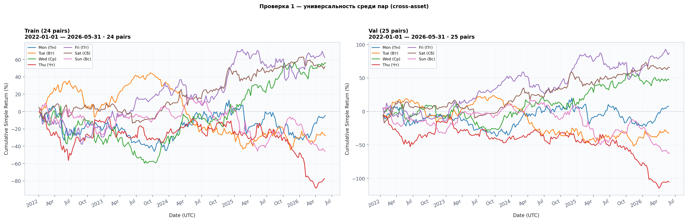

_Рис. 1a. Накопленная open→close доходность по дням недели: train (24 пары) и val (25 пар), один период 2022–2026. Отдельная линия на каждый weekday._

---

#### Проверка 2. Устойчивость во времени (out‑of‑time)

49 пар, train: 2022-01-01 – 2024-04-01, val: 2024-04-01 – 2026-05-31

| День | Train, % | Val, % | Δ     | p-value (train) | Пар с тем же знаком | Статус       |
| ---- | -------- | ------ | ----- | --------------- | ------------------- | ------------ |
| Пн   | -0.03    | +0.08  | +0.11 | 0.9085          | 29/49 (59%)         | ❌ не значим |
| Вт   | +0.03    | -0.27  | -0.30 | 0.5649          | 24/49 (49%)         | ❌ не значим |
| Ср   | +0.10    | +0.41  | +0.32 | 0.0348          | 28/49 (57%)         | ❌ не значим |
| Чт   | -0.19    | -0.58  | -0.39 | 0.0001          | 36/49 (73%)         | ✅ пров. 2   |
| Пт   | +0.51    | +0.29  | -0.22 | <0.0001         | 39/49 (80%)         | ✅ пров. 2     |
| Сб   | +0.20    | +0.33  | +0.13 | 0.0022          | 34/49 (69%)         | ✅ пров. 2    |
| Вс   | +0.24    | -0.55  | -0.79 | 0.0001          | 15/49 (31%)         | ❌ не значим |

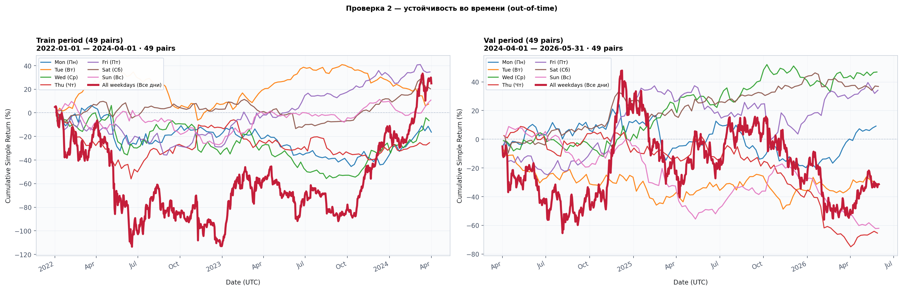

_Рис. 1b. Накопленная open→close доходность: train-период (2022-01-01 – 2024-04-01) и val-период (2024-04-01 – 2026-05-31), 49 пар. Отдельная линия на каждый weekday._

---

#### Итоговая сводка (49 пар, 2022–2026)

| День | Средняя, % | Медиана, % | σ, % | Доля роста | Статус       |
| ---- | ---------- | ---------- | ---- | ---------- | ------------ |
| Пн   | +0.03      | +0.07      | 5.32 | 50.7%      | ❌ не значим |
| Вт   | -0.13      | -0.13      | 4.70 | 51.5%      | ❌ не значим |
| Ср   | +0.27      | -0.05      | 5.35 | 49.3%      | ❌ не значим |
| Чт   | -0.40      | -0.48      | 4.79 | 55.8%      | ✅ значим    |
| Пт   | +0.39      | +0.37      | 5.52 | 54.8%      | ✅ значим    |
| Сб   | +0.27      | +0.10      | 4.50 | 51.7%      | ✅ значим    |
| Вс   | -0.19      | -0.36      | 4.62 | 55.0%      | ❌ не значим |

_Статус «значим» — пересечение проверок 1 и 2 (оба критерия одновременно). «Доля роста» — доля пар с положительной средней intraday-доходностью в этот weekday, не доля дней с close > open._

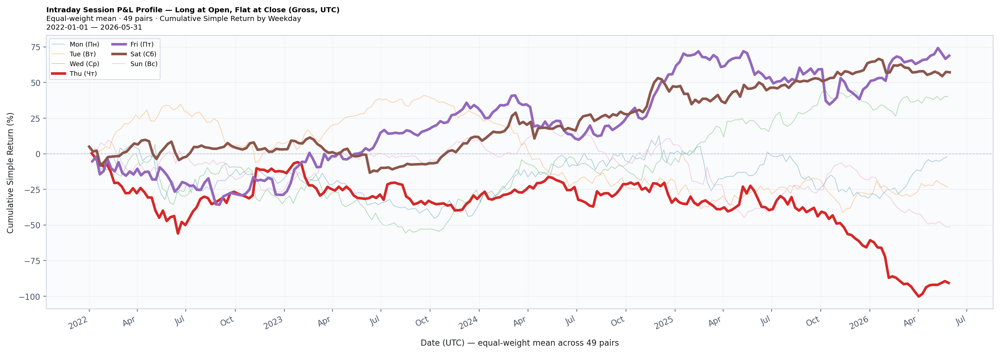

_Рис. 1с. Накопленная open→close доходность: весь период (2022-01-01 – 2026-05-31), все 49 пар. Выделены дни со статусом «значим» в итоговой сводке._

---

#### ML-подтверждение (LightGBM + CPCV)

**Цель:** проверить, содержит ли признак `weekday` предсказательную способность для направления дневной доходности (`direction_up`), и согласованы ли выводы ML-модели со статистическим анализом средних.

**Данные:** 49 пар (первая свеча ≤ 2023-01-01).  
**Train:** 2022-01-01 – 2024-04-01 (32 407 строк day × pair).  
**Holdout test:** 2024-04-01 – 2026-05-31 (38 643 строк day × pair).  
**Таргет:** `direction_up = 1`, если `close > open` (UTC, open→close).  
**Признаки:** два категориальных признака — `weekday_enc` (0=Пн … 6=Вс) и `pair_id`.

**Модель:** LightGBM (бинарная классификация): `num_leaves=7`, `learning_rate=0.05`, `min_child_samples=50`, `n_estimators=300`.

**Схема проверки:**  
1) CPCV на train: `n_splits=7`, `n_test_groups=2` → C(7,2)=**21 фолд**, `embargo_days=1`;  
2) финальный fit на всём train;  
3) однократная holdout-оценка на test.

##### Качество модели: train fit vs pooled OOS vs holdout test

| Метрика  | Train (fit) | Pooled OOS (train) | Holdout test | Δ (Test − OOS) |
| -------- | ----------- | ------------------ | ----------- | ------------- |
| Accuracy | 0.540       | 0.491              | 0.520       | +0.029        |
| ROC AUC  | 0.558       | 0.488              | **0.529**   | +0.041        |
| Log Loss | 0.688       | 0.701              | 0.693       | -0.008        |
| Brier    | 0.247       | 0.254              | 0.250       | -0.004        |
| ECE      | 0.4%        | 5.1%               | 2.9%        | -2.2 п.п.     |

_Train (fit) — финальная модель на всём train, in-sample (те же 32 407 строк). Pooled OOS — CPCV cv-test на train. Holdout test — внешний тест на 2024-04–2026-05._

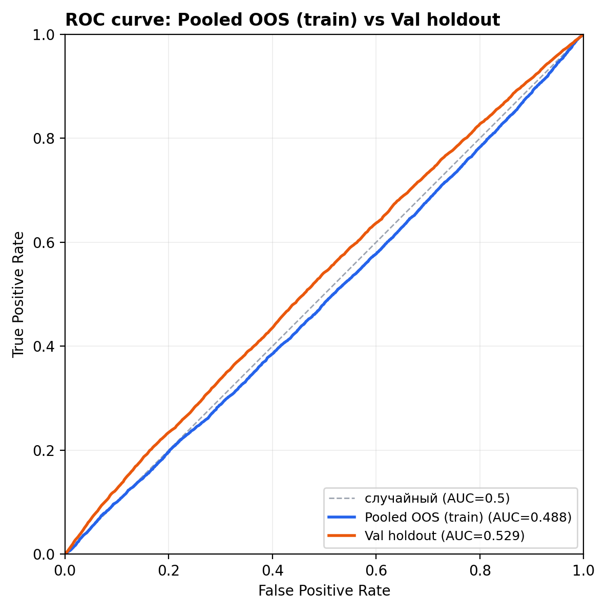

_Рис. 1c-ml. ROC-кривые pooled train OOS (CPCV, синяя) и holdout test (финальная модель, оранжевая). AUC — ранжирование по всем строкам (day × pair)._

##### Стабильность по фолдам (train CPCV, 21 фолд)

| Метрика  | Mean | Std  | Min  | Max  | IQR  | CV, % |
| -------- | ---- | ---- | ---- | ---- | ---- | ----- |
| Accuracy | 0.487 | 0.021 | 0.447 | 0.520 | 0.038 | 4.4 |
| ROC AUC  | 0.491 | 0.027 | 0.442 | 0.541 | 0.039 | 5.4 |
| Log Loss | 0.699 | 0.005 | 0.692 | 0.711 | 0.007 | 0.8 |

_Пороговая проверка: ROC AUC > 0.5 в **8/21** фолдах, Accuracy > 0.5 в **7/21** фолдах._

##### Сравнение со статистическим анализом

Статистика — итоговая сводка 49 пар, **2022–2026**. ML — вероятности финальной модели на train (теперь зависят и от `pair_id`). **Согласие знака** — только для дней со статусом «значим» в итоговой сводке: знак средней intraday совпадает с полушарием `P(up)` относительно 0.5; для остальных — «н/п».

| День | Статистика (средняя intraday, %) | ML P(up), final train-fit | Согласие знака |
| ---- | -------------------------------- | ------------------------- | -------------- |
| Пн   | +0.03 (нейтрально)               | 0.49                      | н/п            |
| Вт   | −0.13 (слабый down)              | 0.51                      | н/п            |
| Ср   | +0.27 (слабый up)                | 0.49                      | н/п            |
| Чт   | **−0.40** (значим, down)         | **0.46**                  | ✅ да          |
| Пт   | **+0.39** (значим, up)           | **0.56**                  | ✅ да          |
| Сб   | **+0.27** (значим, up)           | 0.52                      | ✅ да          |
| Вс   | −0.19 (слабый down)              | 0.48                      | н/п            |

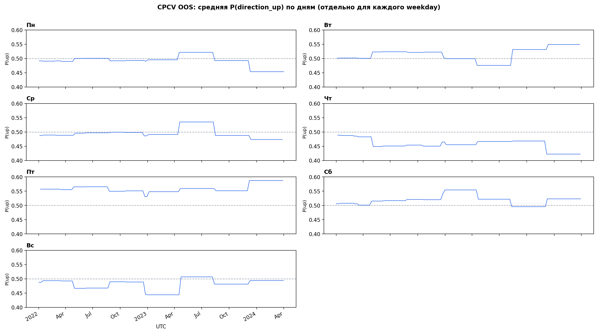

_Рис. 1d. Train CPCV: средняя OOS P(direction_up) по календарным дням, отдельно для каждого weekday._

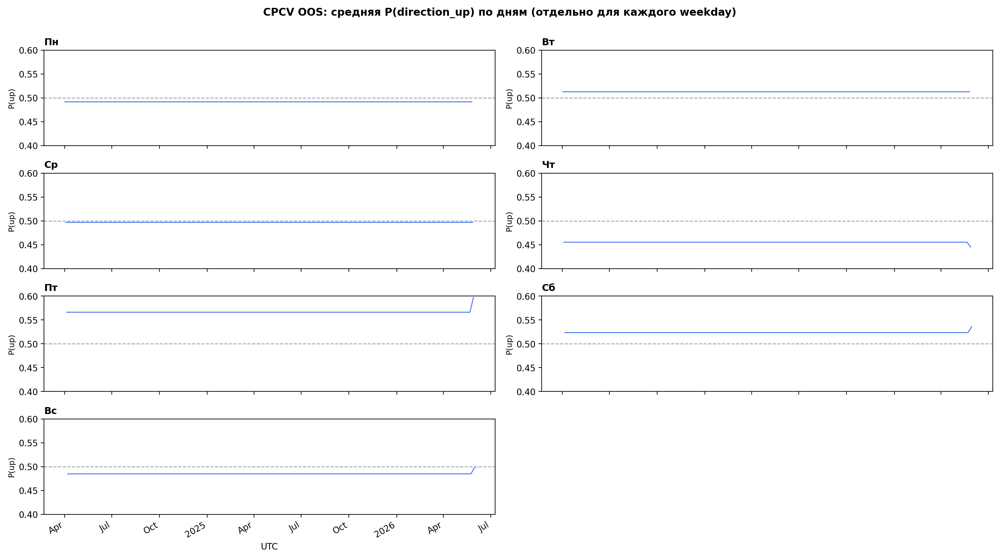

_Рис. 1e. Holdout test: прогнозы финальной train-модели на независимом периоде._

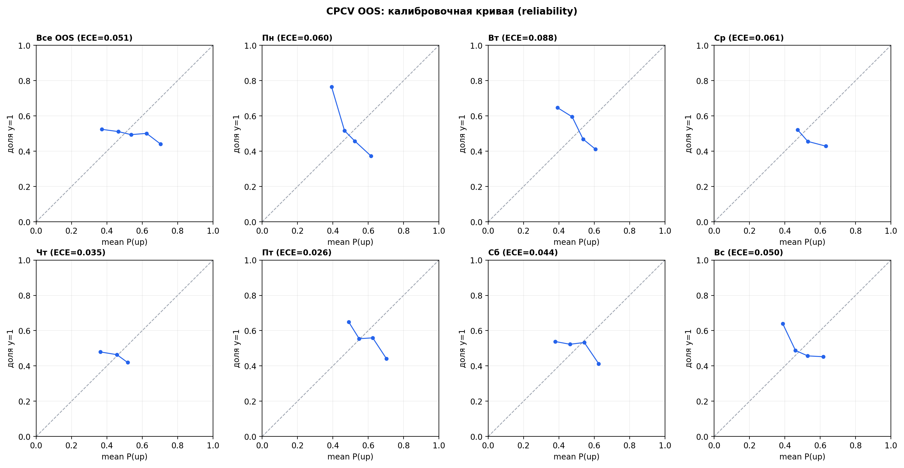

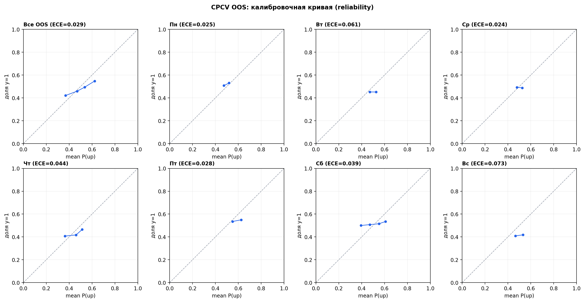

_Рис. 1f. Reliability curve для holdout test (pooled + по weekday)._

**Краткий итог ML:** на полном горизонте (train + holdout test, согласованно со статистикой) эффект дня недели проявляется в ранжировании и знаке `P(up)` на значимых днях (Чт, Пт, Сб). На коротких окнах CPCV внутри train сигнал остаётся умеренным: pooled OOS ROC AUC ≈ 0.488, средний fold ROC AUC ≈ 0.493, тогда как на независимом holdout test финальная модель даёт ROC AUC ≈ 0.529 (Brier 0.250, ECE 2.9%). **Вывод:** сигнал устойчивее на длинных участках, но с `pair_id` появляется дополнительная межпарная структура для дальнейшего расширения модели.

---

### Историческое тестирование стратегии day_of_week (out-of-sample)

**Out-of-sample период** совпадает с val-окном исследования (устойчивость во времени): **2024-04-01 — 2026-05-31 (UTC)**.  
Сигналы сформированы на train (2022-01-01 — 2024-04-01) и не пересматривались.

#### Правила стратегии

| День (UTC)           | Позиция | Доходность позиции           |
| -------------------- | ------- | ---------------------------- |
| **Четверг**          | short   | (open − close) / open × 100% |
| **Пятница, суббота** | long    | (close − open) / open × 100% |
| Пн–Ср, Вс            | flat    | 0%                           |

- Внутри каждого торгового дня — равный вес активных пар (1/N капитала на пару), **без реинвестирования**, NAV=100. В консервативном сценарии N=49 на все торговые дни; в оптимистичном N различается по дням (Чт: 33, Пт: 31, Сб: 23; union: 40 уникальных пар).
- **Exposure:** 42.9% (339 торговых дней из 791)
- **Комиссии** (Bybit USDT Perpetual, non-VIP): taker 0.200% round-trip, maker 0.072% round-trip
- **Бенчмарки:** равновесный B&H 49 пар (gross) и BTC B&H (gross)

#### Сценарии тестирования

| Сценарий           | Описание                                                                                               |
| ------------------ | ------------------------------------------------------------------------------------------------------ |
| **Консервативный** | Все 49 пар на каждый торговый день                                                                     |
| **Оптимистичный**  | Отбор пар по train-периоду: знак эффекта подтверждён в ≥⅔ лет (Чт: 33 пары, Пт: 31, Сб: 23, union: 40) |

#### Сводная таблица полученных метрик (val, 2024-04-01 — 2026-05-31)

| Метрика                       | Консервативный (49 пар, taker) | Консервативный (49 пар, maker) | Оптимистичный (отбор, taker) | Оптимистичный (отбор, maker) | B&H 49 пар (gross) | BTC B&H (gross)  |
| ----------------------------- | ------------------------------ | ------------------------------ | ---------------------------- | ---------------------------- | ------------------ | ---------------- |
| Total Return                  | +68.6%                         | +112.0%                        | +91.2%                       | **+134.6%**                  | −31.4%             | +28.3%           |
| CAGR (compounded)             | +27.3%                         | +41.5%                         | +34.9%                       | **+48.3%**                   | −16.0%             | +12.3%           |
| Sharpe (0% rf)                | 0.67                           | 1.09                           | 0.86                         | **1.27**                     | −0.20              | 0.28             |
| Sharpe / √exposure            | 1.02                           | 1.66                           | 1.32                         | **1.94**                     | −0.20              | 0.28             |
| Max Drawdown                  | −37.7%                         | −32.7%                         | −35.0%                       | **−30.0%**                   | −70.3%             | −37.4%           |
| Recovery from max DD          | 140 дн.                        | 33 дн.                         | 140 дн.                      | **27 дн.**                   | не восстановился   | не восстановился |
| Longest underwater            | 365 дн.                        | **307 дн.**                    | 358 дн.                      | **307 дн.**                  | 539 дн.            | 233 дн.          |
| % time in drawdown            | 92.3%                          | 88.2%                          | 90.9%                        | **86.1%**                    | 98.1%              | 94.3%            |
| Calmar                        | 0.84                           | 1.58                           | 1.20                         | **2.07**                     | −0.21              | 0.35             |
| Profit Factor                 | 1.16                           | 1.28                           | 1.22                         | **1.33**                     | 0.97               | 1.04             |
| Win Rate (trades)             | 55.5%                          | **58.4%**                      | 55.5%                        | 56.9%                        | 50.9%              | 50.2%            |
| Median trade return           | +0.398%                        | +0.526%                        | +0.449%                      | **+0.577%**                  | +0.078%            | +0.007%          |
| Information Ratio (vs B&H 49) | 0.60 (taker)                   | 0.87 (maker)                   | 0.73 (taker)                 | **0.99 (maker)**             | —                  | —                |
| Worst day (net)               | −22.5% (2025-10-10, Пт)        | **−22.3% (2025-10-10, Пт)**    | −23.5% (2025-10-10, Пт)      | −23.4% (2025-10-10, Пт)      | −22.3%             | −14.0%           |

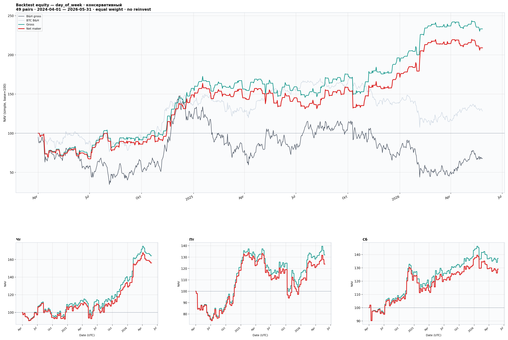
**Рис. 2. Консервативный сценарий** — 49 пар, val (2024-04-01 — 2026-05-31). Красная линия — net maker, синяя — net taker; серые — B&H 49 и BTC.

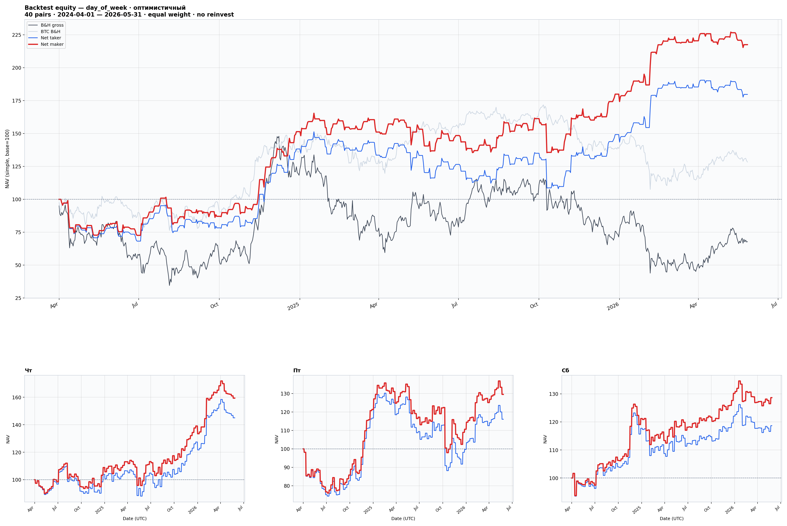
**Рис. 3. Оптимистичный сценарий** — 40 пар (train-отбор), val. Красная — net maker, синяя — net taker; нижний ряд — вклад по дням (Чт / Пт / Сб).

#### Выводы по сводной таблице

- Все активные сценарии превосходят B&H 49 пар и BTC B&H по CAGR и MaxDD на val-окне.
- Maker-исполнение добавляет ~13–14 п.п. к CAGR относительно taker; разница в recovery time завышена пиком августа 2024 — надёжнее смотреть longest underwater (307 vs 358 дн.).
- Лучший сценарий — **оптимистичный maker**: CAGR +48.3%, Sharpe 1.27, MaxDD −30.0%, IR 0.99 vs B&H 49.
- Отбор пар по train даёт ~+7 п.п. CAGR при ~−3 п.п. MaxDD относительно консервативного maker.

#### Вклад по дням недели (оптимистичный, net maker)

| День           | Total Ret | Avg trade | Sharpe | MaxDD  | Skewness (net maker) |
| -------------- | --------- | --------- | ------ | ------ | -------------------- |
| **Чт** (short) | +60.6%    | +0.536%   | 2.68   | −16.5% | −0.09                |
| **Пт** (long)  | +33.7%    | +0.298%   | 1.24   | −29.1% | **−1.11**            |
| **Сб** (long)  | +40.4%    | +0.357%   | 2.12   | −15.0% | −0.02                |

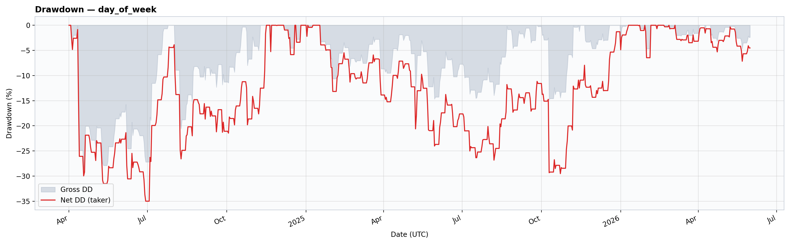
**Рис. 4. Drawdown — оптимистичный сценарий** — общий (жирная красная, net maker) и вклад по дням (Чт / Пт / Сб).

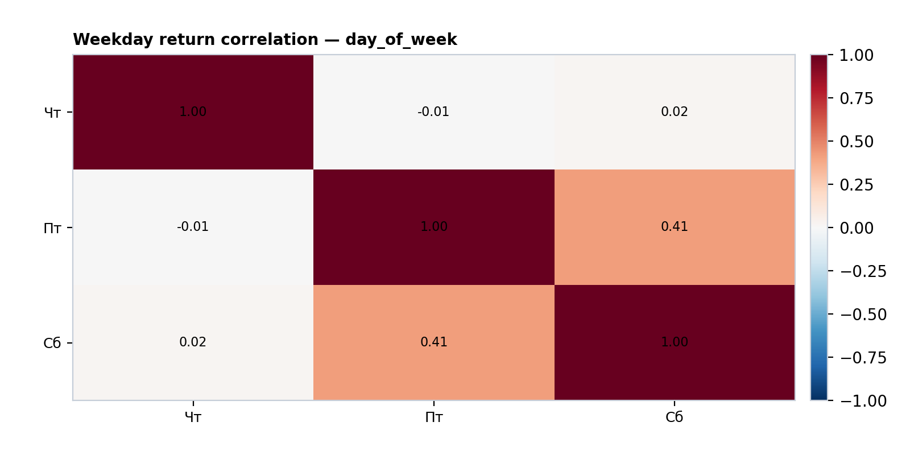
**Рис. 5. Корреляция дневных доходностей — оптимистичный сценарий**

- **Четверг и суббота** — основной вклад в доходность (наибольший Total Ret и Sharpe).
- **Пятница** — слабое звено по риску (низкий Sharpe, глубокая просадка, skew −1.11).
- **Корреляция Пт ↔ Сб** — +0.41 (умеренная, частичная диверсификация).

#### Распределение доходностей (оптимистичный maker)

| Показатель       | Значение |
| ---------------- | -------- |
| Skewness         | −0.64    |
| Kurtosis         | 5.20     |
| 1% VaR (дневной) | −11.2%   |
| 1% CVaR          | −15.4%   |
| 5% VaR           | −5.6%    |
| 5% CVaR          | −9.1%    |

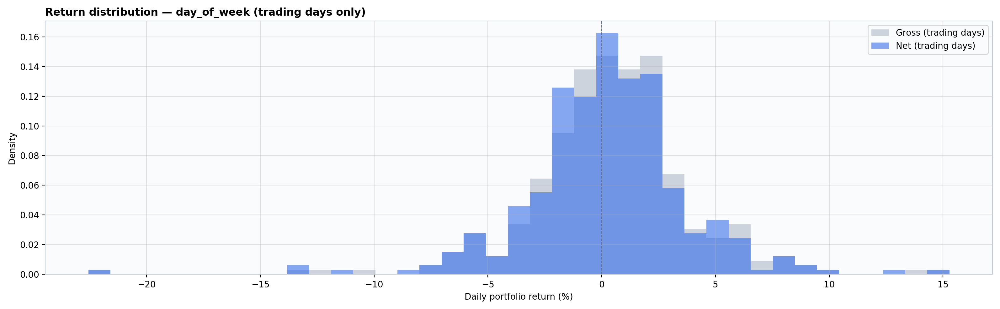
**Рис. 6. Распределение дневных доходностей — оптимистичный сценарий**

Отрицательная асимметрия и «толстые хвосты» согласуются с хвостовым риском (см. ограничения ниже).

#### Ограничения и риски

- Результаты out-of-sample по времени, но **не гарантируют** сохранение эффекта в будущем.
- **Пятница** — наименее устойчивый день (Sharpe 1.24, MaxDD −29.1%, skew −1.11); худший день портфеля −23.4% (2025-10-10, Пт).
- **Комиссии** существенны: taker-исполнение съедает ~68 п.п. от gross до net.
- **Capacity / проскальзывание:** не моделируются (предполагается идеальное maker-исполнение).
- Отрицательная асимметрия и CVaR 1% = −15.4% указывают на хвостовые риски.

#### Ключевые выводы (исследование 1)

| День | Направление | Cross‑asset | Out‑of‑time | ML P(up) | ECE | Sharpe (opt maker) |
| ---- | ----------- | ----------- | ----------- | -------- | --- | ------------------ |
| **Чт** | short | 22/25 (88%) | 36/49 (73%) | 0.46 | 3.6% | 2.68 |
| **Пт** | long | 23/25 (92%) | 39/49 (80%) | 0.56 | 2.1% | 1.24 |
| **Сб** | long | 23/25 (92%) | 34/49 (69%) | 0.52 | 0.8% | 2.12 |

**Отсеяны:** Вт, Ср, Вс (прошли cross‑asset, не прошли out‑of‑time); Пн (не прошёл ни один фильтр). Воскресенье: знак эффекта меняется между train и val (+0.24% → −0.55%), несмотря на значимость в проверке 1.

**Согласование слоёв:** статистика и ML сходятся по знаку на значимых днях (Чт, Пт, Сб); торговая стратегия опирается именно на них. Бэктест (opt maker, val 2024–2026): CAGR +48.3%, Sharpe 1.27, MaxDD −30.0%, IR 0.99 vs B&H 49.

**Итог:** паттерн «short Чт + long Пт, Сб» воспроизводим на независимых парах и во времени; практическая реализация требует maker-комиссий. Основной риск — хвостовые убытки в пятницу; суббота — вспомогательный, но более стабильный long-день.

#### Дополнительные материалы и воспроизведение

| Материал | Описание |
| -------- | -------- |
| [weekday_summary.log](research_outputs/day_of_week/statistics/weekday_summary.log) | Сводные таблицы проверок 1–2 и итоговая |
| [24 train-пары](research_outputs/day_of_week/statistics/weekday_statistics_24pairs_20220101_20260531_train.log) | Проверка 1 — train-когорта |
| [25 val-пар](research_outputs/day_of_week/statistics/weekday_statistics_25pairs_20220101_20260531_val.log) | Проверка 1 — val-когорта |
| [train 2022–2024-04](research_outputs/day_of_week/statistics/weekday_statistics_49pairs_20220101_20240401.log) | Проверка 2 — train-период |
| [val 2024-04–2026](research_outputs/day_of_week/statistics/weekday_statistics_49pairs_20240401_20260531.log) | Проверка 2 — val-период |
| [49 пар, 2022–2026](research_outputs/day_of_week/statistics/weekday_statistics_49pairs_20220101_20260531.log) | Итоговая детальная статистика |
| [ML: train/test JSON](research_outputs/day_of_week/ml/metrics/weekday_direction_49pairs_20220101_20260531_train_test.json) | Полный отчёт: train CPCV + final fit + holdout test |
| [ML: train CPCV P(up)](research_outputs/day_of_week/ml/plots/weekday_direction_49pairs_20220101_20240401_oos_prob.png) | OOS-вероятности по weekday на train CPCV |
| [ML: train CPCV калибровка](research_outputs/day_of_week/ml/plots/weekday_direction_49pairs_20220101_20240401_oos_calibration.png) | Reliability curve на train CPCV |
| [ML: holdout test P(up)](research_outputs/day_of_week/ml/plots/weekday_direction_49pairs_20240401_20260531_oos_prob.png) | Прогнозы финальной train-модели на holdout test |
| [ML: holdout test калибровка](research_outputs/day_of_week/ml/plots/weekday_direction_49pairs_20240401_20260531_oos_calibration.png) | Reliability curve на holdout test |
| [ML: ROC AUC train vs test](research_outputs/day_of_week/ml/plots/weekday_direction_49pairs_20220101_20260531_roc_auc.png) | ROC-кривые Pooled OOS (train) и Holdout test |
| [ML: модель + энкодеры](research_outputs/day_of_week/ml/models/weekday_direction_49pairs_20220101_20240401_model_bundle.pkl) | Bundle: LightGBM + feature schema + classes |
| [ML: лог](research_outputs/day_of_week/ml/weekday_direction_20220101_20260531.log) | Лог train/test запуска |
| [бэктест консервативный](research_outputs/day_of_week/backtest/day_of_week_backtest_49pairs_20240401_20260531.log) | Полный отчёт, 49 пар |
| [бэктест оптимистичный](research_outputs/day_of_week/backtest/day_of_week_backtest_optimistic_thu33_pt31_sb23_20240401_20260531.log) | Полный отчёт, отбор по train |

Из каталога `crypto_research` (нужны `*_klines_1m.jsonl` в `load_data_from_bybit/data` или `CRYPTO_DATA_DIR`):

```bash
cd crypto_research

# Статистика
python3 report_generator.py day_of_week --summary
python3 report_generator.py day_of_week --train --from-date 2022-01-01 --to-date 2026-05-31
python3 report_generator.py day_of_week --val   --from-date 2022-01-01 --to-date 2026-05-31
python3 report_generator.py day_of_week --from-date 2022-01-01 --to-date 2024-04-01 --max-pair-start 2023-01-01
python3 report_generator.py day_of_week --from-date 2024-04-01 --to-date 2026-05-31 --max-pair-start 2023-01-01
python3 report_generator.py day_of_week --from-date 2022-01-01 --to-date 2026-05-31 --max-pair-start 2023-01-01

# ML (train/test по умолчанию: 49 пар, train 2022-01-01–2024-04-01, test 2024-04-01–2026-05-31)
python3 ml_research.py
# один период CPCV без holdout:
# python3 ml_research.py --no-train-test --from-date 2023-01-01 --to-date 2026-05-31

# Бэктест
python3 backtester.py day_of_week --scenario conservative
python3 backtester.py day_of_week --scenario optimistic
```

Артефакты: `research_outputs/day_of_week/statistics/`, `…/ml/`, `…/backtest/`.

---

### Исследование 2. Расстояние между ценой и EMA

Исследование проводится в **два этапа**:

1. **Этап 0 — выбор периода EMA** (`ema_period_screen`): на **train-периоде** (49 пар, 2022-01-01 – 2024-04-01) сравниваем кандидатов **5, 9, 12, 20, 50, 100, 200** по устойчивости сигнала. Это **не** проверка значимости — только фиксация периода для этапов 1–3.
2. **Этапы 1–3 — паттерн** (`ema_spreads` с **EMA(9)**): универсальность среди пар и устойчивость во времени (по критериям из методологии).

---

### Этап 0. Выбор периода EMA (только train)

**Цель:** определить период EMA с наиболее устойчивой связью «вчерашнее отклонение → сегодняшний intraday return».

**Условие (вчера):** `dev = (close − EMA) / EMA × 100%`. Бакеты b0–b6 — по индивидуальным квантилям каждой пары:

| Бакет | Условие          | Бакет | Условие           |
| ----- | ---------------- | ----- | ----------------- |
| b0    | dev > t2⁺        | b4    | t2⁻ ≤ dev < −near |
| b1    | t1⁺ < dev ≤ t2⁺  | b5    | t1⁻ ≤ dev < t2⁻   |
| b2    | near < dev ≤ t1⁺ | b6    | dev < t1⁻         |
| b3    | \|dev\| ≤ near   |       |                   |

_t1⁺/t2⁺ — ⅓ и ⅔ квантили среди dev>0; t1⁻/t2⁻ — ⅓ и ⅔ среди dev<0 (t1⁻ ≤ t2⁻); near = max(Q10(dev), 0.05%)._

**Метрика скрининга:** Δ к BASE в колонках «Цена росла» / «Цена падала» (п.п.) — насколько доля дней с ростом/падением open→close в бакете отличается от безусловной. Значимая ячейка: \|Δ\| ≥ 1.5 п.п.

**Индекс стабильности** (25% на каждую компоненту):

1. ср.\|Δ\| (нормировка)
2. ср.кварталы % (согласие знака Δ по календарным кварталам)
3. ср.пары % (согласие по парам)
4. число значимых ячеек (нормировка)

**Результаты (49 пар, train: 2022-01-01 – 2024-04-01, 9 кварталов):**

| #   | EMA   | ср.\|Δ\|, п.п. | Ср.кварт. | Ср.пары | Знач. | Индекс % |
| --- | ----- | -------------- | --------- | ------- | ----- | -------- |
| 1   | **9** | **3.4**        | **84%**   | **79%** | 8     | **87.6** |
| 2   | 12    | 3.1            | 81%       | 81%     | 8     | 85.1     |
| 3   | 5     | 3.0            | 76%       | 73%     | 9     | 84.8     |
| 4   | 20    | 3.1            | 83%       | 75%     | 8     | 84.5     |
| 5   | 50    | 3.4            | 74%       | 75%     | 8     | 84.3     |
| 6   | 100   | 3.4            | 78%       | 81%     | 7     | 84.2     |
| 7   | 200   | 3.0            | 71%       | 70%     | 9     | 82.4     |

**Выбран EMA(9)** — максимальный индекс стабильности (87.6%), наибольшая сила эффекта (3.4 п.п.), 84% согласия по кварталам, 79% по парам.

### Этапы 1–3. Валидация паттерна EMA(9)

**Метрика:** условная связь вчерашнего dev от EMA(9) с сегодняшним intraday return. Анализируются колонки **«Цена росла»** / **«Цена падала»** (Δ от BASE в п.п.).

**Критерии:** |Δ| ≥ 1.5 п.п. на train, p < 0.0036 (Bonferroni, 14 ячеек), cross‑asset ≥60% val-пар, out‑of‑time ≥60% пар.

_Показаны только ячейки, прошедшие |Δ| ≥ 1.5 п.п. на train:_

#### Проверка 1: универсальность среди пар (24 train / 25 val, 2022–2026)

| Сигнал           | Δ train | Δ val | p-value | Val-пар (≥60%) | Статус       |
| ---------------- | ------- | ----- | ------- | -------------- | ------------ |
| b0 × Цена росла  | −2.59   | −2.51 | 0.0001  | 18/25 (72%)    | ✅ значим    |
| b0 × Цена падала | +2.80   | +2.65 | <0.0001 | 20/25 (80%)    | ✅ значим    |
| b2 × Цена росла  | −2.60   | −0.67 | 0.0009  | 14/25 (56%)    | ❌ не значим |
| b2 × Цена падала | +2.66   | +0.44 | 0.0006  | 15/25 (60%)    | ✅ значим\*  |
| b3 × Цена росла  | −2.15   | −0.74 | 0.0132  | 13/25 (52%)    | ❌ не значим |
| b3 × Цена падала | +2.31   | +0.33 | 0.0066  | 11/25 (44%)    | ❌ не значим |
| b6 × Цена росла  | +4.23   | +3.15 | <0.0001 | 24/25 (96%)    | ✅ значим    |
| b6 × Цена падала | −4.22   | −3.00 | <0.0001 | 23/25 (92%)    | ✅ значим    |

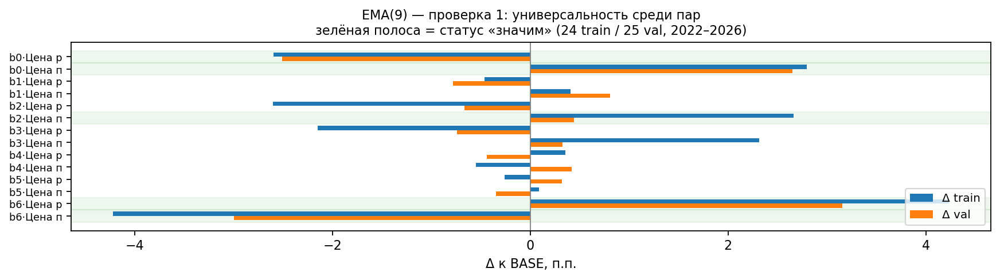

_Рис. EMA-1a. Δ к BASE на train и val (п.п.). Зелёная заливка — статус «значим» по проверке 1._

#### Проверка 2. Устойчивость во времени (49 пар, train 2022–2024-04 / val 2024-04–2026)

| Сигнал           | Δ train | Δ val | p-value | Пар (≥60%)  | Статус       |
| ---------------- | ------- | ----- | ------- | ----------- | ------------ |
| b0 × Цена росла  | −4.64   | −0.70 | <0.0001 | 27/49 (55%) | ❌ не значим |
| b0 × Цена падала | +4.99   | +0.68 | <0.0001 | 28/49 (57%) | ❌ не значим |
| b6 × Цена росла  | +3.47   | +4.23 | <0.0001 | 43/49 (88%) | ✅ значим    |
| b6 × Цена падала | −3.41   | −4.22 | <0.0001 | 41/49 (84%) | ✅ значим    |

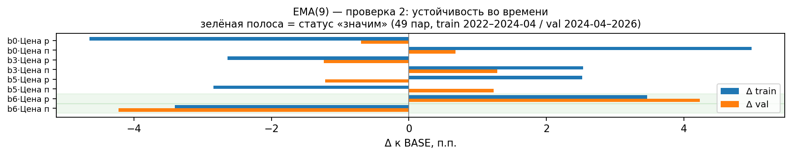

_Рис. EMA-1b. Δ к BASE на train-периоде и val-периоде (п.п.). Зелёная заливка — статус «значим» по проверке 2._

### Ключевые выводы

После двух проверок (cross‑asset + out‑of‑time) подтверждён **только сигнал перепроданности b6**:

| Бакет              | Сигнал        | Δ         | Смысл для стратегии                       |
| ------------------ | ------------- | --------- | ----------------------------------------- |
| **b6** (dev < t1⁻) | Цена росла ↑  | +3.8 п.п. | После сильного падения — завтра чаще рост |
| **b6**             | Цена падала ↓ | −3.7 п.п. | …и реже падение (отскок вверх)            |

_Справочно: на всём периоде 2022–2026 сигнал b6 показывает согласие в 48/49 пар (98%) и 5/5 лет (100%)._

**Что отсеялось:**

- **b0** (перекупленность) — прошёл cross‑asset (72–80%), но **не прошёл out‑of‑time** (55–57% пар)
- **b2, b3** — прошли train, но не прошли cross‑asset (44–60%) или out‑of‑time (<60%)
- **b1, b4, b5** — |Δ| на train ниже порога материальности

**Итог:** устойчивый mean-reversion на **EMA(9)** работает только **на перепроданности (b6)**. Сигнал перекупленности (b0) слабее и не выдерживает out‑of‑time проверку.

#### Дополнительные материалы (исследование)

| Материал                                                                                                                                       | Описание                                                                                           |
| ---------------------------------------------------------------------------------------------------------------------------------------------- | -------------------------------------------------------------------------------------------------- |
| [ema_period_screen train](research_outputs/ema/ema_spreads/statistics/ema_period_screen_49pairs_ema5_9_12_20_50_100_200_20220101_20240401.log) | Этап 0 — скрининг периодов EMA (49 пар, train 2022-01-01 – 2024-04-01), значимые ячейки по бакетам |
| [ema_summary_ema9.log](research_outputs/ema/ema_spreads/statistics/ema_summary_ema9.log)                                                       | Этапы 1–3 — проверки 1–2 и итог: универсальность среди пар, устойчивость во времени, полный пул    |
| [ema_spreads EMA(9), 49 пар](research_outputs/ema/ema_spreads/statistics/ema_spreads_49pairs_ema9_20220101_20260531.log)                       | Этапы 1–3 — детальная статистика: 12 колонок, High/Low, repeatability (годы/пары)                  |

#### Воспроизведение отчётов (исследование)

Из каталога `crypto_research` (нужны `*_klines_1m.jsonl` в `load_data_from_bybit/data` или `CRYPTO_DATA_DIR`):

```bash
cd crypto_research

python3 report_generator.py ema_period_screen # Этап 0: скрининг периодов EMA (train 2022-01-01 – 2024-04-01 по умолчанию)
python3 report_generator.py ema_spreads --summary # Этапы 1–3: сводка train/val (проверки 1–2 + итог) — ema_summary_ema9.log

python3 report_generator.py ema_spreads \  # Этапы 1–3: детальный отчёт EMA(9) — все колонки, repeatability
  --from-date 2022-01-01 --to-date 2026-05-31 --max-pair-start 2023-01-01 \
  --ema-periods 9
```

Отчёты пишутся в `research_outputs/ema/ema_spreads/statistics/`; графики — в `…/statistics/plots/`.

---

### Историческое тестирование стратегии ema_spreads (out-of-sample)

**Out-of-sample период** = val-окно исследования: **2024-04-01 — 2026-05-31 (UTC)**.  
Пороги b6 заморожены на train (2022-01-01 — 2024-04-01).

#### Правила стратегии

| Условие (вчера, UTC close) | Позиция | Доходность                     |
| -------------------------- | ------- | ------------------------------ |
| **b6** (dev < t1⁻, EMA(9)) | long    | `(close − open) / open × 100%` |
| Остальные бакеты           | flat    | 0%                             |

- Равный вес пар, без реинвестирования, NAV=100
- **Exposure:** ~82% (конс.) / ~79% (опт.)
- **Комиссии** (Bybit non-VIP): taker 0.200% round-trip, maker 0.072%
- **Бенчмарки:** B&H 49 пар (gross), BTC B&H (gross)

#### Сценарии

| Сценарий | Описание |
|----------|----------|
| **Консервативный** | Все 49 пар на каждый сигнал b6 |
| **Оптимистичный** | Отбор по train: b6 × «Цена росла», знак Δ + ≥⅔ лет (**33 пары**) |
                       |

#### Результаты (val, 2024-04-01 — 2026-05-31)

| Метрика                       | Конс. (49 пар, gross) | Конс. (49 пар, taker) | Конс. (49 пар, maker) | Опт. (33 пары, gross) | Опт. (33 пары, taker) | Опт. (33 пары, maker) | B&H 49 пар (gross) | BTC B&H (gross) |
| ----------------------------- | --------------------- | --------------------- | --------------------- | --------------------- | --------------------- | --------------------- | ------------------ | ---------------- |
| Total Return                  | +32.2%                | −11.7%                | +16.4%                | +33.4%                | −9.8%                 | +17.9%                | −31.4%             | **+28.3%**       |
| CAGR (compounded)             | +13.7%                | −5.6%                 | +7.3%                 | +14.2%                | −4.6%                 | +7.9%                 | −16.0%             | **+12.3%**       |
| Sharpe (0% rf)                | +0.41                 | −0.15                 | +0.21                 | +0.43                 | −0.13                 | +0.23                 | −0.20              | **+0.28**        |
| Sharpe / √exposure            | +0.45                 | −0.16                 | +0.23                 | +0.49                 | −0.14                 | +0.26                 | −0.20              | **+0.28**        |
| Max Drawdown                  | −24.2%                | −34.2%                | −26.2%                | −22.9%                | −32.0%                | **−24.7%**            | −70.3%             | −37.4%           |
| Recovery from max DD          | 109 дн.               | не восстановился      | **128 дн.**           | 93 дн.                | не восстановился      | **128 дн.**           | не восстановился   | не восстановился |
| Longest underwater            | 203 дн.               | 559 дн.               | **222 дн.**           | 203 дн.               | 301 дн.               | 248 дн.               | 539 дн.            | 233 дн.          |
| Calmar                        | +0.61                 | −0.16                 | +0.29                 | +0.67                 | −0.14                 | +0.33                 | −0.21              | **+0.35**        |
| Profit Factor                 | 1.10                  | 0.97                  | **1.05**              | 1.10                  | 0.97                  | **1.05**              | 0.97               | 1.04             |
| Win Rate (trades)             | 48.0%                 | 44.9%                 | 46.5%                 | 47.8%                 | 45.4%                 | 46.9%                 | **50.9%**          | 50.2%            |
| Median trade return           | −0.003%               | −0.013%               | −0.008%               | −0.005%               | −0.019%               | −0.007%               | **+0.078%**        | +0.007%          |
| Information Ratio (vs B&H 49) | —                     | 0.17 (taker)          | 0.40 (maker)          | —                     | 0.18 (taker)          | **0.41 (maker)**      | —                  | —                |
| Exposure                      | 82.4%                 | 82.4%                 | 82.4%                 | 78.8%                 | 78.8%                 | 78.8%                 | 100%               | 100%             |

*Gross — без комиссий. Taker/maker — с комиссиями.*

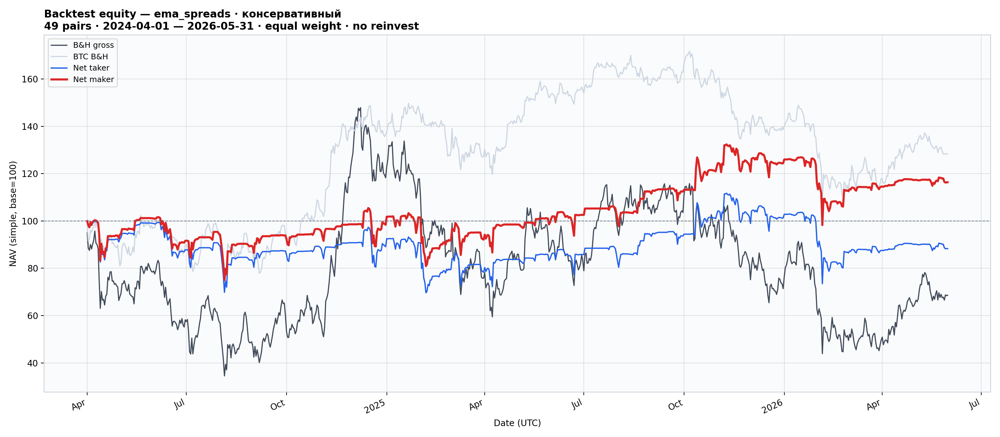
**Рис. EMA-BT-1. Консервативный сценарий (49 пар)**

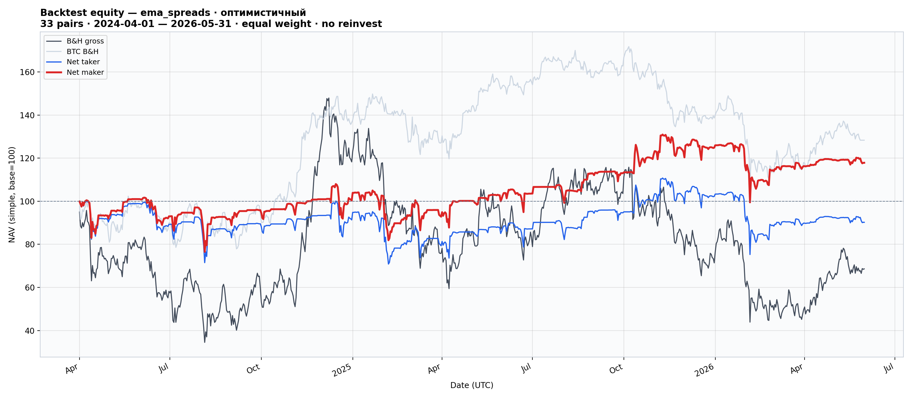
**Рис. EMA-BT-2. Оптимистичный сценарий (33 пары)**

### Ключевые выводы

**1. Gross-альфа подтверждена на out-of-sample.**  
Сигнал b6 → long даёт +32.1% total return при просадке −23.8% (против −31.4% и −70% у B&H 49).

**2. Комиссии — главный враг.**  
Taker (0.20% round-trip) при exposure ~80% превращает положительную gross-доходность в отрицательную net (−10…−12%). Maker (0.072%) сохраняет профит: +16…+18% net.

**3. Отбор пар (оптимистичный) даёт небольшое улучшение.**  
+1.5 п.п. к total return, −1.5 п.п. к просадке относительно консервативного maker.

**4. Сравнение с бенчмарками.**  
Maker-стратегии уступают BTC B&H по CAGR (+7.3–7.9% vs +12.3%), но превосходят по просадке (−24.7–26.2% vs −37.4%). Information Ratio 0.40–0.41 против B&H 49 — умеренная альфа.

**Итог и рекомендация.**  
Сигнал b6 → long статистически подтверждён и даёт gross-альфу, но **только с maker-исполнением** — taker убыточен из-за высокой частоты сделок. Отбор пар по train желателен, но не обязателен. Sharpe 0.21–0.23 указывает, что стратегия — скорее **дополнение** к портфелю, чем его основа. Рекомендуется использовать в комбинации с другими сигналами.

#### Дополнительные материалы (бэктест)

| Материал                                                                                                                                     | Описание                                                    |
| -------------------------------------------------------------------------------------------------------------------------------------------- | ----------------------------------------------------------- |
| [консервативный бэктест EMA](research_outputs/ema/ema_spreads/backtest/ema_spreads_backtest_49pairs_20240401_20260531.log)                 | Полный отчёт, консервативный сценарий (49 пар, b6 long)   |
| [оптимистичный бэктест EMA](research_outputs/ema/ema_spreads/backtest/ema_spreads_backtest_optimistic_b6_33pairs_20240401_20260531.log)     | Полный отчёт, оптимистичный сценарий (33 пары, train-отбор) |

#### Воспроизведение бэктестов (ema_spreads)

Из каталога `crypto_research`:

```bash
cd crypto_research
python3 backtester.py ema_spreads --scenario conservative   # консервативный
python3 backtester.py ema_spreads --scenario optimistic     # оптимистичный
```

Отчёты пишутся в `research_outputs/ema/ema_spreads/backtest/`; графики — в `…/backtest/plots/`.
