# Анализ и выявление воспроизводимых аномалий на криптовалютном рынке

## Цель и описание

Сформировать набор воспроизводимых зависимостей с подтверждённой статистической значимостью на независимых активах (cross‑asset) и непересекающихся временных окнах (out‑of‑time), пригодных для торговой стратегии. Каждое исследование включает статистический анализ, независимую ML-проверку (где применимо) и бэктест на out-of-sample окне.

## Методология

Пул исследования — 49 пар из локального архива Bybit: все пары, у которых первая 1m-свеча ≤ 2023-01-01 (UTC). Это не динамический top-49 по обороту: критерий — достаточная история + ликвидность на момент включения в датасет.

Паттерн считается подтверждённым, если одновременно выполняются два условия:

### 1. Универсальность среди пар (cross‑asset)

Эффект подтверждается на независимой когорте пар (обычно ≥ 60% активов сохраняют направление эффекта).

- **Train**: 24 пары, период 2022-01-01 – 2026-05-31 (ранние данные)
- **Val**: 25 пар, период 2023-01-01 – 2026-05-31 (более новые пары, не пересекаются с train)

### 2. Устойчивость во времени (out‑of‑time)

Эффект сохраняется во втором, непересекающемся временном окне (обычно ≥ 60% активов или единиц наблюдения сохраняют направление)

- **Train**: 49 пар, период 2022-01-01 – 2024-04-01
- **Val**: 49 пар, период 2024-04-01 – 2026-05-31  
  (одни и те же пары, два непересекающихся временных окна)

### ML: Pooled OOS и Mean по фолдам (CPCV)

Во всех ML-разделах на train используется **CPCV**: `n_splits=7`, `n_test_groups=2` → **21 фолд**, `embargo_days=1`. Две таблицы метрик отвечают на **разные** вопросы; расхождение ROC AUC между ними — нормально, это не ошибка.

#### Таблица «Качество модели» — колонка **Pooled OOS (train)**

1. На каждом из 21 фолдов модель обучается заново и предсказывает свой тестовый срез.
2. Одна строка `(day, pair)` попадает в тест в **нескольких** фолдах (обычно ~6 из 21). Для неё OOS-вероятности `P(up)` **усредняются** по фолдам (`build_oos_predictions` в `utils/ml/oos_paths.py`).
3. На получившихся **уникальных** строках train (~32k day × pair) считается **одна** метрика (ROC AUC, accuracy, log loss и т.д.) — это **pooled OOS**.

_Pooled OOS — «какой AUC у финальных усреднённых OOS-вероятностей на train»; эта же pooled-кривая показана на графике ROC AUC (синяя)._

#### Таблица «Стабильность по фолдам» — колонка **Mean**

1. На **каждом** фолде отдельно считается ROC AUC (и accuracy) только по **его** тесту (обычно 6–11k строк).
2. **Mean** — простое среднее 21 значений; **каждый фолд весит одинаково**, независимо от размера теста.
3. Std / Min / Max / «ROC AUC > 0.5» — разброс и доля фолдов выше случайного уровня.

_Mean по фолдам — «насколько стабильно модель на разных временных окнах train»._

#### Почему Pooled OOS ROC AUC часто **ниже** Mean (примеры: RSI 0.507 vs 0.523, EMA 0.527 vs 0.530)

| Причина | Пояснение |
| ------- | --------- |
| **ROC AUC нелинеен** | `mean(AUC_фолд₁…₂₁) ≠ AUC(все строки)` даже без перекрытия фолдов |
| **Усреднение P(up)** | Разные модели дают близкие вероятности → ранжирование up/down **размывается** → pooled AUC падает |
| **Разный вес наблюдений** | Mean: 21 равных веса; pooled: каждый day × pair один раз |

Сумма `n_test` по всем фолдам (~190k) **больше** числа уникальных строк (~32k) именно из‑за перекрытия CPCV; pooled метрика строится только по уникальным строкам после усреднения вероятностей.

## Исследования

### Исследование 1. Эффект дня недели

**Метрика эффекта** — средняя **intraday-доходность open→close (UTC)** по всем календарным дням выбранного дня недели, **pooled** по парам с равным весом:

`(close − open) / open × 100%`

Отрицательное значение — в среднем день закрывается ниже open (удобно для short); положительное — выше open (long).

**Критерии подтверждения:**

- **Cross‑asset (проверка 1):** p-value < 0.0071 (Bonferroni) на train + ≥60% val-пар с тем же знаком, что pooled train
- **Out‑of‑time (проверка 2):** ≥60% пар сохраняют знак среднего open→close во втором периоде

**Порядок раздела:** статистика (проверки 1–2) → ML-подтверждение → бэктест → сводные выводы.

---

#### Проверка 1. Универсальность среди пар (cross‑asset)

24 train-пары (ранние активы) / 25 val-пар (новые активы), период 2022–2026

| День | Train, % | Val, % | Δ     | p-value (train) | Val-пар с тем же знаком | Статус       |
| ---- | -------- | ------ | ----- | --------------- | ----------------------- | ------------ |
| Пн   | -0.02    | +0.09  | +0.11 | 0.7201          | 12/25 (48%)             | ❌ не значим |
| Вт   | -0.12    | -0.15  | -0.03 | 0.0026          | 19/25 (76%)             | ✅ пров. 1  |
| Ср   | +0.24    | +0.30  | +0.06 | 0.0003          | 23/25 (92%)             | ✅ пров. 1  |
| Чт   | -0.34    | -0.47  | -0.13 | <0.0001         | 22/25 (88%)             | ✅ пров. 1  |
| Пт   | +0.27    | +0.53  | +0.26 | 0.0001          | 23/25 (92%)             | ✅ пров. 1  |
| Сб   | +0.23    | +0.32  | +0.10 | 0.0001          | 23/25 (92%)             | ✅ пров. 1  |
| Вс   | -0.20    | -0.18  | +0.02 | <0.0001         | 21/25 (84%)             | ✅ пров. 1  |

_Статус в таблице — результат **только проверки 1**. Финальный торговый статус требует прохождения **обеих** проверок (см. итоговую сводку)._


_Рис. 1a. Накопленная open→close доходность по дням недели: train (24 пары) и val (25 пар), один период 2022–2026. Отдельная линия на каждый weekday._

---

#### Проверка 2. Устойчивость во времени (out‑of‑time)

49 пар, train: 2022-01-01 – 2024-04-01, val: 2024-04-01 – 2026-05-31

| День | Train, % | Val, % | Δ     | p-value (train) | Пар с тем же знаком | Статус       |
| ---- | -------- | ------ | ----- | --------------- | ------------------- | ------------ |
| Пн   | -0.03    | +0.08  | +0.11 | 0.9085          | 29/49 (59%)         | ❌ не значим |
| Вт   | +0.03    | -0.27  | -0.30 | 0.5649          | 24/49 (49%)         | ❌ не значим |
| Ср   | +0.10    | +0.41  | +0.32 | 0.0348          | 28/49 (57%)         | ❌ не значим |
| Чт   | -0.19    | -0.58  | -0.39 | 0.0001          | 36/49 (73%)         | ✅ пров. 2   |
| Пт   | +0.51    | +0.29  | -0.22 | <0.0001         | 39/49 (80%)         | ✅ пров. 2     |
| Сб   | +0.20    | +0.33  | +0.13 | 0.0022          | 34/49 (69%)         | ✅ пров. 2    |
| Вс   | +0.24    | -0.55  | -0.79 | 0.0001          | 15/49 (31%)         | ❌ не значим |


_Рис. 1b. Накопленная open→close доходность: train-период (2022-01-01 – 2024-04-01) и val-период (2024-04-01 – 2026-05-31), 49 пар. Отдельная линия на каждый weekday._

---

#### Итоговая сводка (49 пар, 2022–2026)

| День | Средняя, % | Медиана, % | σ, % | Доля роста | Статус       |
| ---- | ---------- | ---------- | ---- | ---------- | ------------ |
| Пн   | +0.03      | +0.07      | 5.32 | 50.7%      | ❌ не значим |
| Вт   | -0.13      | -0.13      | 4.70 | 51.5%      | ❌ не значим |
| Ср   | +0.27      | -0.05      | 5.35 | 49.3%      | ❌ не значим |
| Чт   | -0.40      | -0.48      | 4.79 | 55.8%      | ✅ значим    |
| Пт   | +0.39      | +0.37      | 5.52 | 54.8%      | ✅ значим    |
| Сб   | +0.27      | +0.10      | 4.50 | 51.7%      | ✅ значим    |
| Вс   | -0.19      | -0.36      | 4.62 | 55.0%      | ❌ не значим |

_Статус «значим» — пересечение проверок 1 и 2 (оба критерия одновременно). «Доля роста» — доля пар с положительной средней intraday-доходностью в этот weekday, не доля дней с close > open._


_Рис. 1с. Накопленная open→close доходность: весь период (2022-01-01 – 2026-05-31), все 49 пар. Выделены дни со статусом «значим» в итоговой сводке._

---

#### ML-подтверждение (LightGBM + CPCV)

**Цель:** проверить, содержит ли признак `weekday` предсказательную способность для направления дневной доходности (`direction_up`), и согласованы ли выводы ML-модели со статистическим анализом средних.

**Данные:** 49 пар (первая свеча ≤ 2023-01-01).  
**Train:** 2022-01-01 – 2024-04-01 (32 407 строк day × pair).  
**Holdout test:** 2024-04-01 – 2026-05-31 (38 563 строк day × pair).  
**Таргет:** `direction_up = 1`, если `close > open` (UTC, open→close).  
**Признаки:** два категориальных признака — `weekday_enc` (0=Пн … 6=Вс) и `pair_id`.

**Модель:** LightGBM (бинарная классификация): `num_leaves=7`, `max_depth=5`, `min_child_samples=80`, `reg_lambda=1.0`, `learning_rate=0.05`, `n_estimators=100`.

**Схема проверки:**  
1) CPCV на train: `n_splits=7`, `n_test_groups=2` → C(7,2)=**21 фолд**, `embargo_days=1`;  
2) финальный fit на всём train;  
3) однократная holdout-оценка на test.

##### Качество модели: train fit vs pooled OOS vs holdout test

| Метрика  | Train (fit) | Pooled OOS (train) | Holdout test | Δ (Test − OOS) |
| -------- | ----------- | ------------------ | ----------- | ------------- |
| Accuracy | 0.540       | 0.491              | 0.518       | +0.027        |
| ROC AUC  | 0.558       | 0.488              | **0.529**   | +0.041        |
| Log Loss | 0.688       | 0.701              | 0.693       | -0.008        |
| Brier    | 0.247       | 0.254              | 0.250       | -0.004        |
| ECE      | 0.3%        | 5.1%               | 2.9%        | -2.2 п.п.     |

_Train (fit) — финальная модель на всём train, in-sample (те же 32 407 строк). Pooled OOS — CPCV cv-test на train. Holdout test — внешний тест на 2024-04–2026-05._


_Рис. 1c-ml. ROC-кривые pooled train OOS (CPCV, синяя) и holdout test (финальная модель, оранжевая). AUC — ранжирование по всем строкам (day × pair)._

##### Стабильность по фолдам (train CPCV, 21 фолд)

| Метрика  | Mean | Std  | Min  | Max  | IQR  | CV, % |
| -------- | ---- | ---- | ---- | ---- | ---- | ----- |
| Accuracy | 0.492 | 0.015 | 0.466 | 0.519 | 0.027 | 3.1 |
| ROC AUC  | 0.493 | 0.017 | 0.459 | 0.526 | 0.028 | 3.5 |
| Log Loss | 0.703 | 0.006 | 0.693 | 0.713 | 0.008 | 0.8 |

_Пороговая проверка: ROC AUC > 0.5 в **7/21** фолдах, Accuracy > 0.5 в **8/21** фолдах._

_Как считаются **Pooled OOS** и **Mean по фолдам** — см. [ML: Pooled OOS и Mean по фолдам (CPCV)](#ml-pooled-oos-и-mean-по-фолдам-cpcv)._

##### Сравнение со статистическим анализом

Статистика — итоговая сводка 49 пар, **2022–2026**. ML — вероятности финальной модели на train (теперь зависят и от `pair_id`). **Согласие знака** — только для дней со статусом «значим» в итоговой сводке: знак средней intraday совпадает с полушарием `P(up)` относительно 0.5; для остальных — «н/п».

| День | Статистика (средняя intraday, %) | ML P(up), final train-fit | Согласие знака |
| ---- | -------------------------------- | ------------------------- | -------------- |
| Пн   | +0.03 (нейтрально)               | 0.49                      | н/п            |
| Вт   | −0.13 (слабый down)              | 0.51                      | н/п            |
| Ср   | +0.27 (слабый up)                | 0.49                      | н/п            |
| Чт   | **−0.40** (значим, down)         | **0.46**                  | ✅ да          |
| Пт   | **+0.39** (значим, up)           | **0.56**                  | ✅ да          |
| Сб   | **+0.27** (значим, up)           | 0.52                      | ✅ да          |
| Вс   | −0.19 (слабый down)              | 0.48                      | н/п            |


_Рис. 1d. Train CPCV: средняя OOS P(direction_up) по календарным дням, отдельно для каждого weekday._


_Рис. 1e. Holdout test: прогнозы финальной train-модели на независимом периоде._


_Рис. 1f. Reliability curve для holdout test (pooled + по weekday)._

**Краткий итог ML:** на полном горизонте (train + holdout test, согласованно со статистикой) эффект дня недели проявляется в ранжировании и знаке `P(up)` на значимых днях (Чт, Пт, Сб). На коротких окнах CPCV внутри train сигнал остаётся умеренным: pooled OOS ROC AUC ≈ 0.488, средний fold ROC AUC ≈ 0.493, тогда как на независимом holdout test финальная модель даёт ROC AUC ≈ 0.529 (Brier 0.250, ECE 2.9%). **Вывод:** сигнал устойчивее на длинных участках, но с `pair_id` появляется дополнительная межпарная структура.

---

### Историческое тестирование стратегии day_of_week (out-of-sample)

**Out-of-sample период** совпадает с val-окном исследования (устойчивость во времени): **2024-04-01 — 2026-05-31 (UTC)**.  
Сигналы сформированы на train (2022-01-01 — 2024-04-01) и не пересматривались.

#### Правила стратегии

| День (UTC)           | Позиция | Доходность позиции           |
| -------------------- | ------- | ---------------------------- |
| **Четверг**          | short   | (open − close) / open × 100% |
| **Пятница, суббота** | long    | (close − open) / open × 100% |
| Пн–Ср, Вс            | flat    | 0%                           |

- Каждая активная пара получает **фиксированную долю 1/peak_pairs** капитала (без реинвестирования, NAV=100). **peak_pairs** — максимум пар, допущенных в один день; в самый загруженный день занято ~100% капитала, в лёгкие дни — меньше. Консервативный: peak=49 (~2.0% на пару); оптимистичный: peak=33 (макс. в Чт, ~3.0% на пару); ML: peak=34 (макс. в Пт, ~2.9% на пару).
- **Exposure:** ~42.7% (336 торговых дней из 787; средняя доля капитала в рынке с учётом peak-весов)
- **Комиссии** (Bybit USDT Perpetual, non-VIP): taker 0.200% round-trip, maker 0.072% round-trip
- **Бенчмарки:** равновесный B&H 49 пар (gross) и BTC B&H (gross)
- **Формат отчётов:** equity и гистограмма — **gross** (бирюзовая) + **net maker** (красная); drawdown и корреляция — net maker. В логе: сводка портфеля — taker / gross / maker; таблицы по дням — net maker и gross; skew/VaR — gross vs net maker. **Win Rate, Profit Factor, median/σ/skew/kurtosis и VaR/CVaR** — по **сделкам** (активные пары в торговый день); Total Return, CAGR, Sharpe, MaxDD — по **дням портфеля**.

#### Сценарии тестирования

| Сценарий           | Описание                                                                                               |
| ------------------ | ------------------------------------------------------------------------------------------------------ |
| **Консервативный** | Все 49 пар на каждый торговый день                                                                     |
| **Оптимистичный**  | Отбор пар по train-периоду: знак эффекта подтверждён в ≥⅔ лет (Чт: 33 пары, Пт: 31, Сб: 23, union: 40) |
| **ML (`day_of_week_ml`)** | **Отбор пар (допуск к торговле в конкретный день недели):**<br>— для каждой ячейки `(день, пара)` **score** по CPCV train: `0.7·abs(mean_p_up − base_rate) + 0.3·max(0, accuracy − 0.5) + 0.2·abs(mean_p_up − 0.5)`<br>— глобальный порог по всем парам: `score_cutoff = quantile(score, score_quantile)` (0.5); пара в списке дня при `score ≥ score_cutoff` и `n_test ≥ min_obs` (50); <br>**Пороги long / short (одинаковые для всех пар):**<br>— `mean_p_up > 0.5`: квантиль `long_quantile` (0.25) → `t_long` (min 0.5)<br>— `mean_p_up < 0.5`: квантиль `short_quantile` (0.75) → `t_short` (max 0.5) |

#### Сводная таблица полученных метрик (val, 2024-04-01 — 2026-05-31)

| Метрика                       | Консервативный (49 пар, taker) | Консервативный (49 пар, maker) | Оптимистичный (отбор, taker) | Оптимистичный (отбор, maker) | ML (maker) | B&H 49 пар (gross) | BTC B&H (gross)  |
| ----------------------------- | ------------------------------ | ------------------------------ | ---------------------------- | ---------------------------- | ---------- | ------------------ | ---------------- |
| Total Return                  | +66.0%                         | +109.0%                        | +79.7%                       | **+117.5%**                  | +87.6%     | −32.2%             | +28.3%           |
| CAGR (compounded)             | +26.5%                         | +40.8%                         | +31.3%                       | **+43.4%**                   | +33.9%     | −16.5%             | +12.3%           |
| Sharpe (0% rf)                | 0.65                           | 1.06                           | 0.83                         | **1.22**                     | 1.12       | −0.21              | 0.28             |
| Sharpe / √exposure            | 0.99                           | 1.63                           | 1.27                         | **1.87**                     | 1.12       | −0.21              | 0.28             |
| Max Drawdown                  | −37.7%                         | −32.7%                         | −31.8%                       | **−27.4%**                   | −32.5%     | −70.3%             | −37.4%           |
| Recovery from max DD          | 140 дн.                        | 33 дн.                         | 140 дн.                      | **27 дн.**                   | 137 дн.    | не восстановился   | не восстановился |
| Longest underwater            | 365 дн.                        | 307 дн.                        | 363 дн.                      | 307 дн.                      | 247 дн.    | 535 дн.            | **233 дн.**      |
| % time in drawdown            | 92.2%                          | 88.2%                          | 90.7%                        | **86.7%**                    | 90.3%      | 98.1%              | 94.3%            |
| Calmar                        | 0.81                           | 1.55                           | 1.16                         | **1.99**                     | 1.25       | −0.21              | 0.35             |
| Profit Factor                 | 1.13                           | 1.22                           | 1.17                         | **1.26**                     | 1.17       | 0.98               | 1.04             |
| Win Rate (trades)             | 51.6%                          | 53.5%                          | 52.4%                        | **54.2%**                    | 53.3%      | 47.8%              | 50.2%            |
| Median trade return           | +0.105%                        | +0.233%                        | +0.185%                      | **+0.313%**                  | +0.224%    | −0.165%            | +0.007%          |
| Information Ratio (vs B&H 49) | 0.60 (taker)                   | 0.86 (maker)                   | 0.67 (taker)                 | **0.90 (maker)**             | 0.75       | —                  | —                |
| Worst day (net)               | −22.5% (2025-10-10, Пт)        | −22.3% (2025-10-10, Пт)        | −22.1% (2025-10-10, Пт)      | −21.9% (2025-10-10, Пт)      | −21.6% (2025-10-10, Пт) | −22.3% | **−14.0%**       |


**Рис. 2. ML-сценарий (day_of_week_ml)** — 49 пар, val (2024-04-01 — 2026-05-31). Бирюзовая — gross, красная — net maker; серые — B&H 49 и BTC.


**Рис. 3. Оптимистичный сценарий** — 40 пар (train-отбор), val. Бирюзовая — gross, красная — net maker; нижний ряд — вклад по дням (Чт / Пт / Сб).

#### Выводы по сводной таблице

- Все активные сценарии превосходят B&H 49 пар и BTC B&H по CAGR и MaxDD на val-окне.
- Maker-исполнение добавляет ~14 п.п. к CAGR относительно taker; разница в recovery time завышена пиком августа 2024 — надёжнее смотреть longest underwater (307 vs 363 дн.).
- Лучший классический сценарий — **оптимистичный maker**: CAGR +43.4%, Sharpe 1.22, MaxDD −27.4%, IR 0.90 vs B&H 49.
- Отбор пар по train даёт ~+2.6 п.п. CAGR при ~+5 п.п. к MaxDD (меньше просадка) относительно консервативного maker.

#### Вклад по дням недели (оптимистичный, net maker)

| День           | Total Ret | Avg trade | Sharpe | MaxDD  | Skewness (net maker) |
| -------------- | --------- | --------- | ------ | ------ | -------------------- |
| **Чт** (short) | +59.4%    | +0.530%   | 0.99   | −16.4% | −0.65                |
| **Пт** (long)  | +29.5%    | +0.280%   | 0.44   | −27.8% | **+1.79**            |
| **Сб** (long)  | +28.7%    | +0.367%   | 0.82   | −11.4% | +2.59                |


**Рис. 4. Drawdown — оптимистичный сценарий** — общий (жирная красная, net maker) и вклад по дням (Чт / Пт / Сб).


**Рис. 5. Корреляция дневных доходностей — оптимистичный сценарий**

- **Четверг и суббота** — основной вклад в доходность (наибольший Total Ret и Sharpe).
- **Пятница** — слабое звено по риску (низкий Sharpe, глубокая просадка, высокий kurtosis 30.0 при skew +1.79).
- **Корреляция Пт ↔ Сб** — +0.41 (умеренная, частичная диверсификация).

#### Распределение доходностей по сделкам (оптимистичный, net maker)

| Показатель          | Значение |
| ------------------- | -------- |
| Skewness            | +1.29    |
| Kurtosis            | 24.45    |
| 1% VaR (per trade)  | −13.6%   |
| 1% CVaR             | −20.3%   |
| 5% VaR              | −7.0%    |
| 5% CVaR             | −11.5%   |


**Рис. 6. Распределение доходностей по сделкам — оптимистичный сценарий** (gross + net maker)

Положительная асимметрия по сделкам сочетается с «толстыми хвостами» (kurtosis 24.5) и глубоким 1% CVaR −20.3% — редкие крупные убытки на уровне отдельных позиций (см. ограничения ниже).

#### Ограничения и риски

- Результаты out-of-sample по времени, но **не гарантируют** сохранение эффекта в будущем.
- **Пятница** — наименее устойчивый день (Sharpe 0.44, MaxDD −27.8%, kurtosis 30.0); худший день портфеля −21.9% (2025-10-10, Пт).
- **Комиссии** существенны: taker-исполнение съедает ~68 п.п. от gross до net.
- **Capacity / проскальзывание:** не моделируются (предполагается идеальное maker-исполнение).
- CVaR 1% по сделкам = −20.3% указывает на хвостовые убытки отдельных позиций при умеренном win rate ~54%.

#### Ключевые выводы (исследование 1)

| День | Направление | Cross‑asset | Out‑of‑time | ML P(up) | ECE | Sharpe (opt maker) |
| ---- | ----------- | ----------- | ----------- | -------- | --- | ------------------ |
| **Чт** | short | 22/25 (88%) | 36/49 (73%) | 0.46 | 3.6% | 0.99 |
| **Пт** | long | 23/25 (92%) | 39/49 (80%) | 0.56 | 2.1% | 0.44 |
| **Сб** | long | 23/25 (92%) | 34/49 (69%) | 0.52 | 0.8% | 0.82 |

**Отсеяны:** Вт, Ср, Вс (прошли cross‑asset, не прошли out‑of‑time); Пн (не прошёл ни один фильтр). Воскресенье: знак эффекта меняется между train и val (+0.24% → −0.55%), несмотря на значимость в проверке 1.

**Согласование слоёв:** статистика и ML сходятся по знаку на значимых днях (Чт, Пт, Сб); торговая стратегия опирается именно на них. Бэктест (opt maker, val 2024–2026): CAGR +43.4%, Sharpe 1.22, MaxDD −27.4%, IR 0.90 vs B&H 49.

**Итог:** паттерн «short Чт + long Пт, Сб» воспроизводим на независимых парах и во времени; практическая реализация требует maker-комиссий. Основной риск — хвостовые убытки в пятницу; суббота — вспомогательный, но более стабильный long-день.

#### Дополнительные материалы и воспроизведение

| Материал | Описание |
| -------- | -------- |
| [weekday_summary.log](research_outputs/day_of_week/statistics/weekday_summary.log) | Сводные таблицы проверок 1–2 и итоговая |
| [24 train-пары](research_outputs/day_of_week/statistics/weekday_statistics_24pairs_20220101_20260531_train.log) | Проверка 1 — train-когорта |
| [25 val-пар](research_outputs/day_of_week/statistics/weekday_statistics_25pairs_20220101_20260531_val.log) | Проверка 1 — val-когорта |
| [train 2022–2024-04](research_outputs/day_of_week/statistics/weekday_statistics_49pairs_20220101_20240401.log) | Проверка 2 — train-период |
| [val 2024-04–2026](research_outputs/day_of_week/statistics/weekday_statistics_49pairs_20240401_20260531.log) | Проверка 2 — val-период |
| [49 пар, 2022–2026](research_outputs/day_of_week/statistics/weekday_statistics_49pairs_20220101_20260531.log) | Итоговая детальная статистика |
| [ML: train/test JSON](research_outputs/day_of_week/ml/metrics/weekday_direction_49pairs_20220101_20260531_train_test.json) | Полный отчёт: train CPCV + final fit + holdout test |
| [ML: train CPCV P(up)](research_outputs/day_of_week/ml/plots/weekday_direction_49pairs_20220101_20240401_oos_prob.png) | OOS-вероятности по weekday на train CPCV |
| [ML: train CPCV калибровка](research_outputs/day_of_week/ml/plots/weekday_direction_49pairs_20220101_20240401_oos_calibration.png) | Reliability curve на train CPCV |
| [ML: holdout test P(up)](research_outputs/day_of_week/ml/plots/weekday_direction_49pairs_20240401_20260531_oos_prob.png) | Прогнозы финальной train-модели на holdout test |
| [ML: holdout test калибровка](research_outputs/day_of_week/ml/plots/weekday_direction_49pairs_20240401_20260531_oos_calibration.png) | Reliability curve на holdout test |
| [ML: ROC AUC train vs test](research_outputs/day_of_week/ml/plots/weekday_direction_49pairs_20220101_20260531_roc_auc.png) | ROC-кривые Pooled OOS (train) и Holdout test |
| [ML: модель + энкодеры](research_outputs/day_of_week/ml/models/weekday_direction_49pairs_20220101_20240401_model_bundle.pkl) | Bundle: LightGBM + feature schema + classes |
| [ML: лог](research_outputs/day_of_week/ml/weekday_direction_20220101_20260531.log) | Лог train/test запуска |
| [бэктест консервативный](research_outputs/day_of_week/backtest/day_of_week_backtest_49pairs_20240401_20260531.log) | Полный отчёт, 49 пар |
| [бэктест оптимистичный](research_outputs/day_of_week/backtest/day_of_week_backtest_optimistic_thu33_pt31_sb23_20240401_20260531.log) | Полный отчёт, отбор по train |
| [ML: policy](research_outputs/day_of_week/ml/policies/weekday_direction_49pairs_20220101_20260531_policy.json) | Frozen отбор пар + пороги t_long/t_short |
| [бэктест ML](research_outputs/day_of_week/backtest/day_of_week_ml_backtest_ml_49pairs_20240401_20260531.log) | day_of_week_ml, holdout test |
| [ML equity curve](research_outputs/day_of_week/backtest/plots/equity_curve_ml_49pairs_20240401_20260531.png) | equity curve ML |

Из каталога `crypto_research` (нужны `*_klines_1m.jsonl` в `load_data_from_bybit/data` или `CRYPTO_DATA_DIR`):

```bash
cd crypto_research

# Статистика
python3 report_generator.py day_of_week --summary
python3 report_generator.py day_of_week --train --from-date 2022-01-01 --to-date 2026-05-31
python3 report_generator.py day_of_week --val   --from-date 2022-01-01 --to-date 2026-05-31
python3 report_generator.py day_of_week --from-date 2022-01-01 --to-date 2024-04-01 --max-pair-start 2023-01-01
python3 report_generator.py day_of_week --from-date 2024-04-01 --to-date 2026-05-31 --max-pair-start 2023-01-01
python3 report_generator.py day_of_week --from-date 2022-01-01 --to-date 2026-05-31 --max-pair-start 2023-01-01

# ML (train/test по умолчанию: 49 пар, train 2022-01-01–2024-04-01, test 2024-04-01–2026-05-31)
python3 ml_research.py
# один период CPCV без holdout:
# python3 ml_research.py --no-train-test --from-date 2023-01-01 --to-date 2026-05-31

# Бэктест
python3 backtester.py day_of_week --scenario conservative
python3 backtester.py day_of_week --scenario optimistic
python3 ml_calibrate_policy.py
python3 backtester.py day_of_week_ml
```

Артефакты: `research_outputs/day_of_week/statistics/`, `…/ml/`, `…/backtest/`.

---

### Исследование 2. Расстояние между ценой и EMA

Исследование проводится в **два этапа**:

1. **Этап 0 — выбор периода EMA** (`ema_period_screen`): на **train-периоде** (49 пар, 2022-01-01 – 2024-04-01) сравниваем кандидатов **5, 9, 12, 20, 50, 100, 200** по устойчивости сигнала. Это **не** проверка значимости — только фиксация периода для этапов 1–3.
2. **Этапы 1–3 — паттерн** (`ema_spreads` с **EMA(9)**): универсальность среди пар и устойчивость во времени (по критериям из методологии).

---

### Этап 0. Выбор периода EMA (только train)

**Цель:** определить период EMA с наиболее устойчивой связью «вчерашнее отклонение → сегодняшний intraday return».

**Условие (вчера):** `dev = (close − EMA) / EMA × 100%`. Бакеты b0–b6 — по индивидуальным квантилям каждой пары:

| Бакет | Условие          | Бакет | Условие           |
| ----- | ---------------- | ----- | ----------------- |
| b0    | dev > t2⁺        | b4    | t2⁻ ≤ dev < −near |
| b1    | t1⁺ < dev ≤ t2⁺  | b5    | t1⁻ ≤ dev < t2⁻   |
| b2    | near < dev ≤ t1⁺ | b6    | dev < t1⁻         |
| b3    | \|dev\| ≤ near   |       |                   |

_t1⁺/t2⁺ — ⅓ и ⅔ квантили среди dev>0; t1⁻/t2⁻ — ⅓ и ⅔ среди dev<0 (t1⁻ ≤ t2⁻); near = max(Q10(dev), 0.05%)._

**Метрика скрининга:** Δ к BASE в колонках «Цена росла» / «Цена падала» (п.п.) — насколько доля дней с ростом/падением open→close в бакете отличается от безусловной. Значимая ячейка: \|Δ\| ≥ 1.5 п.п.

**Индекс стабильности** (25% на каждую компоненту):

1. ср.\|Δ\| (нормировка)
2. ср.кварталы % (согласие знака Δ по календарным кварталам)
3. ср.пары % (согласие по парам)
4. число значимых ячеек (нормировка)

**Результаты (49 пар, train: 2022-01-01 – 2024-04-01, 9 кварталов):**

| #   | EMA   | ср.\|Δ\|, п.п. | Ср.кварт. | Ср.пары | Знач. | Индекс % |
| --- | ----- | -------------- | --------- | ------- | ----- | -------- |
| 1   | **9** | **3.4**        | **84%**   | **79%** | 8     | **87.6** |
| 2   | 12    | 3.1            | 81%       | 81%     | 8     | 85.1     |
| 3   | 5     | 3.0            | 76%       | 73%     | 9     | 84.8     |
| 4   | 20    | 3.1            | 83%       | 75%     | 8     | 84.5     |
| 5   | 50    | 3.4            | 74%       | 75%     | 8     | 84.3     |
| 6   | 100   | 3.4            | 78%       | 81%     | 7     | 84.2     |
| 7   | 200   | 3.0            | 71%       | 70%     | 9     | 82.4     |

**Выбран EMA(9)** — максимальный индекс стабильности (87.6%), наибольшая сила эффекта (3.4 п.п.), 84% согласия по кварталам, 79% по парам.

### Этапы 1–3. Валидация паттерна EMA(9)

**Метрика:** условная связь вчерашнего dev от EMA(9) с сегодняшним intraday return. Анализируются колонки **«Цена росла»** / **«Цена падала»** (Δ от BASE в п.п.).

**Критерии:** |Δ| ≥ 1.5 п.п. на train, p < 0.0036 (Bonferroni, 14 ячеек), cross‑asset ≥60% val-пар, out‑of‑time ≥60% пар.

_Показаны только ячейки, прошедшие |Δ| ≥ 1.5 п.п. на train:_

#### Проверка 1: универсальность среди пар (24 train / 25 val, 2022–2026)

| Сигнал           | Δ train | Δ val | p-value | Val-пар (≥60%) | Статус       |
| ---------------- | ------- | ----- | ------- | -------------- | ------------ |
| b0 × Цена росла  | −2.59   | −2.51 | 0.0001  | 18/25 (72%)    | ✅ значим    |
| b0 × Цена падала | +2.80   | +2.65 | <0.0001 | 20/25 (80%)    | ✅ значим    |
| b2 × Цена росла  | −2.60   | −0.67 | 0.0009  | 14/25 (56%)    | ❌ не значим |
| b2 × Цена падала | +2.66   | +0.44 | 0.0006  | 15/25 (60%)    | ✅ значим\*  |
| b3 × Цена росла  | −2.15   | −0.74 | 0.0132  | 13/25 (52%)    | ❌ не значим |
| b3 × Цена падала | +2.31   | +0.33 | 0.0066  | 11/25 (44%)    | ❌ не значим |
| b6 × Цена росла  | +4.23   | +3.15 | <0.0001 | 24/25 (96%)    | ✅ значим    |
| b6 × Цена падала | −4.22   | −3.00 | <0.0001 | 23/25 (92%)    | ✅ значим    |


_Рис. EMA-1a. Δ к BASE на train и val (п.п.). Зелёная заливка — статус «значим» по проверке 1._

#### Проверка 2. Устойчивость во времени (49 пар, train 2022–2024-04 / val 2024-04–2026)

| Сигнал           | Δ train | Δ val | p-value | Пар (≥60%)  | Статус       |
| ---------------- | ------- | ----- | ------- | ----------- | ------------ |
| b0 × Цена росла  | −4.64   | −0.70 | <0.0001 | 27/49 (55%) | ❌ не значим |
| b0 × Цена падала | +4.99   | +0.68 | <0.0001 | 28/49 (57%) | ❌ не значим |
| b6 × Цена росла  | +3.47   | +4.23 | <0.0001 | 43/49 (88%) | ✅ значим    |
| b6 × Цена падала | −3.41   | −4.22 | <0.0001 | 41/49 (84%) | ✅ значим    |


_Рис. EMA-1b. Δ к BASE на train-периоде и val-периоде (п.п.). Зелёная заливка — статус «значим» по проверке 2._

### Ключевые выводы

После двух проверок (cross‑asset + out‑of‑time) подтверждён **только сигнал перепроданности b6**:

| Бакет              | Сигнал        | Δ         | Смысл для стратегии                       |
| ------------------ | ------------- | --------- | ----------------------------------------- |
| **b6** (dev < t1⁻) | Цена росла ↑  | +3.8 п.п. | После сильного падения — завтра чаще рост |
| **b6**             | Цена падала ↓ | −3.7 п.п. | …и реже падение (отскок вверх)            |

_Справочно: на всём периоде 2022–2026 сигнал b6 показывает согласие в 48/49 пар (98%) и 5/5 лет (100%)._

**Что отсеялось:**

- **b0** (перекупленность) — прошёл cross‑asset (72–80%), но **не прошёл out‑of‑time** (55–57% пар)
- **b2, b3** — прошли train, но не прошли cross‑asset (44–60%) или out‑of‑time (<60%)
- **b1, b4, b5** — |Δ| на train ниже порога материальности

**Итог:** устойчивый mean-reversion на **EMA(9)** работает только **на перепроданности (b6)**. Сигнал перекупленности (b0) слабее и не выдерживает out‑of‑time проверку.

#### ML-подтверждение (LightGBM + CPCV)

**Цель:** проверить, содержит ли нормированное вчерашнее отклонение цены от EMA(9) (`ema_dev_pair_norm`) предсказательную способность для `direction_up`, и согласованы ли выводы ML со статистическим сигналом **b6**.

**Данные:** 49 пар (первая свеча ≤ 2023-01-01).  
**Train:** 2022-01-01 – 2024-04-01 (31 966 строк day × pair).  
**Holdout test:** 2024-04-01 – 2026-05-31 (38 122 строк).  
**Таргет:** `direction_up = 1`, если `close > open`.  
**Признаки:** `pair_id` (категориальный) + `ema_dev_pair_norm` (вчерашний dev от EMA(9), нормировка по train-границам пары, trim 5–95%).

**Модель:** LightGBM, полный fit на всём train (`n_estimators=100`, early stopping по умолчанию отключён).

**Схема:** CPCV на train (`n_splits=7`, `n_test_groups=2` → 21 фолд) → финальный fit на train → holdout test.

##### Качество модели

| Метрика  | Train (fit) | Pooled OOS (train) | Holdout test | Δ (Test − OOS) |
| -------- | ----------- | ------------------ | ------------ | -------------- |
| Accuracy | 0.571       | 0.517              | 0.505        | −0.012         |
| ROC AUC  | 0.602       | 0.527              | **0.513**    | −0.015         |
| Log Loss | 0.679       | 0.694              | 0.698        | +0.004         |
| Brier    | 0.243       | 0.250              | 0.252        | +0.002         |
| ECE      | 2.9%        | 2.8%               | 4.0%         | +1.2 п.п.      |


##### Стабильность по фолдам (train CPCV, 21 фолд)

| Метрика  | Mean  | Std   | Min   | Max   | ROC AUC > 0.5 |
| -------- | ----- | ----- | ----- | ----- | ------------- |
| ROC AUC  | 0.530 | 0.007 | 0.520 | 0.546 | 21/21         |
| Accuracy | 0.516 | 0.006 | 0.504 | 0.531 | 21/21         |

_Как считаются **Pooled OOS** и **Mean по фолдам**, и почему ROC AUC между ними различается — см. [ML: Pooled OOS и Mean по фолдам (CPCV)](#ml-pooled-oos-и-mean-по-фолдам-cpcv)._


_Рис. EMA-ML-1. Предсказательная сила модели по бинам `ema_dev_pair_norm`: train-fit (слева) и holdout test (справа). Отрицательные значения ≈ перепроданность (b6)._

**Краткий итог ML:** слабый, но устойчивый сигнал на train-CPCV (pooled OOS ROC AUC ≈ 0.527), на holdout после полного fit остаётся умеренным (ROC AUC ≈ 0.513). На holdout модель смещена в long (`pred_up_rate` ~53% при `base_rate_up` 48%). ML показывает рост предсказательной силы симметрично на обоих экстремальных хвостах `ema_dev_pair_norm`; в центре edge нет. Это согласуется со статистикой на train (b0 и b6), тогда как аналитика out-of-time устойчиво подтверждает только b6.

#### Дополнительные материалы (исследование)

| Материал                                                                                                                                       | Описание                                                                                           |
| ---------------------------------------------------------------------------------------------------------------------------------------------- | -------------------------------------------------------------------------------------------------- |
| [ema_period_screen train](research_outputs/ema/ema_spreads/statistics/ema_period_screen_49pairs_ema5_9_12_20_50_100_200_20220101_20240401.log) | Этап 0 — скрининг периодов EMA (49 пар, train 2022-01-01 – 2024-04-01), значимые ячейки по бакетам |
| [ema_summary_ema9.log](research_outputs/ema/ema_spreads/statistics/ema_summary_ema9.log)                                                       | Этапы 1–3 — проверки 1–2 и итог: универсальность среди пар, устойчивость во времени, полный пул    |
| [ema_spreads EMA(9), 49 пар](research_outputs/ema/ema_spreads/statistics/ema_spreads_49pairs_ema9_20220101_20260531.log)                       | Этапы 1–3 — детальная статистика: 12 колонок, High/Low, repeatability (годы/пары)                  |
| [ML: train/test JSON](research_outputs/ema/ema_spreads/ml/metrics/direction_ema_49pairs_20220101_20260531_train_test.json)                     | Полный отчёт: train CPCV + final fit + holdout test                                                |
| [ML: ROC AUC train vs test](research_outputs/ema/ema_spreads/ml/plots/direction_ema_49pairs_20220101_20260531_roc_auc.png)                   | ROC-кривые pooled OOS (train) и holdout test                                                       |
| [ML: predictive vs ema_dev](research_outputs/ema/ema_spreads/ml/plots/direction_ema_49pairs_20240401_20260531_ema_dev_predictive.png)        | ROC AUC / accuracy по бинам `ema_dev_pair_norm` (train \| val)                                     |
| [ML: модель + bounds](research_outputs/ema/ema_spreads/ml/models/direction_ema_49pairs_20220101_20240401_model_bundle.pkl)                 | Bundle: LightGBM + pair bounds + feature schema                                                      |
| [ML: лог](research_outputs/ema/ema_spreads/ml/direction_ema_20220101_20260531.log)                                                           | Лог train/test запуска                                                                               |

#### Воспроизведение отчётов (исследование)

Из каталога `crypto_research` (нужны `*_klines_1m.jsonl` в `load_data_from_bybit/data` или `CRYPTO_DATA_DIR`):

```bash
cd crypto_research

python3 report_generator.py ema_period_screen # Этап 0: скрининг периодов EMA (train 2022-01-01 – 2024-04-01 по умолчанию)
python3 report_generator.py ema_spreads --summary # Этапы 1–3: сводка train/val (проверки 1–2 + итог) — ema_summary_ema9.log

python3 report_generator.py ema_spreads \  # Этапы 1–3: детальный отчёт EMA(9) — все колонки, repeatability
  --from-date 2022-01-01 --to-date 2026-05-31 --max-pair-start 2023-01-01 \
  --ema-periods 9

# ML (train/test: 49 пар, train 2022-01-01–2024-04-01, test 2024-04-01–2026-05-31)
python3 ml_research.py ema_spreads_ml --plot-metrics-over-feature
# пересборка predictive-графика из bundle:
# python3 utils/ml/plot_feature_predictive.py ema_spreads_ml
```

Отчёты пишутся в `research_outputs/ema/ema_spreads/statistics/`; графики — в `…/statistics/plots/`. ML-артефакты — в `…/ml/`.

---

### Историческое тестирование стратегии ema_spreads (out-of-sample)

**Out-of-sample период** = val-окно исследования: **2024-04-01 — 2026-05-31 (UTC)**.  
Пороги b6 заморожены на train (2022-01-01 — 2024-04-01).

#### Правила стратегии

| Условие (вчера, UTC close) | Позиция | Доходность                     |
| -------------------------- | ------- | ------------------------------ |
| **b6** (dev < t1⁻, EMA(9)) | long    | `(close − open) / open × 100%` |
| Остальные бакеты           | flat    | 0%                             |

- Равный **peak-вес 1/N** на пару (N = 49 конс. / 33 опт. / **44 ML**), без реинвестирования, NAV=100
- **Exposure:** ~82% (конс.) / ~79% (опт.) / **~98% (ML)**
- **Комиссии** (Bybit non-VIP): taker 0.200% round-trip, maker 0.072%
- **Бенчмарки:** B&H 49 пар (gross), BTC B&H (gross)
- **Формат отчётов:** как у `day_of_week` — графики gross + net maker; в логе сводка taker/gross/maker, таблицы по дням — net maker и gross. WR/PF/median/skew/VaR — **по сделкам**; Total Return, CAGR, Sharpe, MaxDD — **по дням портфеля**.

#### Сценарии

| Сценарий | Описание |
|----------|----------|
| **Консервативный** | Все 49 пар на каждый сигнал b6 |
| **Оптимистичный** | Отбор по train: b6 × «Цена росла», знак Δ + ≥⅔ лет (**33 пары**) |
| **ML (`ema_spreads_ml`)** | **Отбор пар (global pool, без weekday):**<br>— для каждой ячейки `(день, пара)` **score** по CPCV train: `0.7·abs(mean_p_up − base_rate) + 0.3·max(0, accuracy − 0.5) + 0.2·abs(mean_p_up − 0.5)`<br>— агрегация score по паре через все дни недели (взвешенно по `n_test`)<br>— глобальный порог: `score_cutoff = quantile(score, score_quantile)` (**0.1**); пара в пуле при `score ≥ score_cutoff` и `n_test_total ≥ min_obs` (**60**) → **44 пары**<br>**Пороги long / short (одинаковые для всех пар):**<br>— `long_quantile` (**0.999**) → `t_long` (**0.57**)<br>— `short_quantile` (**0.0001**) → `t_short` (**0.28**)<br>— long если `P(up) ≥ t_long`, short если `P(up) ≤ t_short`, иначе flat; признак `ema_dev_pair_norm` + `pair_id` |

#### Результаты (val, 2024-04-01 — 2026-05-31)

| Метрика                       | Конс. (49 пар, gross) | Конс. (49 пар, taker) | Конс. (49 пар, maker) | Опт. (33 пары, gross) | Опт. (33 пары, taker) | Опт. (33 пары, maker) | ML (44 пар, gross) | ML (44 пар, taker) | ML (44 пар, maker) | B&H 49 пар (gross) | BTC B&H (gross) |
| ----------------------------- | --------------------- | --------------------- | --------------------- | --------------------- | --------------------- | --------------------- | ------------------ | ------------------ | ------------------ | ------------------ | ---------------- |
| Total Return                  | +33.6%                | −9.8%                 | +18.0%                | +35.3%                | −7.5%                 | +19.9%                | +27.2%             | +3.7%              | +18.7%             | −32.2%             | **+28.3%**       |
| CAGR (compounded)             | +14.4%                | −4.7%                 | +8.0%                 | +15.1%                | −3.6%                 | +8.8%                 | +11.8%             | +1.7%              | +8.3%              | −16.5%             | **+12.3%**       |
| Sharpe (0% rf)                | +0.43                 | −0.13                 | +0.23                 | +0.46                 | −0.10                 | +0.26                 | **+0.60**          | +0.08              | +0.41              | −0.21              | **+0.28**        |
| Sharpe / √exposure            | +0.47                 | −0.14                 | +0.25                 | +0.51                 | −0.11                 | +0.29                 | **+0.60**          | +0.08              | +0.42              | −0.21              | **+0.28**        |
| Max Drawdown                  | −24.2%                | −34.2%                | −26.2%                | −22.9%                | −32.0%                | **−24.7%**            | **−12.5%**         | −17.8%             | −14.0%             | −70.3%             | −37.4%           |
| Recovery from max DD          | 109 дн.               | не восстановился      | **128 дн.**           | 93 дн.                | не восстановился      | **128 дн.**           | **102 дн.**        | 216 дн.            | 128 дн.            | не восстановился   | не восстановился |
| Longest underwater            | 199 дн.               | 559 дн.               | **222 дн.**           | 199 дн.               | 301 дн.               | 248 дн.               | **221 дн.**        | 552 дн.            | 247 дн.            | 535 дн.            | 233 дн.          |
| Calmar                        | +0.64                 | −0.13                 | +0.32                 | +0.71                 | −0.11                 | +0.37                 | **+1.01**          | +0.10              | +0.62              | −0.21              | **+0.35**        |
| Profit Factor                 | 1.09                  | 0.98                  | **1.05**              | 1.09                  | 0.98                  | **1.05**              | **1.13**           | 1.02               | 1.09               | 0.98               | 1.04             |
| Win Rate (trades)             | 51.0%                 | 49.2%                 | 50.6%                 | 50.6%                 | 49.0%                 | 50.3%                 | **51.8%**          | 49.6%              | 51.1%              | 47.8%              | 50.2%            |
| Median trade return           | +0.126%               | −0.074%               | +0.054%               | +0.091%               | −0.109%               | +0.019%               | **+0.157%**        | −0.043%            | +0.085%            | −0.165%            | +0.007%          |
| Information Ratio (vs B&H 49) | —                     | 0.19 (taker)          | 0.42 (maker)          | —                     | 0.21 (taker)          | **0.44 (maker)**      | —                  | 0.27 (taker)       | 0.38 (maker)       | —                  | —                |
| Exposure                      | 82.3%                 | 82.3%                 | 82.3%                 | 78.7%                 | 78.7%                 | 78.7%                 | 98.3%              | 98.3%              | 98.3%              | 100%               | 100%             |
| Worst day (net)               | −13.7% (2026-02-05)   | −13.7% (2026-02-05)   | −13.6% (2026-02-05)   | −13.5% (2026-02-05)   | −13.5% (2026-02-05)   | −13.4% (2026-02-05)   | −9.4% (2024-04-13) | −9.6% (2024-04-13) | −9.5% (2024-04-13) | −22.3%             | −14.0%           |

*Gross — без комиссий. Taker/maker — с комиссиями.*


**Рис. EMA-BT-1. Консервативный сценарий (49 пар)** — бирюзовая gross, красная net maker.


**Рис. EMA-BT-2. Оптимистичный сценарий (33 пары)** — бирюзовая gross, красная net maker.


**Рис. EMA-BT-3. ML-сценарий (`ema_spreads_ml`)** — 44 пары, val (2024-04-01 — 2026-05-31). Бирюзовая — gross, красная — net maker; серые — B&H 49 и BTC.

#### Вклад по дням недели (ML, net maker)

| День | Total Ret | Avg trade | Sharpe | MaxDD  | Skewness (net maker) |
| ---- | --------- | --------- | ------ | ------ | -------------------- |
| **Ср** | +18.3%    | +1.033%   | 1.15   | −3.1%  | +0.43                |
| **Пт** | +16.2%    | +0.995%   | 0.89   | −3.5%  | −2.58                |
| **Пн** | +3.2%     | +0.185%   | 0.20   | −10.4% | −2.02                |
| **Вс** | +1.8%     | +0.112%   | 0.10   | −10.9% | +0.36                |
| **Вт** | −0.4%     | −0.020%   | −0.03  | −6.0%  | +0.15                |
| **Сб** | −7.2%     | −0.426%   | −0.40  | −10.1% | +0.21                |
| **Чт** | −13.3%    | −0.854%   | −0.68  | −20.9% | −0.06                |


**Рис. EMA-BT-4. Drawdown — ML-сценарий**


**Рис. EMA-BT-5. Корреляция дневных доходностей — ML-сценарий**

#### Распределение доходностей по сделкам (ML, net maker)

| Показатель          | Значение |
| ------------------- | -------- |
| Skewness            | −0.85    |
| Kurtosis            | 15.38    |
| 1% VaR (per trade)  | −14.4%   |
| 1% CVaR             | −20.4%   |
| 5% VaR              | −7.7%    |
| 5% CVaR             | −12.2%   |


**Рис. EMA-BT-6. Распределение доходностей по сделкам — ML-сценарий** (gross + net maker)

### Ключевые выводы

**1. Gross-альфа подтверждена на out-of-sample.**  
Сигнал b6 → long даёт +33.6% total return при просадке −24.2% (против −32.2% и −70% у B&H 49).

**2. Комиссии — главный враг.**  
Taker (0.20% round-trip) при exposure ~80% превращает положительную gross-доходность в отрицательную net (−7…−10%). Maker (0.072%) сохраняет профит: +18…+20% net.

**3. Отбор пар (оптимистичный) даёт небольшое улучшение.**  
+1.9 п.п. к total return maker, −1.5 п.п. к просадке относительно консервативного maker.

**4. Сравнение с бенчмарками.**  
Maker-стратегии уступают BTC B&H по CAGR (+8.0–8.8% vs +12.3%), но превосходят по просадке (−24.7–26.2% vs −37.4%). Information Ratio 0.42–0.44 против B&H 49 — умеренная альфа.

**5. ML (`ema_spreads_ml`) — лучший риск-профиль на val.**  
Gross +27.2%, Sharpe 0.60, MaxDD −12.5%, Calmar 1.01 — заметно лучше rule-based b6. Maker net +18.7% (IR 0.38 vs B&H 49), taker почти в нуле (+3.7%). Основной вклад — **среда и пятница**; **четверг** — слабое звено (−13.3% net maker, MaxDD −20.9%). Высокий exposure (~98%); хвосты по сделкам (1% CVaR −20.4%, kurtosis 15.4) требуют осторожности.

**Итог и рекомендация.**  
Сигнал b6 → long статистически подтверждён и даёт gross-альфу, но **только с maker-исполнением** — taker убыточен из-за высокой частоты сделок. Отбор пар по train желателен, но не обязателен. **ML-вариант** даёт более глубокую просадку и лучший Sharpe на gross, но зависит от калибровки policy (пороги, global pool). Sharpe 0.23–0.41 (maker) указывает, что стратегия — скорее **дополнение** к портфелю, чем его основа. Рекомендуется использовать в комбинации с другими сигналами.

#### Дополнительные материалы (бэктест)

| Материал                                                                                                                                     | Описание                                                    |
| -------------------------------------------------------------------------------------------------------------------------------------------- | ----------------------------------------------------------- |
| [консервативный бэктест EMA](research_outputs/ema/ema_spreads/backtest/ema_spreads_backtest_49pairs_20240401_20260531.log)                 | Полный отчёт, консервативный сценарий (49 пар, b6 long)   |
| [оптимистичный бэктест EMA](research_outputs/ema/ema_spreads/backtest/ema_spreads_backtest_optimistic_b6_33pairs_20240401_20260531.log)     | Полный отчёт, оптимистичный сценарий (33 пары, train-отбор) |
| [ML: policy](research_outputs/ema/ema_spreads/ml/policies/direction_ema_49pairs_20220101_20260531_policy.json) | Frozen global pool + пороги `global_thresholds` |
| [бэктест ML](research_outputs/ema/ema_spreads/backtest/ema_spreads_ml_backtest_ml_44pairs_20240401_20260531.log) | ema_spreads_ml, holdout test (44 пары) |
| [ML equity curve](research_outputs/ema/ema_spreads/backtest/plots/equity_curve_ml_44pairs_20240401_20260531.png) | equity curve ML |

#### Воспроизведение бэктестов (ema_spreads)

Из каталога `crypto_research`:

```bash
cd crypto_research
python3 backtester.py ema_spreads --scenario conservative   # консервативный
python3 backtester.py ema_spreads --scenario optimistic     # оптимистичный
python3 ml_calibrate_policy.py --metrics-json research_outputs/ema/ema_spreads/ml/metrics/direction_ema_49pairs_20220101_20260531_train_test.json
python3 backtester.py ema_spreads_ml                        # ML, holdout test
```

Отчёты пишутся в `research_outputs/ema/ema_spreads/backtest/`; графики — в `…/backtest/plots/`.

---

### Combined bundle `dow_ema_sp`

Реестры: ML — `utils/ml/registry.py`, rule-based — `utils/backtest/bundle_registry.py`.

| Слой | Исследования | Артефакты | Бэктест |
| ---- | ------------ | --------- | ------- |
| **ML** | `day_of_week_ml` + `ema_spreads_ml` | `research_outputs/combined/dow_ema_sp/ml/` | `…/backtest/ml/` |
| **Algo** | `day_of_week` + `ema_spreads` (optimistic) | — | `…/backtest/algo/` |

#### Combined ML

```bash
cd crypto_research
python3 ml_research.py day_of_week_ml ema_spreads_ml
python3 ml_calibrate_policy.py \
  --metrics-json research_outputs/combined/dow_ema_sp/ml/metrics/direction_dow_ema_49pairs_20220101_20260531_train_test.json
python3 backtester.py day_of_week_ml ema_spreads_ml
```

#### Combined algo (rule-based, optimistic)

```bash
python3 backtester.py day_of_week ema_spreads --mode or   # DOW + EMA: все сигналы складываются
python3 backtester.py day_of_week ema_spreads --mode and  # пересечение (одинаковый знак на день+пара)
```

`--mode` обязателен при двух rule-based аргументах. Сценарий фиксируется **optimistic** (train-отбор пар для обеих стратегий).

---

### Исследование 3. RSI

Исследование проводится в **два этапа**:

1. **Этап 0 — выбор периода RSI** (`rsi_period_screen`): на **train-периоде** (49 пар, 2022-01-01 – 2024-04-01) сравниваем кандидатов **5, 9, 14, 21, 50** по устойчивости сигнала. Это **не** проверка значимости — только фиксация периода для следующих этапов.
2. **Этапы 1–3 — паттерн** (`rsi_spreads` с **RSI(9)**): универсальность среди пар и устойчивость во времени (по критериям из методологии).

---

### Этап 0. Выбор периода RSI (только train)

**Цель:** определить период RSI с наиболее устойчивой связью «вчерашний RSI → сегодняшний intraday return».

**Условие (вчера):** RSI Wilder(N) по дневному `close`; значение на конец предыдущего дня (`rsi{N}_prev`). Бакеты b0–b5 — **6 квантилей** по RSI вчера (границы по train-выборке, без look-ahead на return):

| Бакет | Режим (пример для RSI(9)) |
| ----- | ------------------------- |
| b0    | Q1 — низкий RSI (≤34.9)   |
| b1    | Q2                        |
| b2    | Q3                        |
| b3    | Q4                        |
| b4    | Q5                        |
| b5    | Q6 — высокий RSI (>65.0) |

_Границы квантилей зависят от периода N (RSI(5) «растягивается» сильнее, RSI(50) — ближе к середине)._

**Метрика скрининга:** Δ к BASE в колонках «Цена росла» / «Цена падала» (п.п.). Значимая ячейка: \|Δ\| ≥ **2** п.п.

**Индекс стабильности** (25% на каждую компоненту):

1. ср.\|Δ\| (нормировка)
2. ср.кварталы % (согласие знака Δ по календарным кварталам)
3. ср.пары % (согласие по парам)
4. число значимых ячеек (нормировка)

**Результаты (49 пар, train: 2022-01-01 – 2024-04-01, 9 кварталов):**

| #   | RSI   | ср.\|Δ\|, п.п. | Ср.кварт. | Ср.пары | Знач. | Индекс % |
| --- | ----- | -------------- | --------- | ------- | ----- | -------- |
| 1   | **9** | **4.2**        | **94%**   | **84%** | 4     | **89.5** |
| 2   | 14    | 3.6            | 90%       | 78%     | 5     | 88.5     |
| 3   | 21    | 3.8            | 95%       | 80%     | 4     | 86.8     |
| 4   | 50    | 3.8            | 92%       | 84%     | 4     | 86.6     |
| 5   | 5     | 3.9            | 89%       | 83%     | 4     | 86.2     |

**Выбран RSI(9)** — максимальный индекс стабильности (89.5%), наибольшая сила эффекта (4.2 п.п.), 94% согласия по кварталам, 84% по парам.

**Значимые ячейки RSI(9) на train:** **b0** (перепроданность, Q1) — рост ↑ / падение ↓ (~±5.4 п.п.); **b5** (перекупленность, Q6) — обратный сигнал (~±2.5–2.9 п.п.). Аналогичная картина у остальных периодов; у RSI(14) дополнительно b3 (Q4).

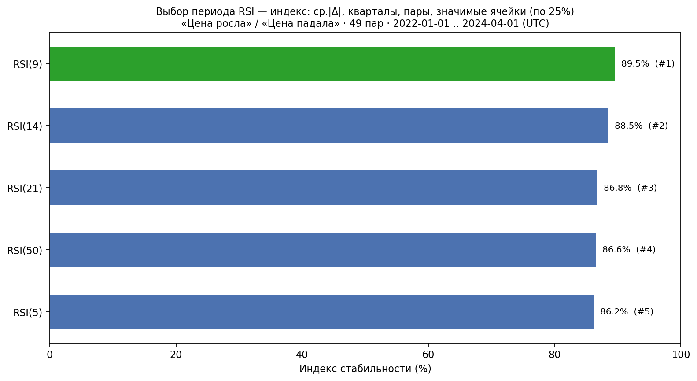

_Рис. RSI-0a. Индекс стабильности по кандидатам RSI (train)._

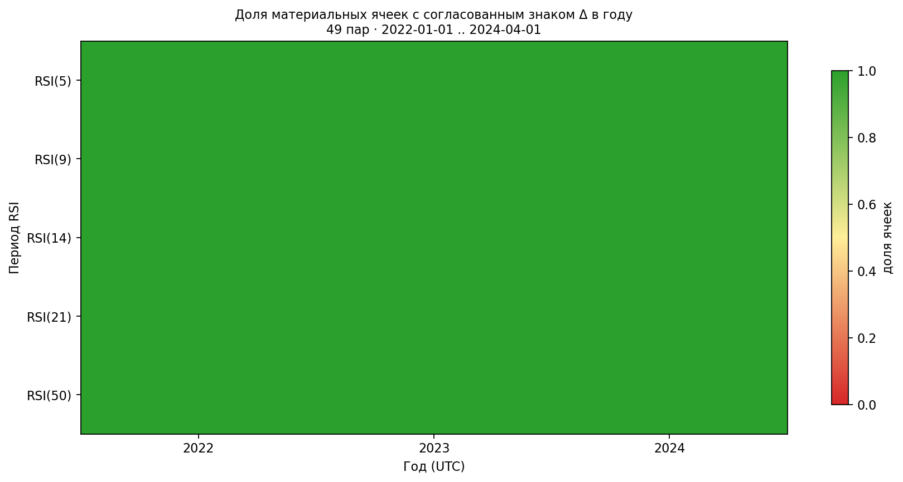

_Рис. RSI-0b. Доля материальных ячеек с согласованным знаком Δ в году._

### Этапы 1–3. Валидация паттерна RSI(9)

**Метрика:** условная связь вчерашнего RSI(9) с сегодняшним intraday return. Анализируются колонки **«Цена росла»** / **«Цена падала»** (Δ от BASE в п.п.).

**Критерии:** |Δ| ≥ 1.5 п.п. на train, p < 0.0042 (Bonferroni, 12 ячеек), cross‑asset ≥60% val-пар, out‑of‑time ≥60% пар.

_Показаны только ячейки, прошедшие |Δ| ≥ 1.5 п.п. на train:_

#### Проверка 1: универсальность среди пар (24 train / 25 val, 2022–2026)

| Сигнал            | Δ train | Δ val | p-value | Val-пар (≥60%) | Статус       |
| ----------------- | ------- | ----- | ------- | -------------- | ------------ |
| b0 Q1 × Цена росла  | +6.44   | +5.34 | <0.0001 | 25/25 (100%)   | ✅ значим    |
| b0 Q1 × Цена падала | −6.69   | −5.37 | <0.0001 | 25/25 (100%)   | ✅ значим    |
| b2 Q3 × Цена росла  | −1.82   | −1.48 | 0.0030  | 14/25 (56%)    | ❌ не значим |
| b2 Q3 × Цена падала | +1.87   | +1.52 | 0.0032  | 14/25 (56%)    | ❌ не значим |
| b3 Q4 × Цена росла  | −2.43   | −0.89 | 0.0001  | 16/25 (64%)    | ✅ значим    |
| b3 Q4 × Цена падала | +2.50   | +0.89 | 0.0001  | 17/25 (68%)    | ✅ значим    |

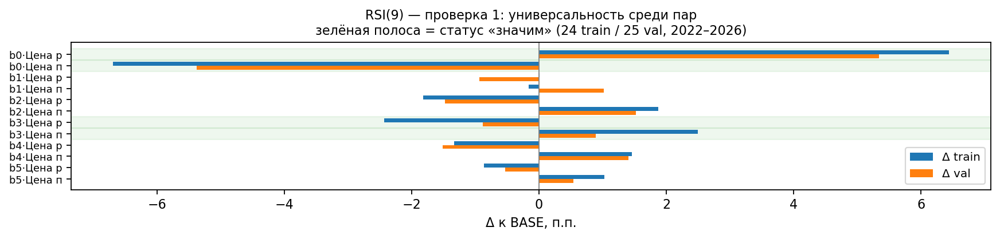

_Рис. RSI-1a. Δ к BASE на train и val (п.п.). Зелёная заливка — статус «значим» по проверке 1._

#### Проверка 2. Устойчивость во времени (49 пар, train 2022–2024-04 / val 2024-04–2026)

| Сигнал            | Δ train | Δ val | p-value | Пар (≥60%)  | Статус       |
| ----------------- | ------- | ----- | ------- | ----------- | ------------ |
| b0 Q1 × Цена росла  | +5.44   | +6.02 | <0.0001 | 42/49 (86%) | ✅ значим    |
| b0 Q1 × Цена падала | −5.85   | −6.02 | <0.0001 | 41/49 (84%) | ✅ значим    |
| b5 Q6 × Цена росла  | −2.56   | +0.55 | <0.0001 | 25/49 (51%) | ❌ не значим |
| b5 Q6 × Цена падала | +2.89   | −0.60 | 0.0001  | 25/49 (51%) | ❌ не значим |

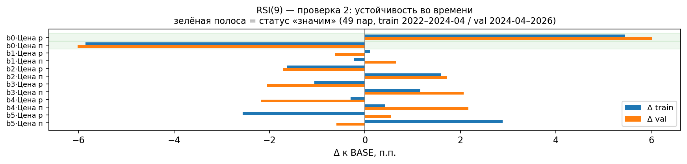

_Рис. RSI-1b. Δ к BASE на train-периоде и val-периоде (п.п.). Зелёная заливка — статус «значим» по проверке 2._

### Ключевые выводы

После двух проверок (cross‑asset + out‑of‑time) подтверждён **только сигнал перепроданности b0 (Q1)**:

| Бакет           | Сигнал        | Δ (полный пул) | Смысл для стратегии                          |
| --------------- | ------------- | -------------- | -------------------------------------------- |
| **b0** (Q1 RSI) | Цена росла ↑  | +6.0 п.п.      | После низкого RSI — завтра чаще рост         |
| **b0**          | Цена падала ↓ | −6.1 п.п.      | …и реже падение (mean-reversion вверх)       |

**Что отсеялось:**

- **b3 Q4** — прошёл cross‑asset (64–68%), но **не прошёл out‑of‑time** (55% пар)
- **b2 Q3** — |Δ| на train ≥ 1.5 п.п., но не прошёл cross‑asset (56%) и Bonferroni на проверке 1
- **b5 Q6** (перекупленность) — сильный эффект на train temporal (−2.6 / +2.9 п.п.), но **знак не сохранился** на val (51% пар) и не прошёл проверку 1
- **b1, b4** — |Δ| на train ниже порога материальности или не прошли p-value

**Итог:** устойчивый mean-reversion на **RSI(9)** работает только **на перепроданности (b0, Q1)**. Сигнал перекупленности (b5, Q6) и средние квантили не выдерживают обе проверки.

#### ML-подтверждение (LightGBM + CPCV)

**Цель:** проверить, содержит ли нормированное вчерашнее значение RSI(9) (`rsi_pair_norm`) предсказательную способность для `direction_up`, и согласованы ли выводы ML со статистическим сигналом **b0 (Q1)**.

**Данные:** 49 пар (первая свеча ≤ 2023-01-01).  
**Train:** 2022-01-01 – 2024-04-01 (31 917 строк day × pair).  
**Holdout test:** 2024-04-01 – 2026-05-31 (38 073 строк).  
**Таргет:** `direction_up = 1`, если `close > open`.  
**Признаки:** `pair_id` (категориальный) + `rsi_pair_norm` (вчерашний RSI(9), per-pair линейная нормировка по train-границам, trim 5–95%; значения могут выходить за [−1, +1] при экстремальном RSI).

**Модель:** LightGBM, полный fit на всём train (`n_estimators=100`, early stopping по умолчанию отключён).

**Схема:** CPCV на train (`n_splits=7`, `n_test_groups=2` → 21 фолд) → финальный fit на train → holdout test.

##### Качество модели

| Метрика  | Train (fit) | Pooled OOS (train) | Holdout test | Δ (Test − OOS) |
| -------- | ----------- | ------------------ | ------------ | -------------- |
| Accuracy | 0.530       | 0.503              | 0.513        | +0.010         |
| ROC AUC  | 0.543       | 0.507              | **0.523**    | +0.016         |
| Log Loss | 0.691       | 0.693              | 0.692        | −0.001         |
| Brier    | 0.249       | 0.250              | 0.250        | −0.000         |
| ECE      | 1.9%        | 1.0%               | 2.6%         | +1.6 п.п.      |

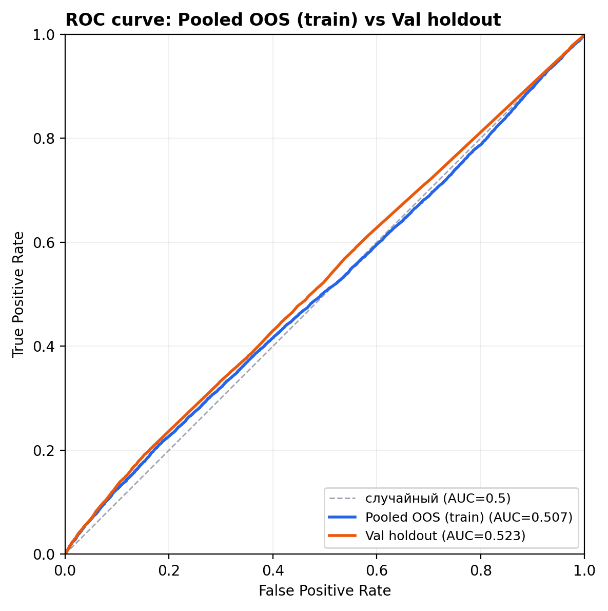

##### Стабильность по фолдам (train CPCV, 21 фолд)

| Метрика  | Mean  | Std   | Min   | Max   | ROC AUC > 0.5 |
| -------- | ----- | ----- | ----- | ----- | ------------- |
| ROC AUC  | 0.523 | 0.012 | 0.506 | 0.544 | 21/21         |
| Accuracy | 0.504 | 0.014 | 0.480 | 0.522 | 14/21         |

_Как считаются **Pooled OOS** и **Mean по фолдам**, и почему ROC AUC между ними различается — см. [ML: Pooled OOS и Mean по фолдам (CPCV)](#ml-pooled-oos-и-mean-по-фолдам-cpcv)._

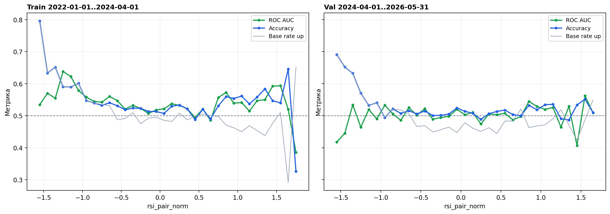

_Рис. RSI-ML-1. Предсказательная сила модели по бинам `rsi_pair_norm`: train-fit (слева) и holdout test (справа). Отрицательные значения ≈ перепроданность (b0, Q1). Серая линия — base rate up (фактическая доля up-дней в бине)._

**Краткий итог ML:** слабый, но устойчивый сигнал на train-CPCV (pooled OOS ROC AUC ≈ 0.507, все 21 фолда > 0.5), на holdout после полного fit — умеренный и **чуть выше EMA** (ROC AUC ≈ 0.523 vs 0.513). На holdout модель смещена в long (`pred_up_rate` ~54% при `base_rate_up` 48%). На хвосте перепроданности (`rsi_pair_norm` < −1) accuracy растёт вместе с base rate — модель улавливает режим mean-reversion, хотя ROC AUC там ниже из-за сжатия вероятностей (почти все предсказания «up»). Это согласуется со статистикой **b0 (Q1)**; сигнал перекупленности (b5) ML не подтверждает.

#### Дополнительные материалы (исследование)

| Материал                                                                                                                                       | Описание                                                                                           |
| ---------------------------------------------------------------------------------------------------------------------------------------------- | -------------------------------------------------------------------------------------------------- |
| [rsi_period_screen train](research_outputs/rsi/rsi_quantiles/statistics/rsi_period_screen_49pairs_rsi5_9_14_21_50_20220101_20240401.log) | Этап 0 — скрининг периодов RSI (49 пар, train 2022-01-01 – 2024-04-01), значимые ячейки по квантилям |
| [rsi_summary_rsi9.log](research_outputs/rsi/rsi_quantiles/statistics/rsi_summary_rsi9.log)                                                   | Этапы 1–3 — проверки 1–2 и итог: универсальность среди пар, устойчивость во времени, полный пул    |
| [rsi_spreads RSI(9), 49 пар](research_outputs/rsi/rsi_quantiles/statistics/rsi_spreads_49pairs_rsi9_20220101_20260531.log)                       | Этапы 1–3 — детальная статистика: 12 колонок, repeatability (годы/пары)                  |
| [ML: train/test JSON](research_outputs/rsi/rsi_quantiles/ml/metrics/direction_rsi_49pairs_20220101_20260531_train_test.json)                     | Полный отчёт: train CPCV + final fit + holdout test                                                |
| [ML: ROC AUC train vs test](research_outputs/rsi/rsi_quantiles/ml/plots/direction_rsi_49pairs_20220101_20260531_roc_auc.png)                   | ROC-кривые pooled OOS (train) и holdout test                                                       |
| [ML: predictive vs rsi](research_outputs/rsi/rsi_quantiles/ml/plots/direction_rsi_49pairs_20240401_20260531_rsi_predictive.png)        | ROC AUC / accuracy / base rate по бинам `rsi_pair_norm` (train \| val)                             |
| [ML: модель + bounds](research_outputs/rsi/rsi_quantiles/ml/models/direction_rsi_49pairs_20220101_20240401_model_bundle.pkl)                 | Bundle: LightGBM + pair bounds + feature schema                                                      |
| [ML: лог](research_outputs/rsi/rsi_quantiles/ml/direction_rsi_20220101_20260531.log)                                                           | Лог train/test запуска                                                                               |

#### Воспроизведение отчётов (исследование)

```bash
cd crypto_research

python3 report_generator.py rsi_period_screen # Этап 0: скрининг периодов RSI (train 2022-01-01 – 2024-04-01 по умолчанию)
python3 report_generator.py rsi_spreads --summary # Этапы 1–3: сводка train/val (проверки 1–2 + итог) — rsi_summary_rsi9.log

python3 report_generator.py rsi_spreads \  # Этапы 1–3: детальный отчёт RSI(9) — все колонки, repeatability
  --from-date 2022-01-01 --to-date 2026-05-31 --max-pair-start 2023-01-01 \
  --rsi-periods 9

# ML (train/test: 49 пар, train 2022-01-01–2024-04-01, test 2024-04-01–2026-05-31)
python3 ml_research.py rsi_spreads_ml --plot-metrics-over-feature
# пересборка predictive-графика из bundle:
# python3 utils/ml/plot_feature_predictive.py rsi_spreads_ml
```

Отчёты пишутся в `research_outputs/rsi/rsi_quantiles/statistics/`; графики — в `…/statistics/plots/`. ML-артефакты — в `…/ml/`.

---

### Историческое тестирование стратегии rsi_spreads (out-of-sample)

**Out-of-sample период** = val-окно исследования: **2024-04-01 — 2026-05-31 (UTC)**.  
Границы квантилей RSI frozen на train (2022-01-01 — 2024-04-01).

#### Правила стратегии

| Условие (вчера, UTC close) | Позиция | Доходность                     |
| -------------------------- | ------- | ------------------------------ |
| **b0** (Q1, RSI(9))        | long    | `(close − open) / open × 100%` |
| Остальные бакеты           | flat    | 0%                             |

- Равный **peak-вес 1/N** на пару (N = 49 конс. / 38 опт. / **44 ML**), без реинвестирования, NAV=100
- **Exposure:** ~67% (конс.) / ~63% (опт.) / **~90% (ML)**
- **Комиссии** (Bybit non-VIP): taker 0.200% round-trip, maker 0.072%
- **Бенчмарки:** B&H 49 пар (gross), BTC B&H (gross)
- **Формат отчётов:** как у `ema_spreads` — gross + net maker; WR/PF/median/skew/VaR — **по сделкам**; Total Return, CAGR, Sharpe, MaxDD — **по дням портфеля**.

#### Сценарии

| Сценарий | Описание |
|----------|----------|
| **Консервативный** | Все 49 пар на каждый сигнал b0 |
| **Оптимистичный** | Отбор по train: b0 × «Цена росла», знак Δ + ≥⅔ лет (**38 пар**) |
| **ML (`rsi_spreads_ml`)** | **Отбор пар (global pool):** score по CPCV train → `score_cutoff = quantile(0.1)` → **44 пары**<br>**Пороги:** `t_long` ≈ **0.51**, `t_short` ≈ **0.49**; признак `rsi_pair_norm` + `pair_id`; long/short (не только b0) |

#### Результаты (val, 2024-04-01 — 2026-05-31)

| Метрика                       | Конс. (49, gross) | Конс. (49, taker) | Конс. (49, maker) | Опт. (38, gross) | Опт. (38, taker) | Опт. (38, maker) | ML (44, gross) | ML (44, taker) | ML (44, maker) | B&H 49 (gross) | BTC B&H (gross) |
| ----------------------------- | ----------------- | ----------------- | ----------------- | ---------------- | ---------------- | ---------------- | -------------- | -------------- | -------------- | -------------- | ---------------- |
| Total Return                  | **+54.3%**        | +25.8%            | **+44.1%**        | +53.4%           | +24.4%           | +42.9%           | +48.0%         | +17.9%         | +37.2%         | −32.2%         | +28.3%           |
| CAGR (compounded)             | **+22.3%**        | +11.2%            | **+18.5%**        | +22.0%           | +10.7%           | +18.0%           | +20.0%         | +7.9%          | +15.8%         | −16.5%         | +12.3%           |
| Sharpe (0% rf)                | **+0.84**         | +0.40             | **+0.68**         | +0.81            | +0.37            | +0.65            | +0.81          | +0.30          | +0.62          | −0.21          | +0.28            |
| Sharpe / √exposure            | **+1.02**         | +0.49             | **+0.83**         | +1.02            | +0.47            | +0.82            | +0.85          | +0.32          | +0.66          | −0.21          | +0.28            |
| Max Drawdown                  | **−18.6%**        | −22.8%            | −20.1%            | −19.5%           | −23.8%           | −20.9%           | **−16.4%**     | −20.1%         | **−16.5%**     | −70.3%         | −37.4%           |
| Recovery from max DD          | 67 дн.            | 162 дн.           | 93 дн.            | 66 дн.           | 163 дн.          | 93 дн.           | **104 дн.**    | 93 дн.         | 144 дн.        | не восст.      | не восст.        |
| Longest underwater            | 121 дн.           | 119 дн.           | 147 дн.           | 120 дн.          | 119 дн.          | 150 дн.          | 120 дн.        | 120 дн.        | 120 дн.        | 535 дн.        | 233 дн.          |
| Calmar                        | **+1.35**         | +0.53             | +1.02             | +1.27            | +0.47            | +0.95            | +1.36          | +0.41          | +1.05          | −0.21          | +0.35            |
| Profit Factor                 | **1.22**          | 1.10              | 1.18              | 1.21             | 1.09             | 1.17             | 1.18           | 1.06           | 1.14           | 0.98           | 1.04             |
| Win Rate (trades)             | 53.6%             | 52.0%             | 53.2%             | 53.5%            | 51.9%            | 53.1%            | 53.6%          | 51.6%          | 53.1%          | 47.8%          | 50.2%            |
| Median trade return           | **+0.386%**       | +0.186%           | +0.314%           | +0.372%          | +0.172%          | +0.300%          | +0.334%        | +0.134%        | +0.262%        | −0.165%        | +0.007%          |
| Information Ratio (vs B&H 49) | —                 | 0.46 (taker)      | **0.60 (maker)**  | —                | 0.45 (taker)     | 0.59 (maker)     | —              | 0.38 (taker)   | 0.53 (maker)   | —              | —                |
| Exposure                      | 66.6%             | 66.6%             | 66.6%             | 63.0%            | 63.0%            | 63.0%            | 90.0%          | 90.0%          | 90.0%          | 100%           | 100%             |
| Worst day (net)               | −13.4%            | −13.6%            | −13.5%            | −13.0%           | −13.1%           | −13.0%           | −12.0%         | −12.1%         | −12.0%         | −22.3%         | −14.0%           |

*Gross — без комиссий. Taker/maker — с комиссиями.*

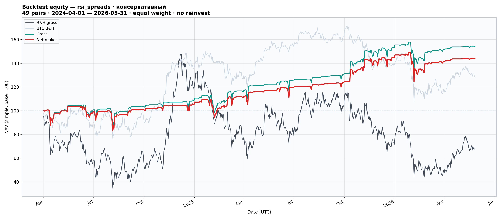
**Рис. RSI-BT-1. Консервативный (49 пар)** — gross / net maker.

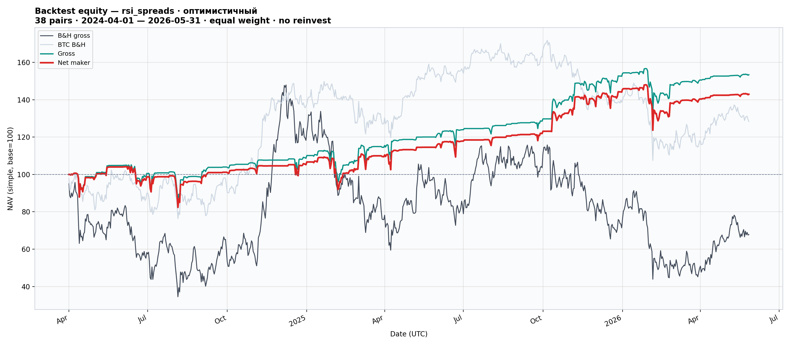
**Рис. RSI-BT-2. Оптимистичный (38 пар)** — gross / net maker.

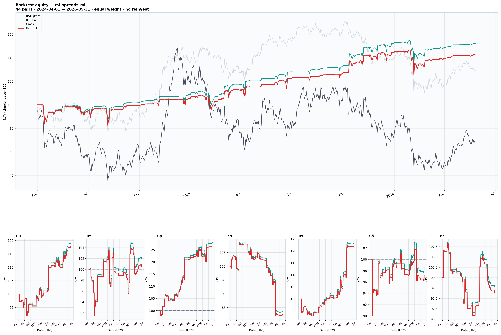
**Рис. RSI-BT-3. ML (`rsi_spreads_ml`)** — 44 пары; gross / net maker; B&H 49 и BTC.

#### Вклад по дням недели (ML, net maker)

| День | Total Ret | Avg trade | Sharpe | MaxDD  |
| ---- | --------- | --------- | ------ | ------ |
| **Ср** | +29.4%    | +1.365%   | 1.45   | −3.8%  |
| **Пн** | +19.5%    | +0.832%   | 0.88   | −8.2%  |
| **Пт** | +18.3%    | +0.863%   | 0.79   | −8.1%  |
| **Вс** | −1.9%     | −0.089%   | −0.08  | −15.8% |
| **Вт** | −1.7%     | −0.076%   | −0.09  | −9.1%  |
| **Сб** | −7.8%     | −0.347%   | −0.35  | −10.1% |
| **Чт** | −18.6%    | −1.005%   | −0.70  | −25.2% |

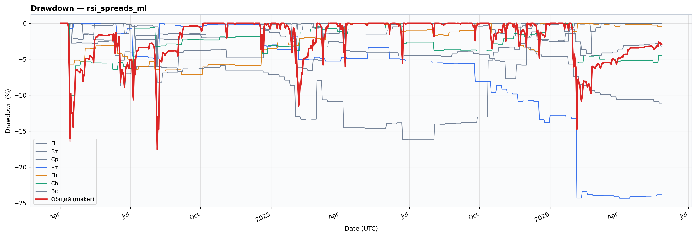
**Рис. RSI-BT-4. Drawdown — ML**

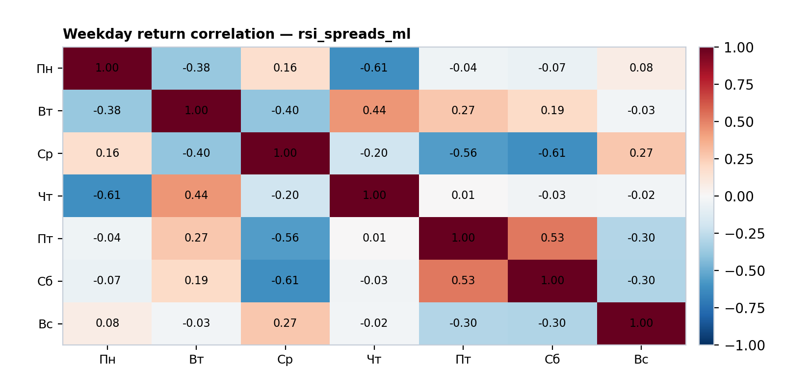
**Рис. RSI-BT-5. Корреляция дневных доходностей — ML**

#### Распределение доходностей по сделкам (ML, net maker)

| Показатель | Значение |
| ---------- | -------- |
| Skewness   | +0.19    |
| Kurtosis   | 9.81     |
| 1% VaR     | −15.0%   |
| 1% CVaR    | −18.8%   |
| 5% VaR     | −8.1%    |
| 5% CVaR    | −12.5%   |

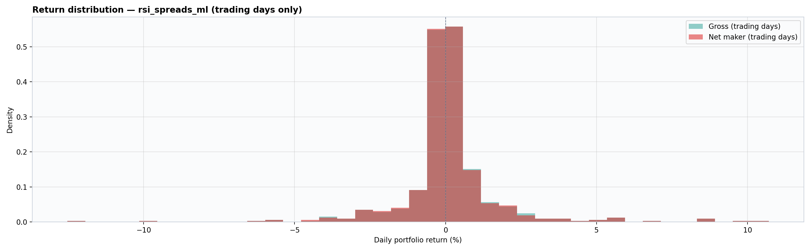
**Рис. RSI-BT-6. Распределение доходностей по сделкам — ML**

### Ключевые выводы (бэктест)

**1. Gross-альфа сильнее EMA.** b0 → long: +54% gross (конс.) при MaxDD −19% vs +34% / −24% у EMA b6.

**2. Maker сохраняет профит, taker — умеренно положителен.** Maker +44% (конс.) / +43% (опт.); taker +26% / +24% — выше EMA из-за меньшего exposure (~67% vs ~82%).

**3. Отбор пар (38) чуть снижает exposure и maker-return** (−1.2 п.п. к конс.), но gross почти тот же.

**4. ML — лучший риск-профиль на gross** (MaxDD −16%, Calmar 1.36), maker +37%; ~64% сделок — short (двусторонняя policy). Среда/понедельник/пятница — вклад; четверг — слабое звено.

**Итог.** Сигнал b0 подтверждён на OOS; **maker обязателен** для rule-based. RSI rule-based превосходит EMA по gross/maker на val; ML даёт меньшую просадку, но зависит от калибровки порогов.

#### Дополнительные материалы (бэктест)

| Материал | Описание |
| -------- | -------- |
| [консервативный](research_outputs/rsi/rsi_quantiles/backtest/rsi_spreads_backtest_49pairs_20240401_20260531.log) | 49 пар, b0 long |
| [оптимистичный](research_outputs/rsi/rsi_quantiles/backtest/rsi_spreads_backtest_optimistic_b0_38pairs_20240401_20260531.log) | 38 пар, train-отбор |
| [ML: policy](research_outputs/rsi/rsi_quantiles/ml/policies/direction_rsi_49pairs_20220101_20260531_policy.json) | Frozen global pool + пороги |
| [бэктест ML](research_outputs/rsi/rsi_quantiles/backtest/rsi_spreads_ml_backtest_ml_44pairs_20240401_20260531.log) | rsi_spreads_ml, holdout |

#### Воспроизведение бэктестов (rsi_spreads)

```bash
cd crypto_research
python3 backtester.py rsi_spreads --scenario conservative
python3 backtester.py rsi_spreads --scenario optimistic
python3 ml_calibrate_policy.py rsi_spreads_ml
python3 backtester.py rsi_spreads_ml
```

Отчёты — `research_outputs/rsi/rsi_quantiles/backtest/`; графики — `…/backtest/plots/`.

---

### Исследование 4. Прогностическая сила последовательных движений цены

**Условие:** перед текущим днём — непрерывная серия дней с закрытием выше/ниже open (длина 1…6; для серий ≥6 дней используется бакет **6д**).

**Метрика:** условная вероятность intraday-событий (12 колонок в детальном отчёте: close, High/Low, пороги μ±50% по паре). В сводке — Δ к BASE в колонках **«Цена росла»** / **«Цена падала»** (п.п.).

**Критерии:** |Δ| ≥ 1.5 п.п. на train, p < 0.0021 (Bonferroni, 24 ячейки = 12 сценариев × 2 колонки), cross‑asset ≥60% val-пар, out‑of‑time ≥60% пар.

---

#### Проверка 1: универсальность среди пар (24 train / 25 val, 2022–2026)

_Показаны ячейки с |Δ train| ≥ 1.5 п.п.:_

| Сигнал                         | Δ train | Δ val | p-value | Val-пар (≥60%) | Статус       |
| ------------------------------ | ------- | ----- | ------- | -------------- | ------------ |
| После 6д падения × Цена росла  | +12.70  | +9.44 | <0.0001 | 20/25 (80%)    | ✅ значим    |
| После 6д падения × Цена падала | −12.58  | −8.95 | <0.0001 | 20/25 (80%)    | ✅ значим    |
| После 4д падения × Цена росла  | +7.07   | +7.07 | 0.0001  | 23/25 (92%)    | ✅ значим    |
| После 4д падения × Цена падала | −6.95   | −6.78 | 0.0002  | 23/25 (92%)    | ✅ значим    |
| После 3д падения × Цена росла  | +4.53   | +5.77 | 0.0001  | 22/25 (88%)    | ✅ значим    |
| После 3д падения × Цена падала | −4.78   | −5.74 | <0.0001 | 23/25 (92%)    | ✅ значим    |
| После 4д роста × Цена росла    | −6.26   | −1.74 | 0.0014  | 15/25 (60%)    | ✅ значим    |
| После 4д роста × Цена падала   | +6.15   | +1.54 | 0.0021  | 17/25 (68%)    | ✅ значим    |
| После 3д роста × Цена росла    | −4.00   | −3.60 | <0.0001 | 22/25 (88%)    | ✅ значим    |
| После 3д роста × Цена падала   | +4.03   | +3.73 | 0.0001  | 22/25 (88%)    | ✅ значим    |
| После 2д роста × Цена росла    | −2.41   | −1.41 | 0.0009  | 16/25 (64%)    | ✅ значим    |
| После 2д роста × Цена падала   | +2.52   | +1.48 | 0.0007  | 16/25 (64%)    | ✅ значим    |

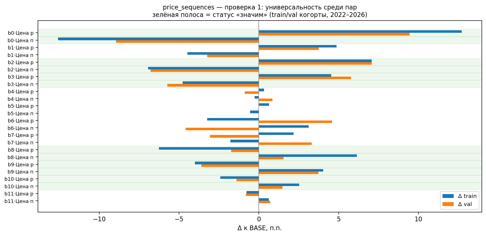

_Рис. PS-1a. Δ к BASE на train и val (п.п.). Зелёная заливка — статус «значим» по проверке 1._

#### Проверка 2. Устойчивость во времени (49 пар, train 2022–2024-04 / val 2024-04–2026)

| Сигнал                         | Δ train | Δ val | p-value | Пар (≥60%)  | Статус       |
| ------------------------------ | ------- | ----- | ------- | ----------- | ------------ |
| После 6д падения × Цена росла  | +14.43  | +9.92 | <0.0001 | 35/44 (80%) | ✅ значим    |
| После 6д падения × Цена падала | −13.70  | −9.94 | <0.0001 | 33/44 (75%) | ✅ значим    |
| После 3д падения × Цена росла  | +7.30   | +3.85 | <0.0001 | 33/49 (67%) | ✅ значим    |
| После 3д падения × Цена падала | −7.58   | −3.91 | <0.0001 | 32/49 (65%) | ✅ значим    |
| После 3д роста × Цена росла    | −3.14   | −4.42 | 0.0009  | 31/49 (63%) | ✅ значим    |
| После 3д роста × Цена падала   | +3.33   | +4.39 | 0.0005  | 30/49 (61%) | ✅ значим    |
| После 2д роста × Цена падала   | +5.03   | −0.51 | <0.0001 | 30/49 (61%) | ✅ значим    |
| После 4д падения × Цена росла  | +7.07   | +7.41 | 0.0001  | 29/49 (59%) | ❌ не значим |
| После 4д роста × Цена росла    | −9.12   | +0.24 | <0.0001 | 25/49 (51%) | ❌ не значим |
| После 2д роста × Цена росла    | −4.79   | +0.48 | <0.0001 | 28/49 (57%) | ❌ не значим |

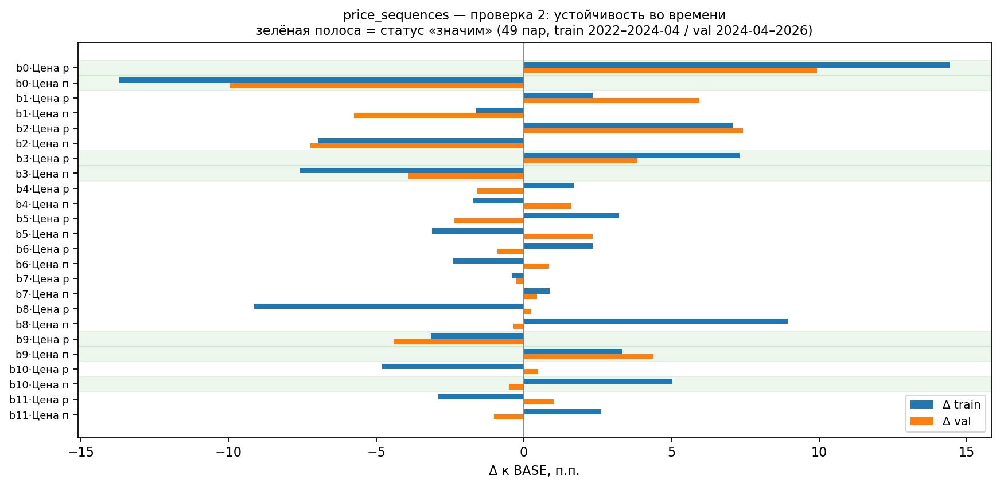

_Рис. PS-1b. Δ к BASE на train-периоде и val-периоде (п.п.). Зелёная заливка — статус «значим» по проверке 2._

### Ключевые выводы

После двух проверок (cross‑asset + out‑of‑time) подтверждены **три устойчивых паттерна**:

| Сценарий          | Сигнал        | Δ (полный пул) | Смысл для стратегии                                      |
| ----------------- | ------------- | -------------- | -------------------------------------------------------- |
| **После 6д падения** | Цена росла ↑  | +11.2 п.п.     | После длинной серии падений — завтра чаще рост           |
| **После 6д падения** | Цена падала ↓ | −10.9 п.п.     | …и реже падение (mean-reversion вверх)                   |
| **После 3д падения** | Цена росла ↑  | +5.1 п.п.      | Короткий отскок после 3 дней падения                     |
| **После 3д падения** | Цена падала ↓ | −5.2 п.п.      | …и реже падение                                          |
| **После 3д роста**   | Цена росла ↓  | −3.8 п.п.      | После 3 дней роста — завтра реже рост (ослабление тренда) |
| **После 3д роста**   | Цена падала ↑ | +3.9 п.п.      | …и чаще падение                                          |

**Что отсеялось:**

- **После 4д падения / 4д роста** — сильный эффект на cross‑asset (88–92% val-пар), но **не прошли out‑of‑time** (57–59% пар)
- **После 2д роста** — на temporal подтвердилась только колонка «Цена падала»; в полном пуле — одна ячейка, без симметричного «Цена росла»
- **После 1–2д падения, 5–6д роста** — |Δ| на train ниже порога или нет подтверждения на val

**Итог:** прогностическая сила **нарастает с длиной серии падений** (пик на 6д) и проявляется **на 3д серии роста** (обратный сигнал). Однодневные и короткие серии (1–2д) не выдерживают обе проверки.

**Справочно (holdout 2024-04-01 – 2026-05-31, 49 пар):** в детальном отчёте «Закрытие в плюсе» Δ к BASE — после 6д падения **+9.9 п.п.**, после 4д падения **+7.4 п.п.**, после 3д роста **−4.4 п.п.**; BASE ≈ 47.8%.

#### ML-подтверждение (LightGBM + CPCV)

**Цель:** проверить, содержит ли нормированная длина серии роста/падения (`streak_pair_norm`) предсказательную способность для `direction_up`, и согласованы ли выводы ML со статистическими сигналами **после 6д/3д падения** и **после 3д роста**.

**Фича `streak_pair_norm`:** знак×длина непрерывной серии дней перед текущим днём (вчерашний знак close vs open, длина серии без ограничения 6д). Положительные значения — серия роста, отрицательные — серия падения. Нормировка **per-pair** по train (trim 5–95%): min → **−1**, max → **+1** (длинная серия падения → отрицательный хвост, длинная серия роста → положительный).

**Данные:** 49 пар (первая свеча ≤ 2023-01-01).  
**Train:** 2022-01-01 – 2024-04-01 (32 110 строк day × pair).  
**Holdout test:** 2024-04-01 – 2026-05-31 (38 441 строк).  
**Таргет:** `direction_up = 1`, если `close > open`.  
**Признаки:** `pair_id` + `streak_pair_norm`.

**Модель:** LightGBM, полный fit на train (`n_estimators=100`, early stopping по умолчанию отключён).  
**Схема:** CPCV на train (`n_splits=7`, `n_test_groups=2` → 21 фолд) → финальный fit на train → holdout test.

##### Качество модели

| Метрика  | Train (fit) | Pooled OOS (train) | Holdout test | Δ (Test − OOS) |
| -------- | ----------- | ------------------ | ------------ | -------------- |
| Accuracy | 0.536       | 0.524              | 0.499        | −0.025         |
| ROC AUC  | 0.554       | 0.526              | **0.510**    | −0.016         |
| Log Loss | 0.690       | 0.692              | 0.694        | +0.002         |
| Brier    | 0.248       | 0.250              | 0.250        | +0.000         |
| ECE      | 2.0%        | 0.7%               | 2.7%         | +2.0 п.п.      |

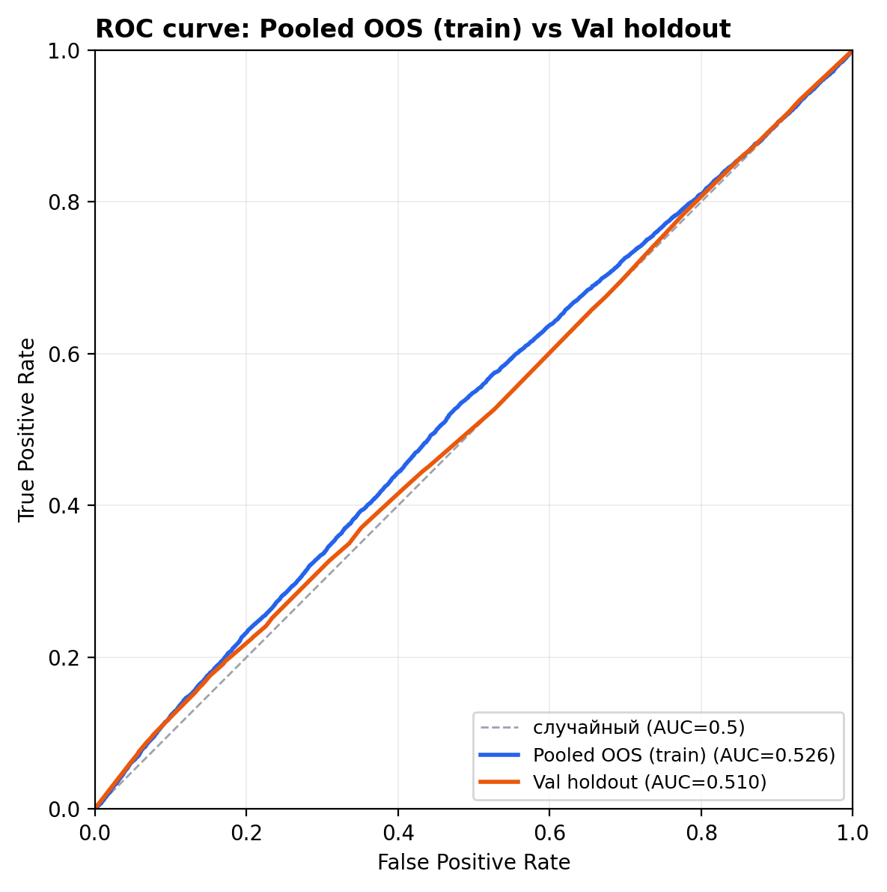

##### Стабильность по фолдам (train CPCV, 21 фолд)

| Метрика  | Mean  | Std   | Min   | Max   | ROC AUC > 0.5 |
| -------- | ----- | ----- | ----- | ----- | ------------- |
| ROC AUC  | 0.536 | 0.014 | 0.509 | 0.559 | 21/21         |
| Accuracy | 0.521 | 0.011 | 0.504 | 0.538 | 21/21         |

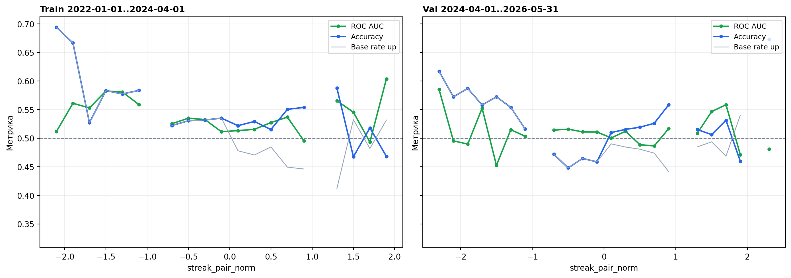

_Рис. PS-ML-1. Предсказательная сила модели по бинам `streak_pair_norm`: train-fit (слева) и holdout test (справа). Отрицательные значения ≈ серия падения; положительные ≈ серия роста._

**Краткий итог ML:** на train-CPCV сигнал устойчивый (pooled OOS ROC AUC ≈ 0.526, все 21 фолда > 0.5). На holdout после полного fit эффект слабее (ROC AUC ≈ 0.510), но на хвосте **длинной серии падения** (`streak_pair_norm` ≪ 0) accuracy растёт вместе с base rate — модель улавливает mean-reversion, согласуясь со статистикой **6д/3д падения**; на **положительном хвосте** (серия роста) — ослабление вероятности роста, в духе сигнала **3д роста**.

---

### Историческое тестирование стратегии price_sequences (out-of-sample)

**Out-of-sample период** = val-окно исследования: **2024-04-01 — 2026-05-31 (UTC)**.

#### Правила стратегии

| Условие (серия перед днём, UTC) | Позиция | Доходность |
| ------------------------------- | ------- | ---------- |
| **Ровно 3д роста** (close > open) | short | `(open − close) / open × 100%` |
| **≥3д падения** (close < open) | long | `(close − open) / open × 100%` |
| Остальное | flat | 0% |

- Равный **peak-вес 1/N** на пару (N = активных слотов в день), без реинвестирования, NAV=100
- **Exposure:** ~89% (конс.) / ~80% (опт.)
- **Комиссии** (Bybit non-VIP): taker 0.200% round-trip, maker 0.072%
- **Бенчмарки:** B&H 49 пар (gross), BTC B&H (gross)
- **Формат отчётов:** gross + net maker; WR/PF/median — **по сделкам** (pair-day); Total Return, CAGR, Sharpe, MaxDD — **по дням портфеля**

#### Сценарии

| Сценарий | Описание |
| -------- | -------- |
| **Консервативный** | Все 49 пар на оба сигнала (short 3д роста / long ≥3д падения) |
| **Оптимистичный** | Раздельный train-отбор: short только на **23** парах (`3d_up_short`), long только на **34** (`3d_down_long`); критерий — знак Δ × «Цена росла» + ≥⅔ лет на train (2022–2024-04) |

#### Результаты (val, 2024-04-01 — 2026-05-31)

| Метрика                       | Конс. (49, gross) | Конс. (49, taker) | Конс. (49, maker) | Опт. (sh23+lg34, gross) | Опт. (sh23+lg34, taker) | Опт. (sh23+lg34, maker) | B&H 49 (gross) | BTC B&H (gross) |
| ----------------------------- | ----------------- | ----------------- | ----------------- | ---------------------- | ---------------- | ---------------- | -------------- | --------------- |
| Total Return                  | **+35.3%**        | +4.8%             | **+24.3%**        | +20.9%                 | −7.1%            | +10.9%           | −32.2%         | +28.3%          |
| CAGR (compounded)             | **+15.1%**        | +2.2%             | **+10.6%**        | +9.2%                  | −3.3%            | +4.9%            | −16.5%         | +12.3%          |
| Sharpe (0% rf)                | **+0.69**         | +0.09             | **+0.48**         | +0.40                  | −0.14            | +0.21            | −0.21          | +0.28           |
| Sharpe / √exposure            | **+0.73**         | +0.10             | **+0.50**         | +0.45                  | −0.15            | +0.23            | −0.21          | +0.28           |
| Max Drawdown                  | **−19.5%**        | −26.4%            | −21.6%            | −22.6%                 | −29.9%           | −24.8%           | −70.3%         | −37.4%          |
| Recovery from max DD          | **170 дн.**       | 477 дн.           | **201 дн.**       | 221 дн.                | не восст.        | 433 дн.          | не восст.      | не восст.       |
| Longest underwater            | 299 дн.           | 716 дн.           | 330 дн.           | 88 дн.                 | 778 дн.          | 93 дн.           | 535 дн.        | 233 дн.         |
| Calmar                        | **+0.84**         | +0.09             | **+0.52**         | +0.43                  | −0.11            | +0.20            | −0.21          | +0.35           |
| Profit Factor                 | **1.14**          | 1.02              | **1.09**          | 1.08                   | 0.97             | 1.04             | 0.98           | 1.04            |
| Win Rate (trades)             | **54.3%**         | 51.9%             | 53.5%             | 54.1%                  | 51.7%            | 53.3%            | 47.8%          | 50.2%           |
| Median trade return           | **+0.353%**       | +0.153%           | **+0.281%**       | +0.348%                | +0.148%          | +0.276%          | −0.165%        | +0.007%         |
| Information Ratio (vs B&H 49) | —                 | 0.25 (taker)      | **0.38 (maker)**  | —                      | 0.17 (taker)     | 0.30 (maker)     | —              | —               |
| Exposure                      | 89.3%             | 89.3%             | 89.3%             | 80.1%                  | 80.1%            | 80.1%            | 100%           | 100%            |
| Worst day (net)               | −9.7% (2024-04-12)| −9.9% (2024-04-12)| −9.8% (2024-04-12)| −10.4% (2024-04-12)    | −10.5%           | −10.4%           | −22.3%         | −14.0%          |

*Gross — без комиссий. Taker/maker — с комиссиями.*

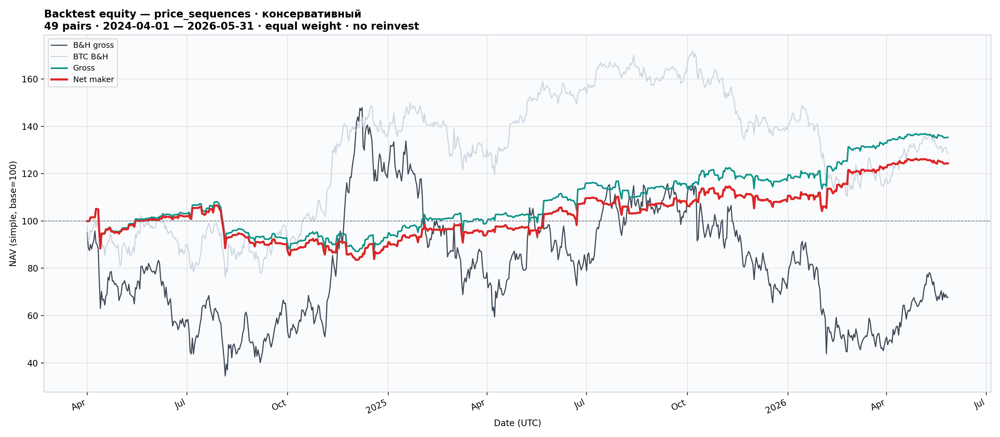
**Рис. PS-BT-1. Консервативный (49 пар)** — gross / net maker.

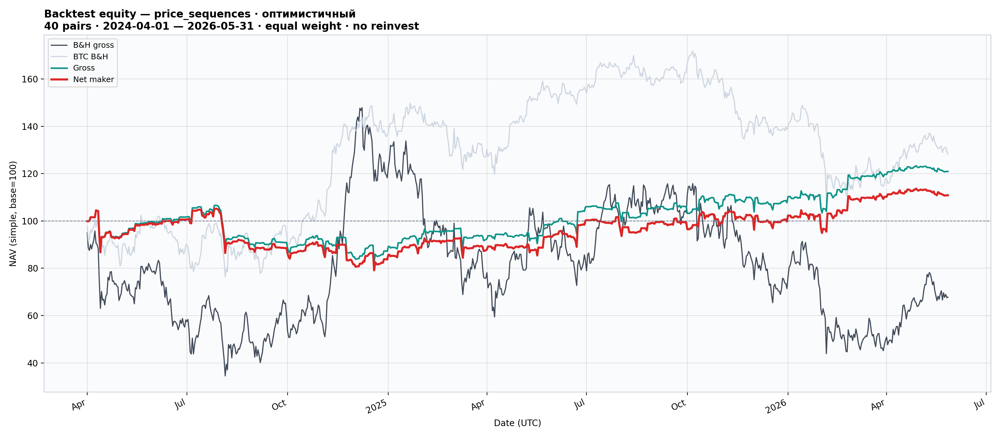
**Рис. PS-BT-2. Оптимистичный (short 23 пар / long 34 пар, раздельный отбор)** — gross / net maker.

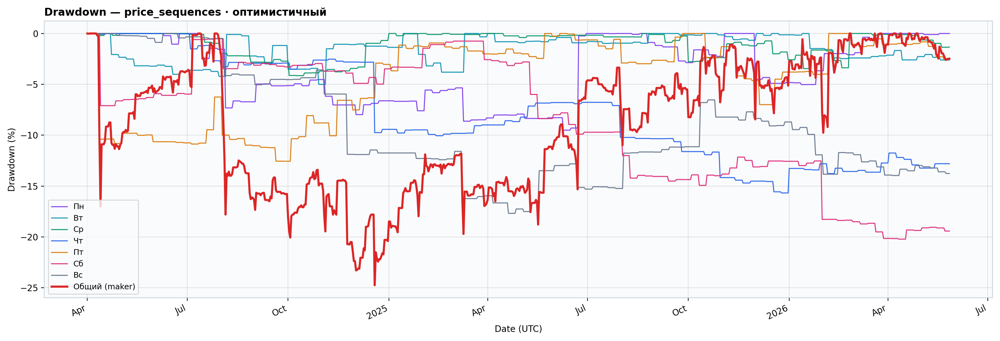
**Рис. PS-BT-3. Drawdown — оптимистичный (sh23+lg34)**

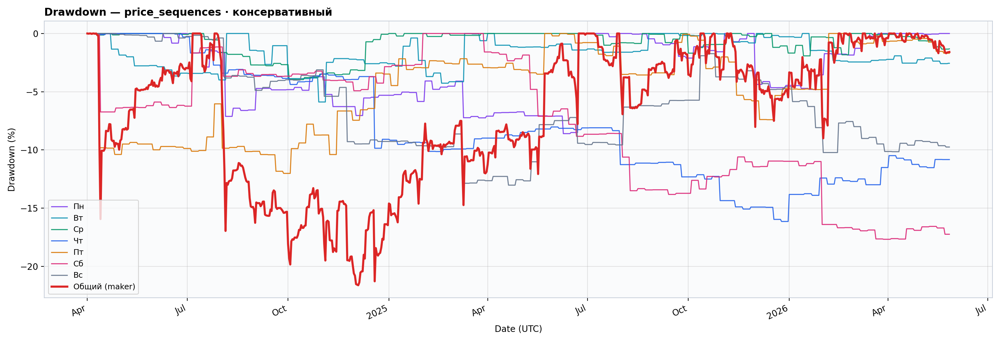
**Рис. PS-BT-4. Drawdown — консервативный**

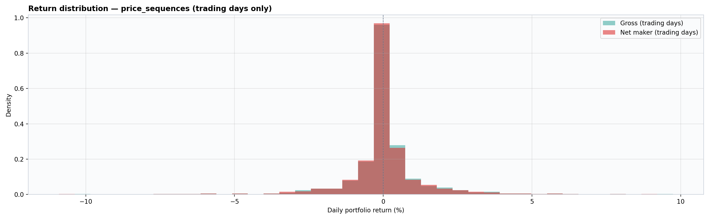
**Рис. PS-BT-5. Распределение доходностей по сделкам — оптимистичный (gross)**

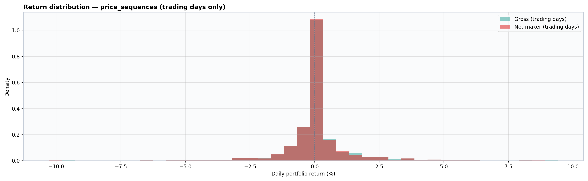
**Рис. PS-BT-6. Распределение доходностей по сделкам — консервативный (gross)**

#### Вклад по сегментам (gross / net maker, консервативный)

| Сегмент       | Trades | Gross Total Ret | Gross Sharpe | Net maker Total Ret | Net maker Sharpe |
| ------------- | ------ | --------------- | ------------ | ------------------- | ---------------- |
| **3d_up_short** | 393    | +8.9%           | 0.57         | +5.6%               | 0.36             |
| **3d_down_long** | 514   | **+26.4%**      | **0.70**     | **+18.7%**          | **0.50**         |

#### Вклад по сегментам (gross / net maker, оптимистичный)

| Сегмент       | Trades | Gross Total Ret | Gross Sharpe | Net maker Total Ret | Net maker Sharpe |
| ------------- | ------ | --------------- | ------------ | ------------------- | ---------------- |
| **3d_up_short** (23 пары) | 274 | −6.3% | −0.53 | −8.6% | −0.72 |
| **3d_down_long** (34 пары) | 477 | **+27.2%** | **0.72** | **+19.4%** | **0.51** |

### Ключевые выводы (бэктест)

**1. Консервативный сценарий — положительная gross/maker-альфа на val.** +35% gross / +24% net maker при MaxDD −20% / −22% vs B&H −32% (MaxDD −70%). IR (maker) **0.38**.

**2. Двусторонняя стратегия: long ≥3д падения — основной драйвер.** Сегмент `3d_down_long` даёт **+26% gross**; `3d_up_short` — умеренный **+9% gross** на всех 49 парах.

**3. Maker обязателен.** Taker +4.8% (конс.) — на грани; maker +24.3%. Комиссии съедают ~10 п.п. от gross.

**4. Оптимистичный отбор (раздельный short/long) на val не улучшает результат.** Gross +21% vs +35% (конс.); short-сегмент на отобранных 23 парах **отрицателен** на val (−6% gross), long-сегмент силён (+27%). Train-критерий (Δ «Цена росла») для short не переносится на holdout.

**5. ML-бэктест (`price_sequences_ml`) — умеренная maker-альфа при низкой exposure.** Global-policy, 44 пары (train-отбор), frozen LightGBM + `streak_pair_norm`. Net maker **+11.7%** (gross +16.3%) при MaxDD −13.9% и exposure **55%** — слабее rule-based консервативного (+24% maker), но IR (maker) **0.31** vs B&H. Модель на holdout даёт ROC AUC **0.510** (чуть выше случайного); в бэктесте фактически только **long** (short-порог не срабатывает на отобранных парах).

#### ML-бэктест (`price_sequences_ml`, val 2024-04-01 — 2026-05-31)

Frozen policy (`global`, 44 пары) + модель `pair_id` + `streak_pair_norm`. Комиссии и бенчмарки — как у rule-based выше.

| Метрика | ML (gross) | ML (net taker) | ML (net maker) | Rule-based конс. (maker) | B&H 49 (gross) |
| ------- | ---------- | -------------- | -------------- | ------------------------ | -------------- |
| Total Return | +16.3% | +3.4% | **+11.7%** | +24.3% | −32.2% |
| CAGR (compounded) | +7.3% | +1.6% | **+5.3%** | +10.6% | −16.5% |
| Sharpe (0% rf) | **0.57** | 0.12 | 0.41 | 0.48 | −0.21 |
| Max Drawdown | −13.6% | −15.1% | **−13.9%** | −21.6% | −70.3% |
| Profit Factor | 1.15 | 1.03 | **1.11** | 1.09 | 0.98 |
| Win Rate (trades) | 53.9% | 51.5% | **53.1%** | 53.5% | 47.8% |
| Information Ratio (vs B&H 49) | — | 0.25 | **0.31** | 0.38 | — |
| Exposure | 55.4% | 55.4% | 55.4% | 89.3% | 100% |
| Worst day (net maker) | — | — | **−5.4%** (2024-04-12) | −9.8% | −22.3% |

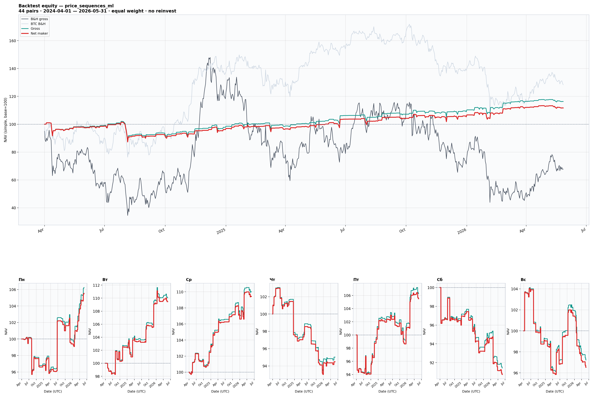
**Рис. PS-BT-7. `price_sequences_ml` — equity curve** (gross + net maker).

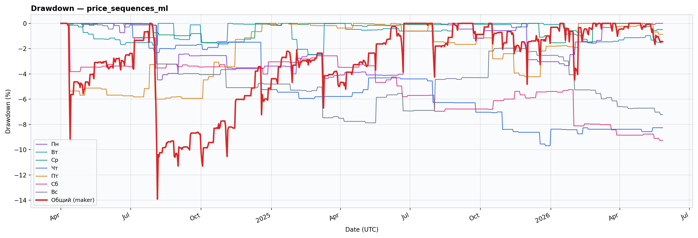
**Рис. PS-BT-8. Drawdown — `price_sequences_ml`**.

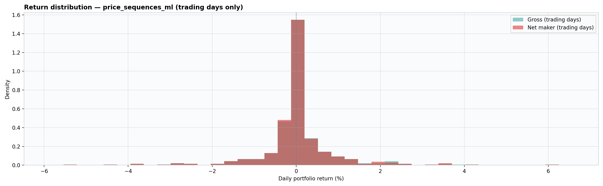
**Рис. PS-BT-9. Распределение доходностей по сделкам — `price_sequences_ml` (gross)**.

#### Дополнительные материалы (бэктест)

| Материал | Описание |
| -------- | -------- |
| [консервативный](research_outputs/price_sequences/backtest/price_sequences_backtest_49pairs_20240401_20260531.log) | 49 пар, short 3д роста / long ≥3д падения |
| [оптимистичный](research_outputs/price_sequences/backtest/price_sequences_backtest_optimistic_sh23_lg34_40pairs_20240401_20260531.log) | short 23 / long 34 пар, раздельный train-отбор по сегментам |
| [ML `price_sequences_ml`](research_outputs/price_sequences/backtest/price_sequences_ml_backtest_ml_44pairs_20240401_20260531.log) | frozen global-policy, 44 пары, `streak_pair_norm` |

#### Воспроизведение бэктестов (price_sequences)

```bash
cd crypto_research
python3 backtester.py price_sequences --scenario conservative
python3 backtester.py price_sequences --scenario optimistic
python3 backtester.py price_sequences_ml
python3 ml_calibrate_policy.py price_sequences_ml   # policy перед первым ML-бэктестом
```

Отчёты — `research_outputs/price_sequences/backtest/`; графики — `…/backtest/plots/`.

---

#### Дополнительные материалы (исследование)

| Материал                                                                                                                                              | Описание                                                                                  |
| ----------------------------------------------------------------------------------------------------------------------------------------------------- | ----------------------------------------------------------------------------------------- |
| [price_sequences_summary.log](research_outputs/price_sequences/statistics/price_sequences_summary.log)                                                  | Сводка: проверки 1–2 и итог (универсальность среди пар, устойчивость во времени, полный пул) |
| [price_sequences_statistics_49pairs_20240401_20260531.log](research_outputs/price_sequences/statistics/price_sequences_statistics_49pairs_20240401_20260531.log) | Детальная статистика: 12 сценариев × 12 колонок, repeatability (годы/пары)               |
| [ML: train/test JSON](research_outputs/price_sequences/ml/metrics/direction_streak_49pairs_20220101_20260531_train_test.json)                     | Полный отчёт: train CPCV + final fit + holdout test                                                |
| [ML: ROC AUC train vs test](research_outputs/price_sequences/ml/plots/direction_streak_49pairs_20220101_20260531_roc_auc.png)                   | ROC-кривые pooled OOS (train) и holdout test                                                       |
| [ML: predictive vs streak](research_outputs/price_sequences/ml/plots/direction_streak_49pairs_20240401_20260531_streak_predictive.png)        | ROC AUC / accuracy / base rate по бинам `streak_pair_norm` (train \| val)                             |
| [ML: модель + bounds](research_outputs/price_sequences/ml/models/direction_streak_49pairs_20220101_20240401_model_bundle.pkl)                 | Bundle: LightGBM + pair bounds + feature schema                                                      |
| [ML: policy](research_outputs/price_sequences/ml/policies/direction_streak_49pairs_20220101_20260531_policy.json)                               | Frozen global-policy (отбор пар + пороги)                                                            |

#### Воспроизведение отчётов (исследование)

```bash
cd crypto_research

python3 report_generator.py price_sequences --summary

python3 report_generator.py price_sequences --train --from-date 2022-01-01 --to-date 2026-05-31
python3 report_generator.py price_sequences --val   --from-date 2022-01-01 --to-date 2026-05-31

python3 report_generator.py price_sequences --from-date 2022-01-01 --to-date 2024-04-01 --max-pair-start 2023-01-01
python3 report_generator.py price_sequences --from-date 2024-04-01 --to-date 2026-05-31 --max-pair-start 2023-01-01

# ML (train/test: 49 пар, train 2022-01-01–2024-04-01, test 2024-04-01–2026-05-31)
python3 ml_research.py price_sequences_ml --train-test --plot-metrics-over-feature
# пересборка predictive-графика из bundle:
# python3 utils/ml/plot_feature_predictive.py price_sequences_ml
```

Отчёты пишутся в `research_outputs/price_sequences/statistics/`; графики сводки — в `…/statistics/plots/`. ML-артефакты — в `…/ml/`. Бэктест rule-based — в `…/backtest/`.

---


### Исследование 5. Расстояние между объемом и его ЕМА

Исследование проводится в **два этапа** (по той же схеме, что EMA/RSI):

1. **Этап 0 — выбор периода EMA объёма** (`volume_ema_period_screen`): на **train-периоде** (49 пар, 2022-01-01 – 2024-04-01) сравниваем кандидатов **5, 9, 12, 20, 50, 100, 200** по устойчивости сигнала. Это **не** проверка значимости — только фиксация периода для следующих этапов.
2. **Этапы 1–3 — паттерн** (`volume_spreads` с **EMA(volume, 50)**): универсальность среди пар и устойчивость во времени (по критериям из методологии).

**Важно:** используется не сырой `day_volume` (дрейф ликвидности), а **относительное** отклонение объёма от своей EMA.

---

### Этап 0. Выбор периода EMA(volume) (только train)

**Цель:** определить период EMA по дневному объёму с наиболее устойчивой связью «вчерашний режим объёма → сегодняшний intraday return».

**Условие (вчера):**  
`vol_log_rel_N = ln(day_volume / EMA(day_volume, N))` на конец предыдущего дня (`vol_log_rel{N}_prev`).  
EMA считается по дневному объёму (сумма минутного `volume` за UTC-день), **per-pair**.

Бакеты b0–b4 — **5 режимов** по per-pair квантилям `vol_log_rel` на train (без look-ahead на return):

| Бакет | Режим              | Условие (per-pair)   |
| ----- | ------------------ | -------------------- |
| b0    | LOW                | ≤ q30                |
| b1    | NORMAL             | q30 – q70            |
| b2    | HIGH               | q70 – q85            |
| b3    | VERY_HIGH          | q85 – q95            |
| b4    | SPIKE              | > q95                |

_Пороги q30/q70/q85/q95 фиксируются отдельно для каждой пары на train-выборке._

**Метрика скрининга:** Δ к BASE в колонках «Цена росла» / «Цена падала» (п.п.) — насколько доля дней с ростом/падением open→close в бакете отличается от безусловной. Значимая ячейка: \|Δ\| ≥ **1.5** п.п.

**Индекс стабильности** (25% на каждую компоненту):

1. ср.\|Δ\| (нормировка)
2. ср.кварталы % (согласие знака Δ по календарным кварталам)
3. ср.пары % (согласие по парам)
4. число значимых ячеек (нормировка)

**Результаты (49 пар, train: 2022-01-01 – 2024-04-01, 9 кварталов):**

| #   | EMA(vol) | ср.\|Δ\|, п.п. | Ср.кварт. | Ср.пары | Знач. | Индекс % |
| --- | -------- | -------------- | --------- | ------- | ----- | -------- |
| 1   | **50**   | 2.1            | 74%       | 61%     | **6** | **72.3** |
| 2   | 200      | **3.9**        | 71%       | 64%     | 2     | 67.1     |
| 3   | 20       | 2.7            | **89%**   | **74%** | 2     | 66.6     |
| 4   | 100      | 3.3            | 75%       | 69%     | 2     | 65.8     |
| 5   | 12       | 1.8            | 62%       | 61%     | 5     | 63.3     |
| 6   | 9        | 1.6            | 56%       | 59%     | 2     | 47.6     |
| 7   | 5        | 1.7            | 56%       | 57%     | 1     | 43.5     |

**Выбран EMA(volume, 50)** — максимальный индекс стабильности (72.3%), наибольшее число значимых ячеек (6), 74% согласия по кварталам.

**Значимые ячейки EMA(volume, 50) на train:**

| Бакет        | Сигнал        | Δ, п.п. | Кварталы | Пары  | Интерпретация                                      |
| ------------ | ------------- | ------- | -------- | ----- | -------------------------------------------------- |
| b2 HIGH      | Цена росла ↑  | +2.1    | 8/9      | 33/49 | Повышенный объём — завтра чаще рост                |
| b2 HIGH      | Цена падала ↓ | −2.1    | 9/9      | 31/49 | …и реже падение (momentum)                         |
| b3 VERY_HIGH | Цена росла ↑  | +2.1    | 6/9      | 26/49 | То же на ещё более высоком объёме                  |
| b3 VERY_HIGH | Цена падала ↓ | −1.8    | 6/9      | 27/49 |                                                    |
| b4 SPIKE     | Цена росла ↓  | −2.2    | 5/9      | 31/49 | Экстремальный всплеск — **обратный** сигнал       |
| b4 SPIKE     | Цена падала ↑ | +2.3    | 6/9      | 30/49 | …завтра чаще падение (mean-reversion после spike) |

_На коротких периодах (5–12) сигнал слабее и менее стабилен; у EMA(20) сильный momentum в b2 (±2.7 п.п., 8/9 кварталов), но всего 2 значимые ячейки. У EMA(100/200) доминирует только b4 SPIKE с крупным |Δ| (~3.4–3.9 п.п.), но мало ячеек и ниже индекс._

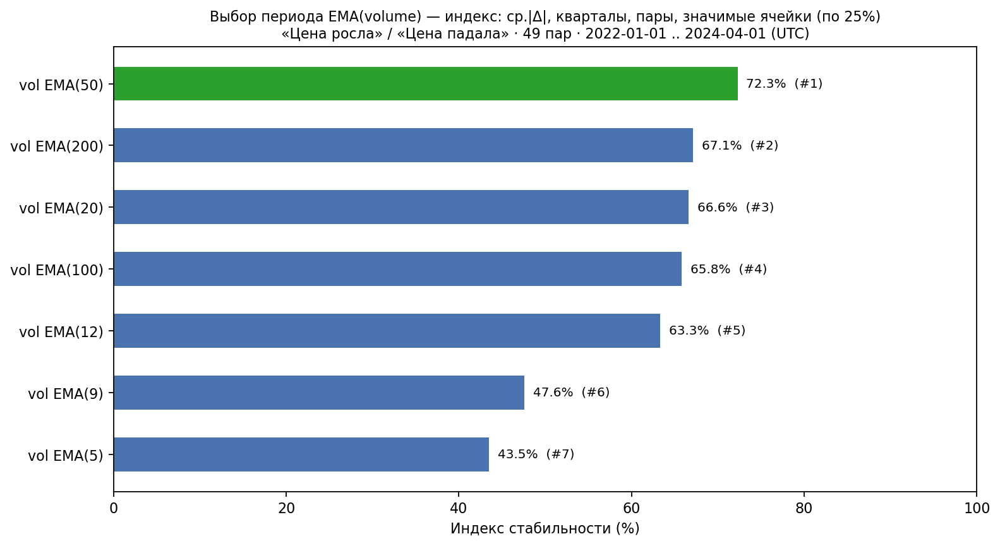

_Рис. VOL-0a. Индекс стабильности по кандидатам EMA(volume) (train)._

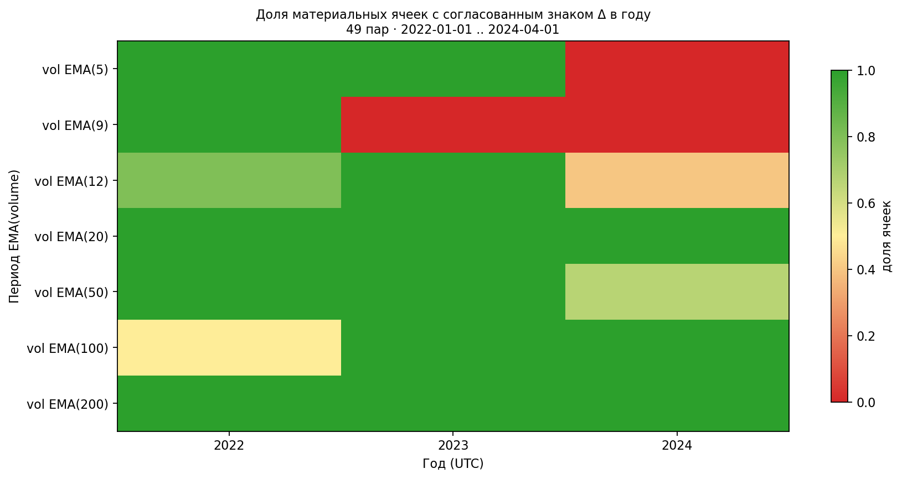

_Рис. VOL-0b. Доля материальных ячеек с согласованным знаком Δ в году._

### Ключевые выводы (этап 0)

1. **EMA(volume, 50)** — лучший компромисс по индексу стабильности: 6 значимых ячеек, согласие 74% по кварталам и 61% по парам.
2. **Два режима объёма:** при **HIGH / VERY_HIGH** (b2–b3) — **momentum** (рост чаще, падение реже); при **SPIKE** (b4) — **разворот** (рост реже, падение чаще). Это различие важно для этапов 1–3.
3. **Короткие периоды (5, 9)** и **длинные (100, 200)** дают меньше устойчивых ячеек; EMA(20) силён по кварталам/парам, но уступает EMA(50) по числу значимых комбинаций.
4. **LOW / NORMAL** (b0–b1) на train не дали \|Δ\| ≥ 1.5 п.п. ни у одного кандидата.

**Следующий шаг:** этапы 1–3 с **EMA(volume, 50)** — проверки cross-asset и out-of-time по методологии EMA/RSI.

### Этапы 1–3. Валидация паттерна EMA(volume, 50)

**Метрика:** условная связь вчерашнего `vol_log_rel50` с сегодняшним intraday return. Анализируются колонки **«Цена росла»** / **«Цена падала»** (Δ от BASE в п.п.).

**Критерии:** |Δ| ≥ 1.5 п.п. на train, p < 0.005 (Bonferroni, 10 ячеек), cross‑asset ≥60% val-пар, out‑of‑time ≥60% пар.

_Показаны только ячейки, прошедшие |Δ| ≥ 1.5 п.п. на train temporal:_

#### Проверка 1: универсальность среди пар (24 train / 25 val, 2022–2026)

| Сигнал | Δ train | Δ val | p-value | Val-пар (≥60%) | Статус |
| ------ | ------- | ----- | ------- | -------------- | ------ |
| b2 HIGH × Цена росла | +1.86 | +1.42 | 0.011 | 18/25 (72%) ✅ | ❌ не значим |
| b2 HIGH × Цена падала | −1.99 | −1.24 | 0.009 | 17/25 (68%) ✅ | ❌ не значим |

_На cross-asset ни одна ячейка не прошла Bonferroni (p ≥ 0.005)._

#### Проверка 2. Устойчивость во времени (49 пар, train 2022–2024-04 / val 2024-04–2026)

| Сигнал | Δ train | Δ val | p-value | Пар (≥60%) | Статус |
| ------ | ------- | ----- | ------- | ---------- | ------ |
| b0 LOW × Цена росла | −1.53 | −0.86 | 0.0001 | 31/49 (63%) ✅ | ❌ не значим\* |
| b2 HIGH × Цена росла | +2.12 | +1.38 | 0.0004 | 31/49 (63%) ✅ | ✅ значим |
| b2 HIGH × Цена падала | −2.10 | −1.33 | 0.0004 | 30/49 (61%) ✅ | ✅ значим |

\*b0 LOW × «Цена росла» прошёл out-of-time, но не прошёл cross-asset.

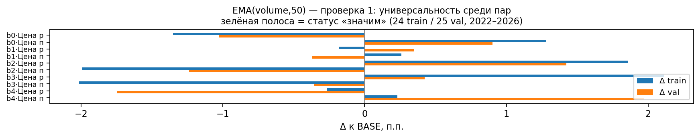

_Рис. VOL-1a. Δ к BASE на train и val (п.п.). Зелёная полоса = статус «значим»._

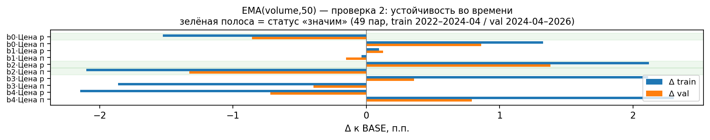

_Рис. VOL-1b. Δ к BASE на train-периоде и val-периоде (п.п.)._

### Ключевые выводы (этапы 1–3)

После двух проверок (cross‑asset + out‑of‑time) подтверждён **только momentum-сигнал HIGH (b2)**:

| Бакет | Сигнал | Δ (полный пул) | Смысл |
| ----- | ------ | -------------- | ----- |
| **b2 HIGH** | Цена росла ↑ | +1.66 п.п. | После повышенного объёма — завтра чаще рост |
| **b2 HIGH** | Цена падала ↓ | −1.65 п.п. | …и реже падение |

**Что отсеялось:**

- **b3 VERY_HIGH, b4 SPIKE** — сильные эффекты на train screen, но не выдержали out-of-time (<60% пар) или Bonferroni
- **b0 LOW** — прошёл out-of-time по «Цена росла» (63%), но **не прошёл cross-asset** и Bonferroni на падении
- **b1 NORMAL** — |Δ| ниже порога

**Итог:** устойчивый сигнал на **EMA(volume, 50)** — только **momentum при HIGH (b2)** на out-of-time; полный пул (пересечение проверок 1 и 2) — **не значим**.

#### ML-подтверждение (LightGBM + CPCV)

**Цель:** проверить, содержит ли вчерашнее относительное отклонение объёма от EMA(volume, 50) (`vol_log_rel_pair`) предсказательную способность для `direction_up`, и согласуется ли ML со статистическим momentum-сигналом **b2 HIGH**.

**Данные:** 49 пар (первая свеча ≤ 2023-01-01).  
**Train:** 2022-01-01 – 2024-04-01 (29 957 строк day × pair).  
**Holdout test:** 2024-04-01 – 2026-05-31 (36 113 строк).  
**Таргет:** `direction_up = 1`, если `close > open`.  
**Признаки:** `pair_id` (категориальный) + `vol_log_rel_pair` — **сырое** `ln(day_volume / EMA(volume, 50))` вчера, **без** min/max нормировки (метрика уже относительна per-pair).

**Модель:** LightGBM, early stopping на holdout (`best_iter=15`).

**Схема:** CPCV на train (`n_splits=7`, `n_test_groups=2` → 21 фолд) → финальный fit на train → holdout test.

##### Качество модели

| Метрика  | Train (fit) | Pooled OOS (train) | Holdout test | Δ (Test − OOS) |
| -------- | ----------- | ------------------ | ------------ | -------------- |
| Accuracy | 0.529       | 0.507              | 0.502        | −0.005         |
| ROC AUC  | 0.543       | 0.512              | **0.508**    | −0.004         |
| Log Loss | 0.692       | 0.693              | 0.693        | +0.000         |
| Brier    | 0.249       | 0.250              | 0.250        | +0.000         |
| ECE      | 2.2%        | 1.5%               | 2.2%         | +0.7 п.п.      |

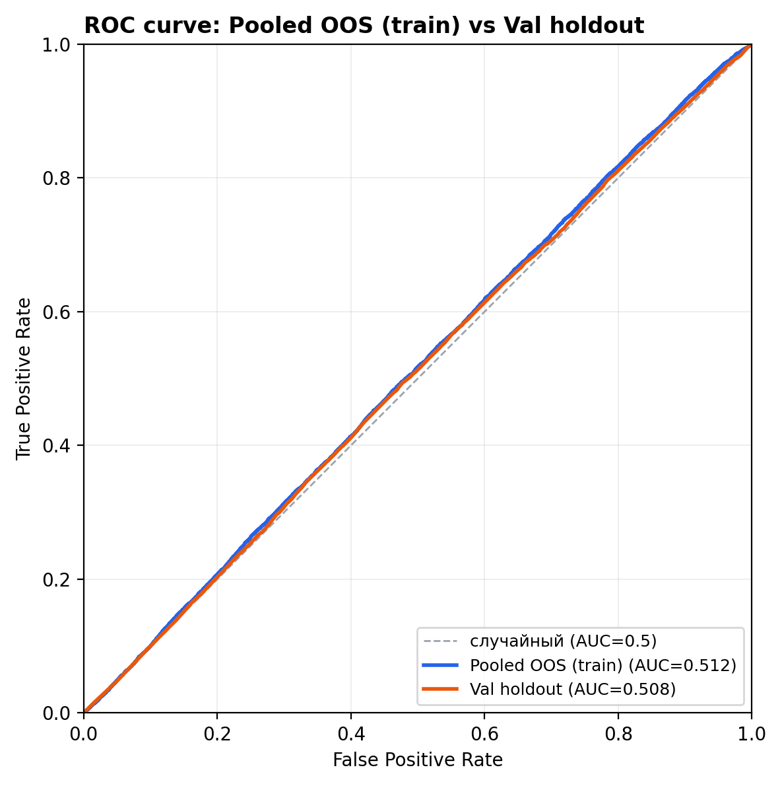

##### Стабильность по фолдам (train CPCV, 21 фолд)

| Метрика  | Mean  | Std   | Min   | Max   | ROC AUC > 0.5 |
| -------- | ----- | ----- | ----- | ----- | ------------- |
| ROC AUC  | 0.518 | 0.005 | 0.510 | 0.527 | 21/21         |
| Accuracy | 0.509 | 0.005 | 0.495 | 0.520 | 19/21         |

_Как считаются **Pooled OOS** и **Mean по фолдам**, и почему ROC AUC между ними различается — см. [ML: Pooled OOS и Mean по фолдам (CPCV)](#ml-pooled-oos-и-mean-по-фолдам-cpcv)._

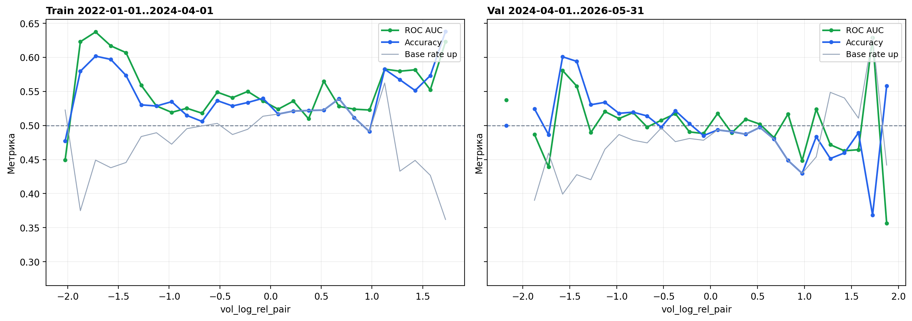

_Рис. VOL-ML-1. Предсказательная сила модели по бинам `vol_log_rel_pair`: train-fit (слева) и holdout test (справа). Положительные значения ≈ повышенный объём (b2 HIGH / momentum)._

**Краткий итог ML:** слабый, но устойчивый сигнал на train-CPCV (pooled OOS ROC AUC ≈ 0.512, все 21 фолда > 0.5). На holdout ROC AUC **0.508** — на уровне standalone EMA (0.513), ниже RSI (0.523). Модель смещена в long (`pred_up_rate` ~62% при `base_rate_up` 48%). Feature importance: `pair_id` 47%, `vol_log_rel_pair` 43%. Predictive-график слабо подтверждает рост P(up) при высоком `vol_log_rel` — в согласии с **b2 HIGH** на out-of-time, но эффект тонкий; cross-asset проверка статистики не пройдена.

---

### Историческое тестирование стратегии volume_spreads (out-of-sample)

**Out-of-sample период** = val-окно исследования: **2024-04-01 — 2026-05-31 (UTC)**.  
Пороги бакетов q30/q70/q85/q95 per-pair заморожены на train (2022-01-01 — 2024-04-01).

#### Правила стратегии

| Условие (вчера, UTC close) | Позиция | Доходность |
| -------------------------- | ------- | ---------- |
| **b2 HIGH** (q70–q85 ln(vol/EMA50)) | long | `(close − open) / open × 100%` |
| Остальные бакеты | flat | 0% |

- Равный **peak-вес 1/N** на пару (N = 49 конс. / **27** опт. / **49** ML), без реинвестирования, NAV=100
- **Exposure:** ~94% (конс.) / ~85% (опт.) / **100% (ML)**
- **Комиссии** (Bybit non-VIP): taker 0.200% round-trip, maker 0.072%
- **Бенчмарки:** B&H 49 пар (gross), BTC B&H (gross)
- **Формат отчётов:** как у `ema_spreads` / `rsi_spreads`

#### Сценарии

| Сценарий | Описание |
|----------|----------|
| **Консервативный** | Все 49 пар, long при вчерашнем b2 HIGH |
| **Оптимистичный** | Train-отбор: b2 HIGH × «Цена росла», знак Δ + ≥⅔ лет (**27 пар**) |
| **ML (`volume_spreads_ml`)** | Все **49 пар**, без train-отбора пар<br>**Пороги:** `t_long = 0.51`, `t_short = 0.49` (из `prob_return_dependence` на train, edge 0.25%)<br>Признак `vol_log_rel_pair` + `pair_id`; long/short по P(up) |

#### Результаты (val, 2024-04-01 — 2026-05-31)

| Метрика | Конс. (49, gross) | Конс. (49, taker) | Конс. (49, maker) | Опт. (27, gross) | Опт. (27, taker) | Опт. (27, maker) | ML (49, gross) | ML (49, taker) | ML (49, maker) | B&H 49 (gross) | BTC B&H (gross) |
| ------- | ----------------- | ----------------- | ----------------- | ---------------- | ---------------- | ---------------- | -------------- | -------------- | -------------- | -------------- | ---------------- |
| Total Return | +0.6% | −23.7% | −8.1% | −2.3% | −27.0% | −11.2% | **+14.6%** | −25.8% | **+0.0%** | −32.2% | **+28.3%** |
| CAGR (compounded) | +0.3% | −11.8% | −3.9% | −1.1% | −13.6% | −5.3% | **+6.5%** | −13.0% | **+0.0%** | −16.5% | +12.3% |
| Sharpe (0% rf) | 0.02 | −0.66 | −0.23 | −0.06 | −0.69 | −0.29 | **+0.38** | −0.68 | 0.00 | −0.21 | +0.28 |
| Max Drawdown | −18.0% | −29.9% | −19.7% | −24.4% | −30.2% | −25.7% | −19.0% | −27.1% | −21.6% | −70.3% | −37.4% |
| Profit Factor | 1.00 | 0.90 | 0.96 | 0.99 | 0.89 | 0.95 | 1.04 | 0.93 | 1.00 | 0.98 | 1.04 |
| Win Rate (trades) | 48.8% | 47.0% | 48.4% | 48.7% | 47.0% | 48.3% | 49.8% | 47.8% | 49.2% | 47.8% | 50.2% |
| Median trade return | −0.09% | −0.29% | −0.16% | −0.10% | −0.30% | −0.18% | 0.00% | −0.20% | −0.07% | −0.17% | +0.01% |
| Information Ratio (vs B&H 49) | — | 0.06 (taker) | 0.18 (maker) | — | 0.04 (taker) | 0.16 (maker) | — | 0.04 (taker) | **0.22 (maker)** | — | — |
| Exposure | 94.3% | 94.3% | 94.3% | 85.1% | 85.1% | 85.1% | 100% | 100% | 100% | 100% | 100% |
| Worst day (net) | −6.5% (2026-02-05) | −6.6% | −6.6% | −6.4% | −6.5% | −6.5% | −5.6% (2024-04-12) | −5.7% | −5.6% | −22.3% | −14.0% |

*Gross — без комиссий. Taker/maker — с комиссиями. ML: при maker net total ≈ gross edge (+14.6% gross → +0.03% maker). Rule-based: высокий exposure (~94% дней в b2) съедает edge на taker.*

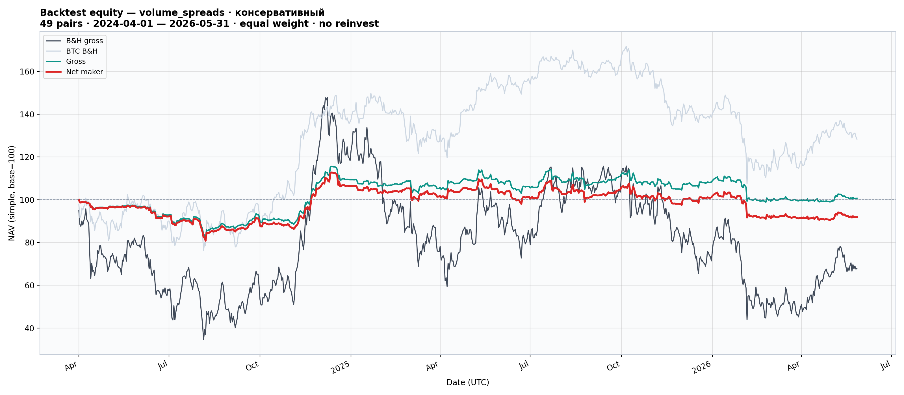
**Рис. VOL-BT-1. Консервативный (49 пар)** — gross / net maker.

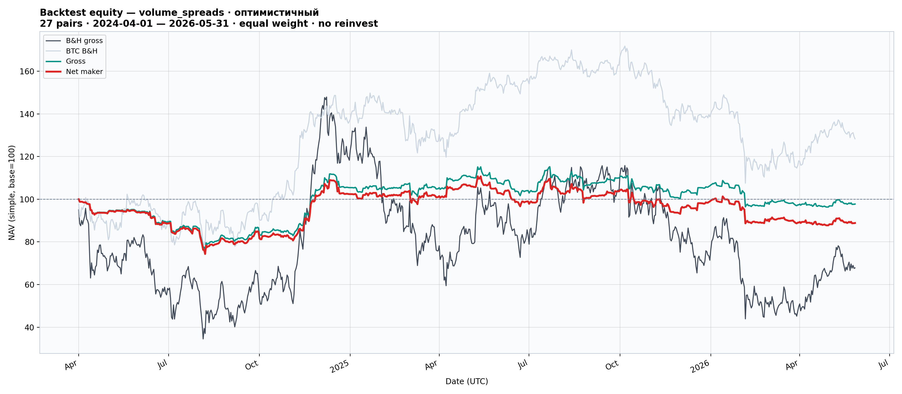
**Рис. VOL-BT-2. Оптимистичный (27 пар)** — gross / net maker.

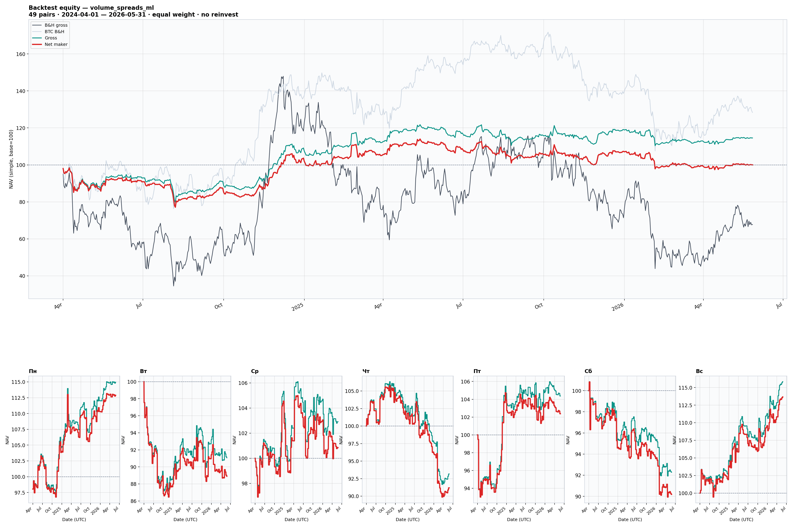
**Рис. VOL-BT-3. ML (`volume_spreads_ml`)** — 49 пар, без отбора; gross / net maker.

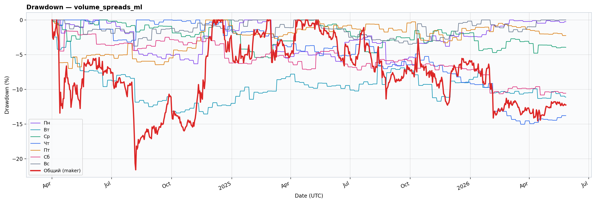
**Рис. VOL-BT-4. Drawdown — ML**

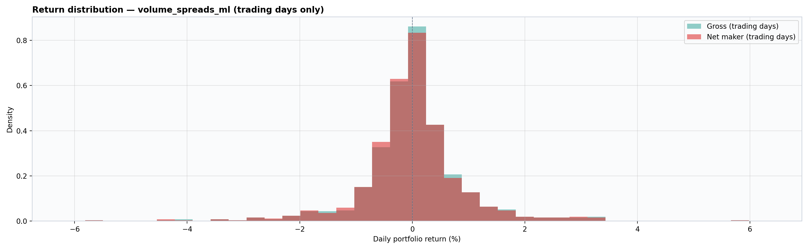
**Рис. VOL-BT-5. Распределение доходностей — ML (net maker)**

#### Вклад по дням недели (ML, net maker)

| День | Total Ret | Avg trade | Sharpe | MaxDD |
| ---- | --------- | --------- | ------ | ----- |
| **Вс** | +13.7% | +0.454% | 1.04 | −3.8% |
| **Пн** | +12.9% | +0.449% | 0.71 | −6.6% |
| **Пт** | +2.4% | +0.086% | 0.17 | −7.0% |
| **Ср** | +0.8% | +0.029% | 0.06 | −5.5% |
| **Чт** | −8.8% | −0.321% | −0.66 | −15.0% |
| **Сб** | −9.8% | −0.337% | −0.82 | −10.8% |
| **Вт** | −11.1% | −0.368% | −0.76 | −13.5% |

### Ключевые выводы (бэктест)

**1. Rule-based b2 не монетизируется на val.** Gross около нуля (+0.6% конс., −2.3% опт.) при WR ~49% — статистический momentum на out-of-time не переносится в intraday PnL после комиссий.

**2. Высокий exposure убивает taker.** ~94% дней в рынке (b2 встречается часто) → taker −24% / −27% даже при IR maker ~0.16–0.18 vs B&H.

**3. ML без отбора пар (49, `t_long=0.51` / `t_short=0.49`).** Exposure 100%; gross **+14.6%**, maker **≈0%** (+0.03%), taker −25.8%; IR maker **0.22** vs B&H. Слабый gross-edge (PF 1.04, Sharpe 0.38) почти полностью уходит в комиссии; воскресенье и понедельник дают основной вклад, вторник/четверг/суббота — отрицательные.

**4. Оптимистичный отбор (27 пар) не улучшает gross** относительно консервативного — эффект b2 слишком тонкий для pair cherry-picking.

**Итог.** Объёмный momentum **b2 HIGH** подтверждён статистикой out-of-time, но **не готов к standalone rule-based** на val. ML даёт умеренную gross-альфу (+14.6%) при maker ≈ 0 и лучшем IR maker (0.22), чем rule-based; для taker нужны более редкие сигналы или комбинация с другими фичами.

#### Дополнительные материалы (исследование)

| Материал                                                                                                                                       | Описание                                                                                                    |
| ---------------------------------------------------------------------------------------------------------------------------------------------- | ----------------------------------------------------------------------------------------------------------- |
| [volume_ema_period_screen train](research_outputs/volume/volume_regimes/statistics/volume_ema_period_screen_49pairs_vol5_9_12_20_50_100_200_20220101_20240401.log) | Этап 0 — скрининг периодов EMA(volume) (49 пар, train 2022-01-01 – 2024-04-01), значимые ячейки по бакетам |
| [volume_summary_vol50.log](research_outputs/volume/volume_regimes/statistics/volume_summary_vol50.log) | Этапы 1–3 — проверки 1–2 и итог: универсальность среди пар, устойчивость во времени, полный пул |
| [ML: train/test JSON](research_outputs/volume/volume_regimes/ml/metrics/direction_vol_49pairs_20220101_20260531_train_test.json) | Полный отчёт: train CPCV + final fit + holdout test |
| [ML: ROC AUC train vs test](research_outputs/volume/volume_regimes/ml/plots/direction_vol_49pairs_20220101_20260531_roc_auc.png) | ROC-кривые pooled OOS (train) и holdout test |
| [ML: predictive vs vol_log_rel](research_outputs/volume/volume_regimes/ml/plots/direction_vol_49pairs_20240401_20260531_vol_log_rel_predictive.png) | ROC AUC / accuracy по бинам `vol_log_rel_pair` (train \| val) |
| [ML: модель + period](research_outputs/volume/volume_regimes/ml/models/direction_vol_49pairs_20220101_20240401_model_bundle.pkl) | Bundle: LightGBM + `vol_period=50` + feature schema |
| [ML: лог](research_outputs/volume/volume_regimes/ml/direction_vol_20220101_20260531.log) | Лог train/test запуска |
| [бэктест консервативный](research_outputs/volume/volume_regimes/backtest/volume_spreads_backtest_49pairs_20240401_20260531.log) | 49 пар, b2 long |
| [бэктест оптимистичный](research_outputs/volume/volume_regimes/backtest/volume_spreads_backtest_optimistic_b2_27pairs_20240401_20260531.log) | 27 пар, train-отбор b2 |
| [бэктест ML](research_outputs/volume/volume_regimes/backtest/volume_spreads_ml_backtest_ml_49pairs_20240401_20260531.log) | volume_spreads_ml, 49 пар, без отбора |

#### Воспроизведение отчётов (исследование)

```bash
cd crypto_research

python3 report_generator.py volume_ema_period_screen # Этап 0: скрининг периодов EMA(volume) (train 2022-01-01 – 2024-04-01 по умолчанию)
python3 report_generator.py volume_spreads --summary   # Этапы 1–3: сводка train/val — volume_summary_vol50.log

# опционально другой период:
# python3 report_generator.py volume_spreads --summary --ema-periods 50

# ML (train/test: 49 пар, train 2022-01-01–2024-04-01, test 2024-04-01–2026-05-31)
python3 ml_research.py volume_spreads_ml --train-test --plot-metrics-over-feature
# пересборка predictive-графика из bundle:
# python3 utils/ml/plot_feature_predictive.py volume_spreads_ml

# Бэктест (val 2024-04-01 — 2026-05-31)
python3 backtester.py volume_spreads --scenario conservative
python3 backtester.py volume_spreads --scenario optimistic
python3 backtester.py volume_spreads_ml
```

Отчёты пишутся в `research_outputs/volume/volume_regimes/statistics/`; графики — в `…/statistics/plots/`. ML-артефакты — в `…/ml/`. Бэктест — в `…/backtest/`.

---

### Исследование 6. Волатильность (range / SMA)

Исследование проводится в **два этапа** (по той же схеме, что EMA/RSI):

1. **Этап 0 — выбор периода SMA(range)** (`volatility_period_screen`): на **train-периоде** (49 пар, 2022-01-01 – 2024-04-01) сравниваем кандидатов **5, 9, 12, 20, 50, 100, 200** по устойчивости сигнала. Это **не** проверка значимости — только фиксация периода для следующих этапов.
2. **Этапы 1–3 — паттерн** (`volatility_spreads` с **SMA(range, 9)**): универсальность среди пар и устойчивость во времени (по критериям из методологии).

**Важно:** сигнал — **вчера → сегодня**, без forward-горизонта. Вчерашний дневной range нормируется на SMA(range) той же пары; return измеряется на **следующий** UTC-день (open→close).

---

### Этап 0. Выбор периода SMA(range) (только train)

**Цель:** определить период SMA по дневному range с наиболее устойчивой связью «вчерашний режим волатильности → сегодняшний intraday return».

**Условие (вчера):**

- `range_pct = (high − low) / close × 100%`
- `ratio = range_pct / SMA(range_pct, N)`
- `dev = ratio − 1` на конец предыдущего дня (`range_dev{N}_prev`)

Бакеты **b0–b6** — те же per-pair квантили, что у EMA (по знаку `ratio−1`):

| Бакет | Условие              | Бакет | Условие                |
| ----- | -------------------- | ----- | ---------------------- |
| b0    | ratio−1 > t2⁺        | b4    | t2⁻ ≤ ratio−1 < −near  |
| b1    | t1⁺ < ratio−1 ≤ t2⁺  | b5    | t1⁻ ≤ ratio−1 < t2⁻    |
| b2    | near < ratio−1 ≤ t1⁺ | b6    | ratio−1 < t1⁻          |
| b3    | \|ratio−1\| ≤ near   |       |                        |

_t1⁺/t2⁺ — ⅓ и ⅔ квантили среди ratio−1>0; t1⁻/t2⁻ — ⅓ и ⅔ среди ratio−1<0 (t1⁻ ≤ t2⁻); near = max(Q10(\|ratio−1\|), 0.05%)._

**Метрика скрининга:** Δ к BASE в колонках «Цена росла» / «Цена падала» (п.п.). Значимая ячейка: \|Δ\| ≥ **1.5** п.п.

**Индекс стабильности** (25% на каждую компоненту): ср.\|Δ\|, ср.кварталы %, ср.пары %, число значимых ячеек.

**Результаты (49 пар, train: 2022-01-01 – 2024-04-01):**

| #   | SMA   | ср.\|Δ\|, п.п. | Ср.кварт. | Ср.пары | Знач. | Индекс % |
| --- | ----- | -------------- | --------- | ------- | ----- | -------- |
| 1   | **9** | **3.3**        | **82%**   | 73%     | 7     | **81.3** |
| 2   | 50    | 2.3            | 68%       | 71%     | 10    | 77.7     |
| 3   | 12    | 2.6            | 69%       | 69%     | 8     | 73.7     |
| 4   | 5     | 2.6            | 80%       | 73%     | 6     | 73.2     |
| 5   | 20    | 3.2            | 74%       | **79%** | 4     | 72.0     |
| 6   | 100   | 2.9            | 76%       | 72%     | 4     | 68.8     |
| 7   | 200   | 2.2            | 57%       | 68%     | 6     | 62.9     |

**Выбран SMA(range, 9)** — максимальный индекс стабильности (81.3%), 82% согласия по кварталам.

**Значимые ячейки SMA(9) на train (этап 0):**

| Бакет | Сигнал        | Δ, п.п. | Кварталы | Пары  | Интерпретация (на train)                    |
| ----- | ------------- | ------- | -------- | ----- | ------------------------------------------- |
| b0    | Цена росла ↑  | +1.6    | 7/9      | 31/49 | Высокий range вчера — завтра чаще рост      |
| b1–b2 | Цена росла/↓  | ±3.2…3.7| 7–8/9    | 32–38/49 | Повышенный range — сильный сдвиг знаков  |
| b6    | Цена росла ↓  | −3.9    | 8/10     | 42/49 | Сжатый range — завтра реже рост             |
| b6    | Цена падала ↑ | +3.9    | 8/10     | 42/49 | …и чаще падение                             |

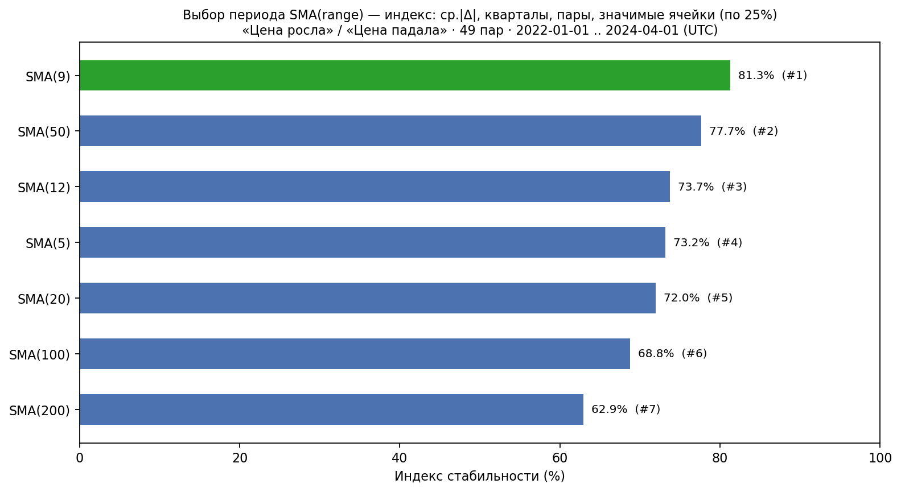

_Рис. VAR-0a. Индекс стабильности по кандидатам SMA(range) (train)._

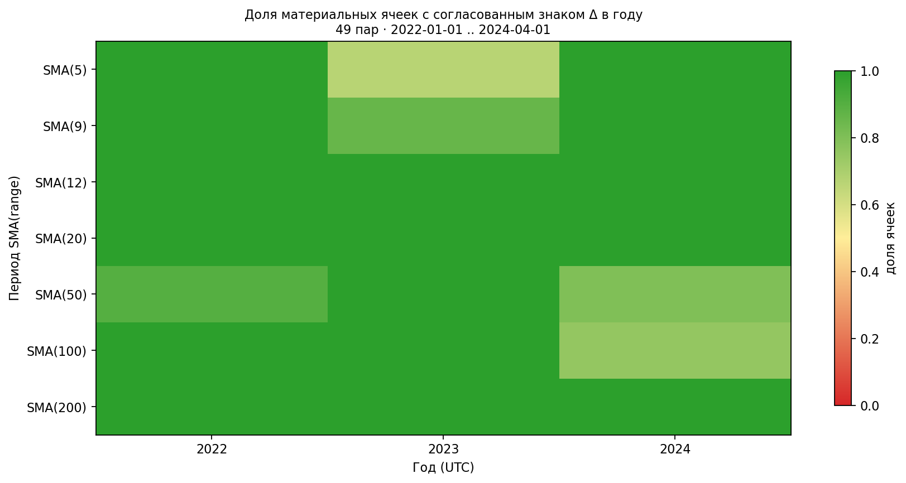

_Рис. VAR-0b. Доля материальных ячеек с согласованным знаком Δ в году._

### Этапы 1–3. Валидация паттерна SMA(range, 9)

**Метрика:** условная связь вчерашнего `range_dev9` с сегодняшним intraday return. Анализируются колонки **«Цена росла»** / **«Цена падала»** (Δ от BASE в п.п.).

**Критерии:** |Δ| ≥ 1.5 п.п. на train, p < 0.0036 (Bonferroni, 14 ячеек), cross‑asset ≥60% val-пар, out‑of‑time ≥60% пар.

_Показаны только ячейки, прошедшие |Δ| ≥ 1.5 п.п. на train:_

#### Проверка 1: универсальность среди пар (24 train / 25 val, 2022–2026)

| Сигнал              | Δ train | Δ val | p-value | Val-пар (≥60%) | Статус       |
| ------------------- | ------- | ----- | ------- | -------------- | ------------ |
| b1 × Цена росла     | +1.85   | +1.57 | 0.034   | 17/25 (68%) ✅ | ❌ не значим |
| b1 × Цена падала    | −1.83   | −1.51 | 0.031   | 17/25 (68%) ✅ | ❌ не значим |
| b2 × Цена росла     | +2.38   | +2.35 | 0.019   | 21/25 (84%) ✅ | ❌ не значим |
| b2 × Цена падала    | −2.37   | −2.17 | 0.013   | 21/25 (84%) ✅ | ❌ не значим |
| b6 × Цена росла     | −3.15   | −2.77 | <0.0001 | 23/25 (92%) ✅ | ✅ значим    |
| b6 × Цена падала    | +3.23   | +2.69 | <0.0001 | 22/25 (88%) ✅ | ✅ значим    |

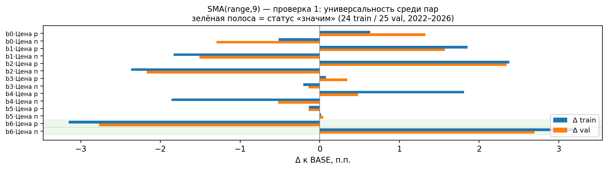

_Рис. VAR-1a. Δ к BASE на train и val (п.п.). Зелёная полоса = статус «значим»._

#### Проверка 2. Устойчивость во времени (49 пар, train 2022–2024-04 / val 2024-04–2026)

| Сигнал              | Δ train | Δ val | p-value | Пар (≥60%)  | Статус       |
| ------------------- | ------- | ----- | ------- | ----------- | ------------ |
| b1 × Цена росла     | +3.32   | +1.07 | 0.001   | 30/49 (61%) ✅ | ✅ значим\* |
| b1 × Цена падала    | −3.21   | −1.08 | 0.001   | 30/49 (61%) ✅ | ✅ значим\* |
| b2 × Цена росла     | +3.73   | +0.79 | 0.0002  | 22/49 (45%) ❌ | ❌ не значим |
| b2 × Цена падала    | −3.61   | −0.74 | 0.0006  | 18/49 (37%) ❌ | ❌ не значим |
| b6 × Цена росла     | −3.96   | −2.38 | <0.0001 | 38/49 (78%) ✅ | ✅ значим    |
| b6 × Цена падала    | +3.91   | +2.40 | <0.0001 | 39/49 (80%) ✅ | ✅ значим    |

\*b1 прошёл out-of-time, но **не прошёл cross-asset** (p ≥ 0.0036 на train-парах).

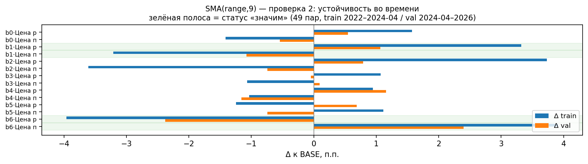

_Рис. VAR-1b. Δ к BASE на train-периоде и val-периоде (п.п.)._

### Ключевые выводы

После двух проверок (cross‑asset + out‑of‑time) подтверждён **только сигнал сжатой волатильности b6**:

| Бакет                    | Сигнал        | Δ (полный пул) | Смысл для стратегии                                      |
| ------------------------ | ------------- | -------------- | -------------------------------------------------------- |
| **b6** (ratio−1 < t1⁻)   | Цена росла ↓  | −2.98 п.п.     | После очень тихого дня — завтра **реже** рост            |
| **b6**                   | Цена падала ↑ | +2.98 п.п.     | …и **чаще** падение (лёгкий медвежий уклон на след. день)|

_Направление **противоположно EMA b6**: у EMA перепроданность → отскок вверх; у range/SMA — сжатие → слабый bearish bias, а не mean-reversion long._

**Что отсеялось:**

- **b0–b2** (повышенный range вчера) — сильные эффекты на train screen и частично на cross-asset (b2: 84% val-пар), но **b2 не выдержал out-of-time** (37–45% пар); **b1** прошёл out-of-time, но не Bonferroni на cross-asset
- **b3–b5** — |Δ| ниже порога материальности на train summary
- **b0** — не прошёл |Δ| ≥ 1.5 п.п. на train в этапах 1–3

**Итог:** режим волатильности вчера предсказывает return сегодня **узко** — только при **экстремально низком range относительно SMA(9)**. Сигнал устойчив по парам (88–92%) и по времени (78–80%). ML и бэктест — следующий шаг (пока не реализованы).

#### Дополнительные материалы (исследование)

| Материал                                                                                                                                       | Описание                                                                                                    |
| ---------------------------------------------------------------------------------------------------------------------------------------------- | ----------------------------------------------------------------------------------------------------------- |
| [volatility_period_screen train](research_outputs/volatility/volatility_spreads/statistics/volatility_period_screen_49pairs_sma5_9_12_20_50_100_200_20220101_20240401.log) | Этап 0 — скрининг периодов SMA(range) (49 пар, train 2022-01-01 – 2024-04-01), значимые ячейки по бакетам |
| [volatility_summary_sma9.log](research_outputs/volatility/volatility_spreads/statistics/volatility_summary_sma9.log)                         | Этапы 1–3 — проверки 1–2 и итог: универсальность среди пар, устойчивость во времени, полный пул           |

#### Воспроизведение отчётов (исследование)

```bash
cd crypto_research

python3 report_generator.py volatility_period_screen  # Этап 0: скрининг периодов SMA(range) (train 2022-01-01 – 2024-04-01 по умолчанию)
python3 report_generator.py volatility_spreads --summary   # Этапы 1–3: сводка train/val — volatility_summary_sma9.log

# опционально другой период:
# python3 report_generator.py volatility_spreads --summary --ema-periods 9
```

Отчёты пишутся в `research_outputs/volatility/volatility_spreads/statistics/`; графики — в `…/statistics/plots/`.

---
## Сравнение стратегий

Этот раздел сводит два уровня сравнения на одном holdout-окне **2024-04-01 — 2026-05-31**:

1. **Качество моделей** — как менялись предсказательные метрики при добавлении фич: `day_of_week_ml` → `ema_spreads_ml` → `rsi_spreads_ml` → `volume_spreads_ml` → `price_sequences_ml` → combined `dow_ema_sp` → `dow_ema_rsi_sp` → combined `dow_ema_rsi_streak` → combined `dow_ema_rsi_streak_vol`.
2. **Торговый результат** — ML-бэктест combined на **49 парах** (пороги из `train_test.json`) vs **combined algo (`--mode or` / `and`)** на том же val-окне; отдельно — ML `price_sequences_ml`.

Метрики модели: **классификатор** (ROC AUC, accuracy при valley/0.5, калибровка) и **торговые пороги** (`t_long`/`t_short` → signal acc, hit rate, доля long/short на holdout). Метрики бэктеста — к **портфелю** на всех **49 парах** пула; пороги long/short — `prob_return_thresholds` из `train_test.json` (без `policy.json`). Комиссии — Bybit RU/CIS (taker / maker).

### Эволюция ML-модели (holdout test)

Обучение: train **2022-01-01 — 2024-04-01** (CPCV); оценка модели: holdout test **2024-04-01 — 2026-05-31**. Во всех строках — одни и те же 49 пар и период test; меняются только признаки и объединённая модель. **AUC pooled / Acc pooled** — OOS-метрики CPCV на train (pooled по всем фолдам). **AUC test / Acc test** — holdout test (2024-04-01 — 2026-05-31); accuracy при `classification_threshold` (valley на train P(up), иначе 0.5). **Торговые пороги** `t_long` / `t_short` — из `prob_return_dependence` на train (frozen); **Signal acc**, **Hit long/short**, **%long/%short** — на holdout test только по строкам с сигналом long (`P(up)≥t_long`) или short (`P(up)≤t_short`); flat не входит в signal acc.

| Этап | Признаки | AUC pooled | Acc pooled | AUC test | Acc test | Brier | ECE | Log-loss | base↑ | pred↑ | t_long | t_short | Signal acc | Hit long | Hit short | %long | %short |
| ---- | -------- | ---------- | ---------- | -------- | -------- | ----- | --- | -------- | ----- | ----- | ------ | ------- | ---------- | -------- | --------- | ----- | ------ |
| **day_of_week_ml** | `pair_id`, `weekday_enc` | 0.484 | 0.489 | 0.533 | 0.520 | 0.249 | 0.026 | 0.692 | 47.8% | 51.6% | 0.527 | 0.460 | 0.542 | 0.533 | 0.579 | 18.0% | 4.4% |
| **ema_spreads_ml** | `pair_id`, `ema_dev_pair_norm` | **0.518** | 0.506 | 0.517 | 0.506 | 0.250 | 0.028 | 0.693 | 47.8% | 59.4% | — | — | — | — | — | — | — |
| **rsi_spreads_ml** | `pair_id`, `rsi_pair_norm` | 0.507 | 0.503 | 0.522 | 0.513 | 0.250 | 0.026 | 0.692 | 47.8% | 53.6% | — | — | — | — | — | — | — |
| **volume_spreads_ml** (vol) | `pair_id`, `vol_log_rel_pair` | 0.512 | 0.507 | 0.508 | 0.502 | 0.250 | **0.022** | 0.693 | 48.0% | 61.9% | 0.5 | 0.5 | 0.502 | 0.485 | 0.529 | 61.9% | 38.1% |
| **price_sequences_ml** | `pair_id`, `streak_pair_norm` | **0.526** | **0.524** | 0.509 | 0.498 | 0.250 | 0.027 | 0.694 | 47.8% | 53.1% | — | — | — | — | — | — | — |
| **dow_ema_sp** (combined) | `pair_id`, `weekday_enc`, `ema_dev_pair_norm` | 0.520 | 0.515 | **0.546** | **0.536** | **0.249** | 0.028 | **0.691** | 47.8% | 51.0% | 0.519 | 0.470 | 0.536 | 0.520 | 0.584 | 35.2% | 11.8% |
| **dow_ema_rsi_sp** (combined) | `pair_id`, `weekday_enc`, `ema_dev_pair_norm`, `rsi_pair_norm` | 0.519 | 0.511 | **0.547** | 0.534 | **0.249** | 0.027 | **0.690** | 47.8% | 50.3% | 0.514 | 0.472 | **0.542** | 0.523 | 0.577 | 38.6% | 21.2% |
| **dow_ema_rsi_streak** (combined) | `pair_id`, `weekday_enc`, `ema_dev_pair_norm`, `rsi_pair_norm`, `streak_pair_norm` | 0.529 | 0.520 | 0.540 | 0.511 | **0.249** | 0.027 | 0.691 | 47.8% | **68.8%** | 0.518 | 0.460 | 0.526 | 0.509 | 0.565 | **46.4%** | 20.4% |
| **dow_ema_rsi_vol** (combined) | `pair_id`, `weekday_enc`, `ema_dev_pair_norm`, `rsi_pair_norm`, `vol_log_rel_pair` | 0.517 | 0.511 | **0.545** | **0.536** | 0.249 | 0.023 | 0.691 | 48.0% | 48.0% | 0.516 | 0.473 | 0.543 | 0.524 | 0.574 | 31.1% | 18.9% |
| **dow_ema_rsi_streak_vol** (combined) | `pair_id`, `weekday_enc`, `ema_dev_pair_norm`, `rsi_pair_norm`, `streak_pair_norm`, `vol_log_rel_pair` | 0.531 | **0.528** | 0.533 | 0.510 | **0.249** | 0.024 | 0.692 | 48.0% | 66.7% | 0.523 | 0.474 | 0.527 | 0.512 | 0.544 | 37.9% | 31.9% |

_У standalone `ema` / `rsi` / `price_sequences` пороги не считались (нет `prob_return_dependence` в прогоне). У `volume_spreads_ml`: в корне `prob_return_thresholds` — `t_long=0.51`, `t_short=0.49`; signal_metrics на holdout — 0.5/0.5 (fallback). **AUC pooled / Acc pooled** — `train_cpcv.pooled_oos_metrics` на train; **AUC test / Acc test**, Brier, ECE, log-loss, pred↑ — holdout test._

**Как читать таблицу:**

- **day_of_week_ml** — на holdout test ROC AUC **0.533**, Acc **0.520**; pooled AUC **0.484**, Acc **0.489**. Широкие пороги (`t_long` 0.527 / `t_short` 0.460) → мало сделок (**22%** active), signal acc **0.542**.
- **ema_spreads_ml** — pooled AUC **0.518** (лучший среди standalone на train); на test ROC AUC 0.517, сильное смещение в long (`pred↑` 59.4%). Торговые пороги не оценивались.
- **rsi_spreads_ml** — на test ROC AUC 0.522, Acc 0.513; pooled слабее EMA (AUC **0.507**). Торговые пороги не оценивались.
- **volume_spreads_ml** (vol) — слабый классификатор на test (AUC **0.508**, Acc 0.502); лучшая калибровка (ECE **0.022**). Пороги 0.5/0.5 на holdout → signal acc **0.502**, высокая доля long (**62%**).
- **price_sequences_ml** — лучший pooled среди standalone (AUC **0.526**, Acc **0.524**), но на test слабее (AUC 0.509). Торговые пороги не оценивались.
- **dow_ema_sp** — лучший test ROC AUC (**0.546**) и accuracy (**53.6%**); signal acc **0.536**, short hit **0.584** при умеренной активности (47% long+short).
- **dow_ema_rsi_sp** — лучший **signal acc (0.542)** и бэктест (+125% net maker); больше short-сигналов (**21%**) при `t_long`/`t_short` 0.514 / 0.472.
- **dow_ema_rsi_streak** — самая высокая активность (**67%** long+short), но signal acc **0.526** и hit long **0.509** ниже `dow_ema_rsi_sp`; `pred↑` 68.8% при valley-пороге accuracy 0.481.
- **dow_ema_rsi_streak_vol** — полный стек из 5 исследований; лучший pooled Acc (**0.528**), на test AUC **0.533**, signal acc **0.527**; активность **70%** long+short при `t_long`/`t_short` **0.523** / **0.474**; `pred↑` 66.7%.
- **dow_ema_rsi_vol** — DOW+EMA+RSI+vol без streak; на test совпадает с `day_of_week_ml` (AUC **0.545**) — артефакт прогона до фикса dynamic bundle; требует перезапуска.


**Рис. С1. ROC AUC по фолдам CPCV — day_of_week_ml** (train-период).


**Рис. С2. ROC AUC по фолдам CPCV — ema_spreads_ml**.


**Рис. С3. ROC AUC train \| test — combined dow_ema_sp**.


**Рис. С4. Распределение P(up) на holdout test — dow_ema_sp** (калибровка по дням недели).


**Рис. С5. Предсказательная сила по бинам `ema_dev_pair_norm` — dow_ema_sp** (train-fit и holdout test).

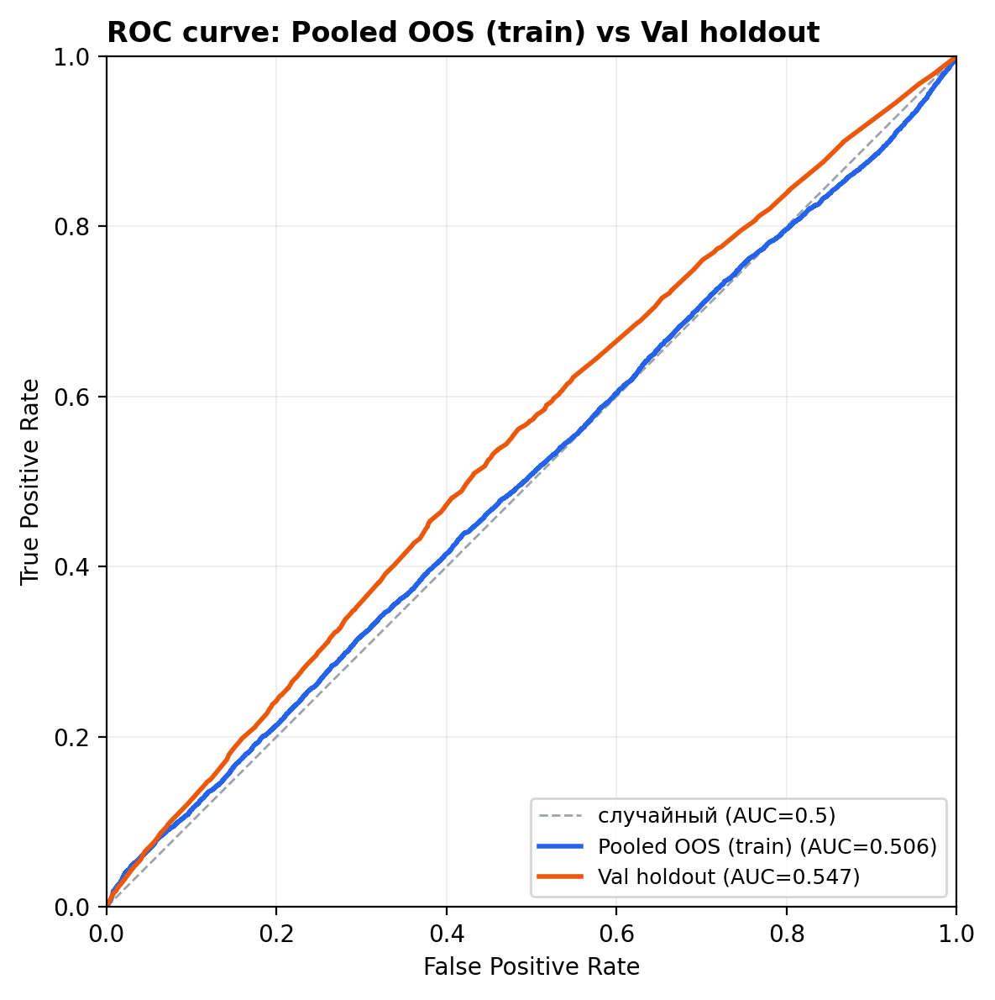
**Рис. С6. ROC AUC train \| test — combined dow_ema_rsi_sp**.


**Рис. С6b. ROC AUC train \| test — `price_sequences_ml`**.

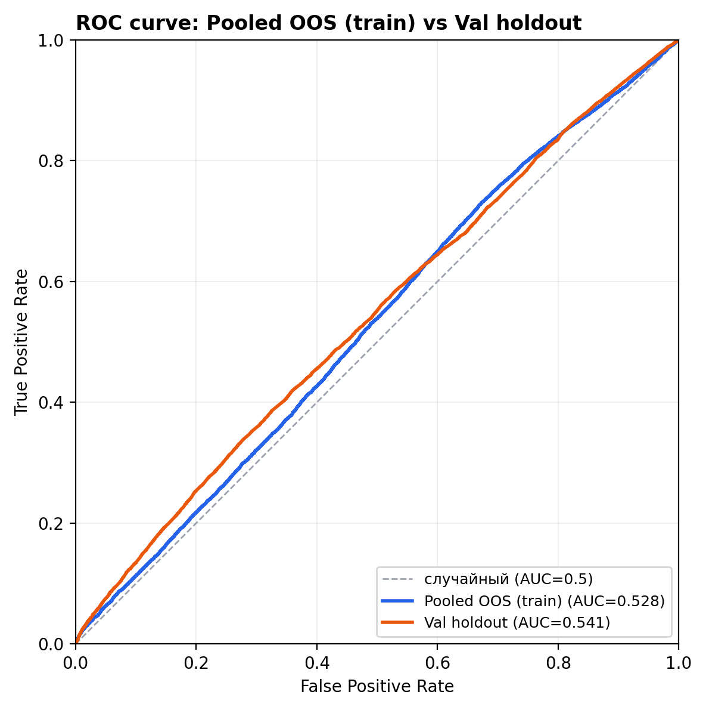
**Рис. С6c. ROC AUC train \| test — combined `dow_ema_rsi_streak`**.

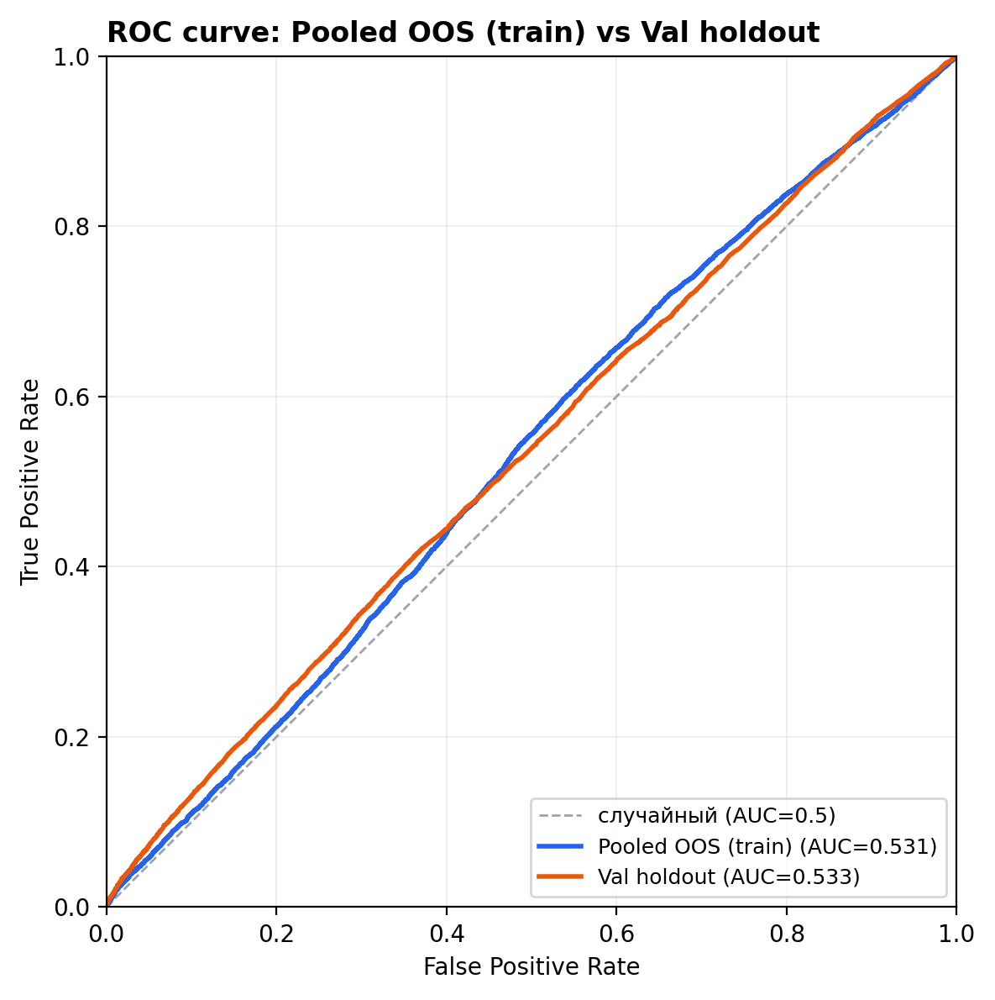
**Рис. С6d. ROC AUC train \| test — combined `dow_ema_rsi_streak_vol`**.

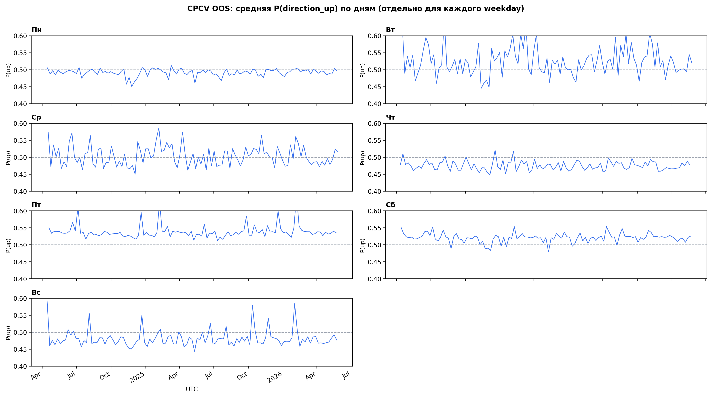
**Рис. С7. Распределение P(up) на holdout test — dow_ema_rsi_sp**.

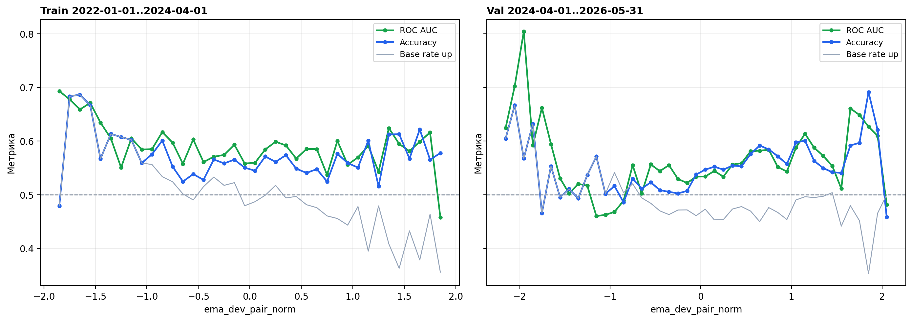
**Рис. С8. Предсказательная сила по бинам `ema_dev_pair_norm` — dow_ema_rsi_sp**.

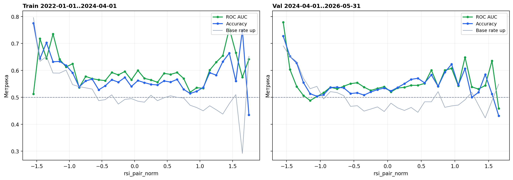
**Рис. С8b. Предсказательная сила по бинам `rsi_pair_norm` — dow_ema_rsi_sp** (фича в модели; gain ≈ 11 vs ema 22).

### Бэктест: combined `dow_ema_sp` (ML vs algo `or`)

Период: **2024-04-01 — 2026-05-31**. ML — все **49 пар**, пороги `t_long`/`t_short` из `train_test.json`. Algo `or` — train-отбор 47 пар, DOW + EMA **складываются** (`peak_slots=65`); данные algo из предыдущего прогона.

| Метрика | Combined ML (`dow_ema_sp`) | Combined algo `or` |
| ------- | -------------------------- | ------------------ |
| Пар (union) | 49 | 47 |
| Total Return (net maker) | **+93.9%** | +69.3% |
| CAGR (net maker) | **+36.0%** | +31.5% |
| Sharpe (net maker) | **1.05** | 1.13 |
| Win Rate (net maker) | **53.4%** | 52.4% |
| Max Drawdown (net maker) | −24.5% | −25.3% |
| Profit Factor (net maker) | 1.16 | **1.16** |
| Information Ratio (net maker vs B&H 49) | **0.73** | 0.44 |
| Worst day (net maker) | −18.5% (2025-10-10, Пт) | **−11.4%** (2025-10-10, Пт) |


**Рис. С9. Equity curve — combined ML `dow_ema_sp`** (gross + net maker; B&H 49 и BTC).


**Рис. С10. Equity curve — combined algo `or` `dow_ema_sp`**.


**Рис. С11. Drawdown — combined ML `dow_ema_sp`**.


**Рис. С12. Drawdown — combined algo `or` `dow_ema_sp`**.

### Бэктест: combined `dow_ema_rsi_sp` (ML vs algo `or` / `and`)

Период: **2024-04-01 — 2026-05-31**. ML — все **49 пар**, пороги из `train_test.json`. Algo `or` / `and` — train-отбор 48 пар; данные algo из предыдущего прогона.

| Метрика | Combined ML | Algo `or` | Algo `and` |
| ------- | ----------- | --------- | ---------- |
| Пар (union) | 49 | 48 | 48 |
| Total Return (net maker) | **+125.4%** | +60.8% | +14.8% |
| CAGR (net maker) | **+45.8%** | +27.4% | +6.3% |
| Sharpe (net maker) | **1.29** | 1.06 | 0.44 |
| Win Rate (net maker) | **54.0%** | 52.6% | 54.4% |
| Max Drawdown (net maker) | −28.4% | −21.0% | **−13.6%** |
| Profit Factor (net maker) | 1.17 | 1.16 | **1.24** |
| Information Ratio (net maker vs B&H 49) | **0.84** | 0.40 | 0.32 |
| Worst day (net maker) | −19.6% (2025-10-10, Пт) | −9.9% (2024-04-13, Сб) | **−7.9%** (2024-04-13, Сб) |

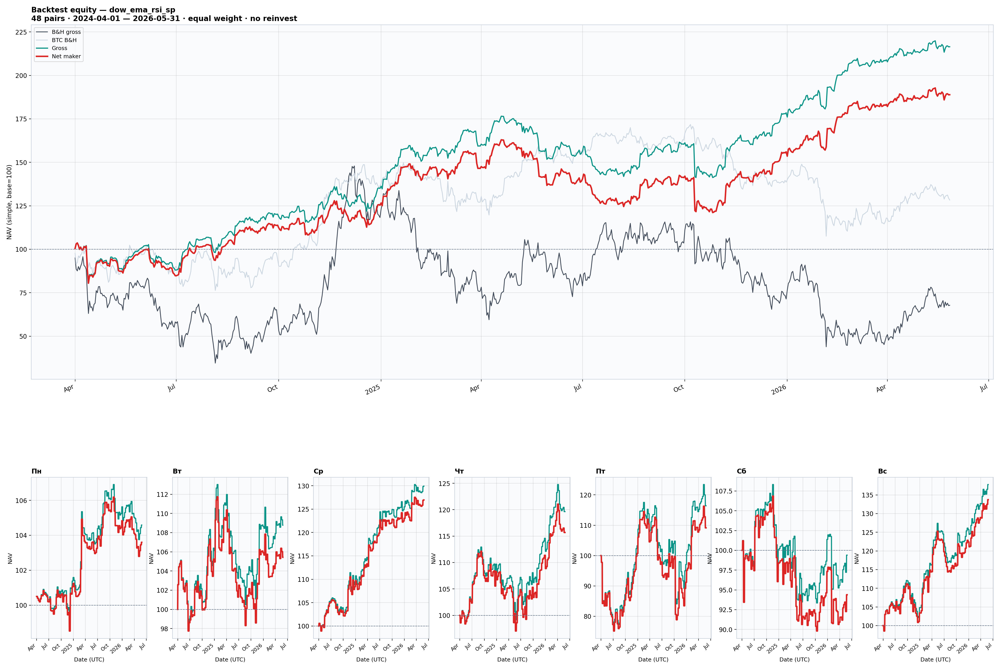
**Рис. С13. Equity curve — combined ML `dow_ema_rsi_sp`**.

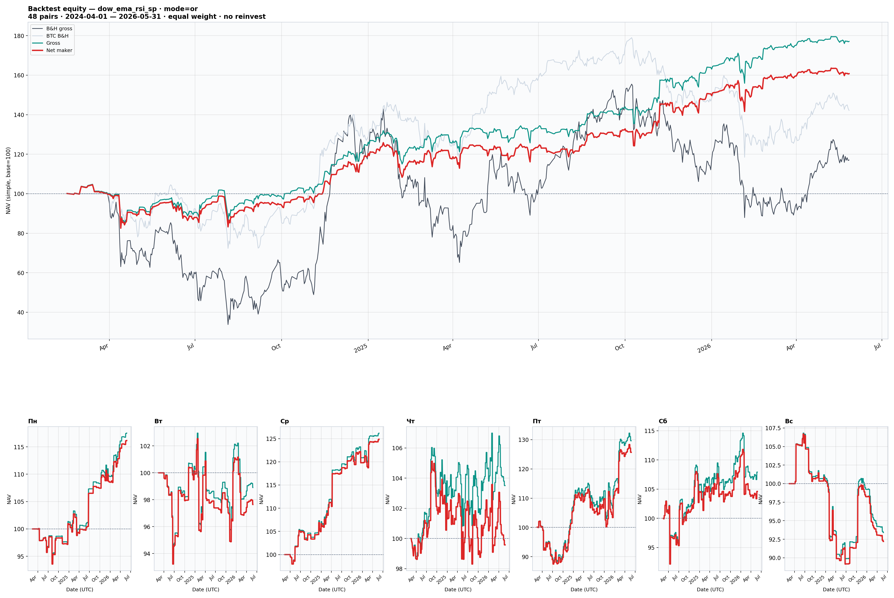
**Рис. С14. Equity curve — combined algo `or` `dow_ema_rsi_sp`**.

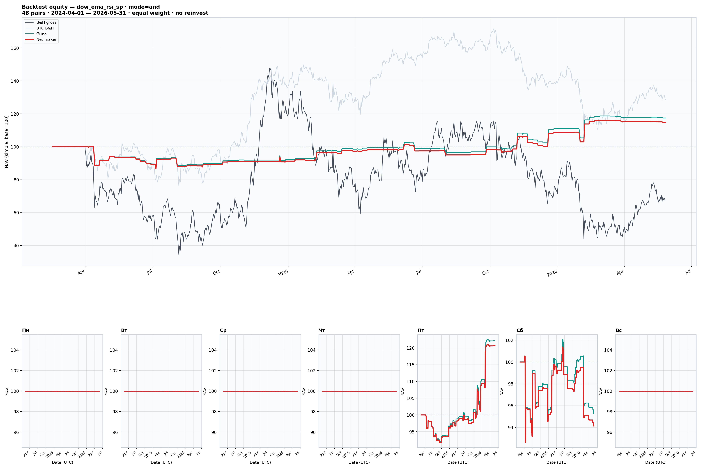
**Рис. С15. Equity curve — combined algo `and` `dow_ema_rsi_sp`**.

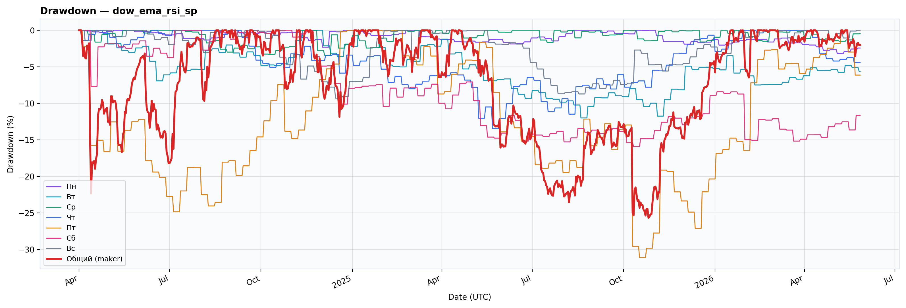
**Рис. С16. Drawdown — combined ML `dow_ema_rsi_sp`**.

### Бэктест: `price_sequences_ml` (standalone ML)

Период: **2024-04-01 — 2026-05-31**. Frozen global-policy (44 пары) + модель `streak_pair_norm`. Для сравнения — rule-based консервативный (49 пар, maker).

| Метрика | `price_sequences_ml` (ML) | Rule-based конс. (maker) |
| ------- | --------------------------- | ------------------------ |
| Пар (union) | 44 | 49 |
| Total Return (net maker) | **+11.7%** | +24.3% |
| CAGR (net maker) | +5.3% | **+10.6%** |
| Sharpe (net maker) | 0.41 | **0.48** |
| Win Rate (net maker) | 53.1% | 53.5% |
| Max Drawdown (net maker) | **−13.9%** | −21.6% |
| Profit Factor (net maker) | 1.11 | 1.09 |
| Information Ratio (net maker vs B&H 49) | 0.31 | **0.38** |
| Exposure | 55.4% | 89.3% |
| Worst day (net maker) | **−5.4%** (2024-04-12) | −9.8% |


**Рис. С16b. Equity curve — `price_sequences_ml`**.

### Бэктест: combined `dow_ema_rsi_streak` (ML vs algo `and`)

Период: **2024-04-01 — 2026-05-31**. ML — все **49 пар**, пороги из `train_test.json` (`t_long`≈0.518 / `t_short`≈0.460). Algo `and` — train-отбор 34 пар (данные из предыдущего прогона).

| Метрика | Combined ML `dow_ema_rsi_streak` | Algo `and` |
| ------- | -------------------------------- | ---------- |
| Пар (union) | 49 | 34 |
| Total Return (net maker) | **+62.2%** | +9.4% |
| CAGR (net maker) | **+25.2%** | +4.0% |
| Sharpe (net maker) | **0.61** | 0.37 |
| Win Rate (net maker) | 52.3% | **54.5%** |
| Max Drawdown (net maker) | −35.0% | **−8.7%** |
| Profit Factor (net maker) | 1.07 | **1.32** |
| Information Ratio (net maker vs B&H 49) | **0.41** | 0.28 |
| Exposure | 99.9% | **6.4%** |
| Worst day (net maker) | −20.7% (2025-10-10) | **−6.2%** (2024-04-13) |

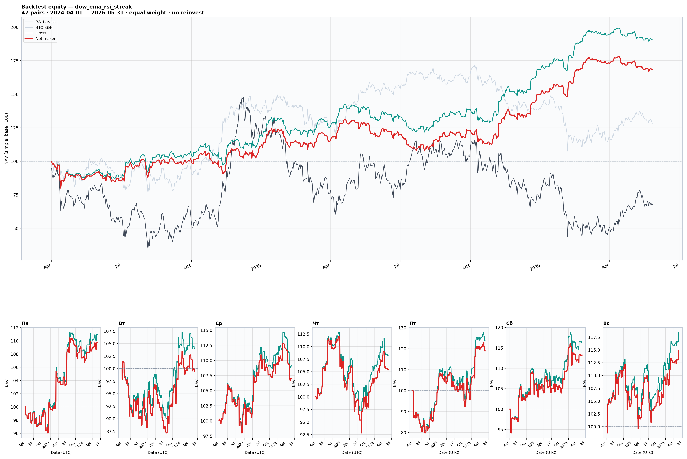
**Рис. С17. Equity curve — combined ML `dow_ema_rsi_streak`**.


**Рис. С18. Equity curve — combined algo `and` `dow_ema_rsi_streak`**.

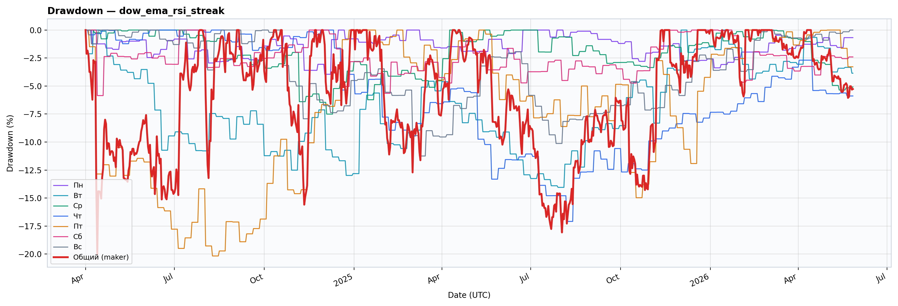
**Рис. С19. Drawdown — combined ML `dow_ema_rsi_streak`**.

### Бэктест: combined `dow_ema_rsi_streak_vol` (ML vs algo `or`)

Период: **2024-04-01 — 2026-05-31**. ML — все **49 пар**, пороги из `train_test.json` (`t_long`≈0.523 / `t_short`≈0.474). Algo `or` — train-отбор 34 пар (optimistic; DOW + EMA + RSI + streak + volume складываются, `peak_slots=133`).

| Метрика | Combined ML `dow_ema_rsi_streak_vol` | Algo `or` |
| ------- | ------------------------------------ | --------- |
| Пар (union) | 49 | 34 |
| Total Return (net maker) | +29.7% | **+47.9%** |
| CAGR (net maker) | +12.8% | **+19.2%** |
| Sharpe (net maker) | 0.30 | **0.80** |
| Win Rate (net maker) | 51.8% | **52.3%** |
| Max Drawdown (net maker) | −39.2% | **−23.2%** |
| Profit Factor (net maker) | 1.03 | **1.12** |
| Information Ratio (net maker vs B&H 49) | 0.38 | **0.67** |
| Exposure | 99.9% | 100.0% |
| Worst day (net maker) | −14.6% (2025-10-10, Пт) | **−9.9%** (2024-04-13, Сб) |

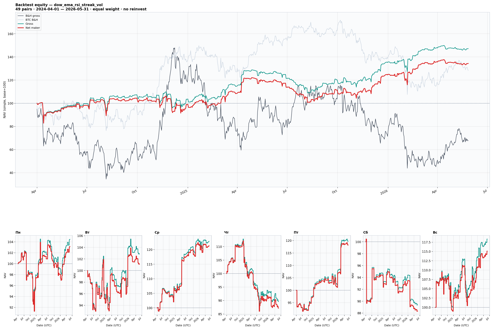
**Рис. С20. Equity curve — combined ML `dow_ema_rsi_streak_vol`**.

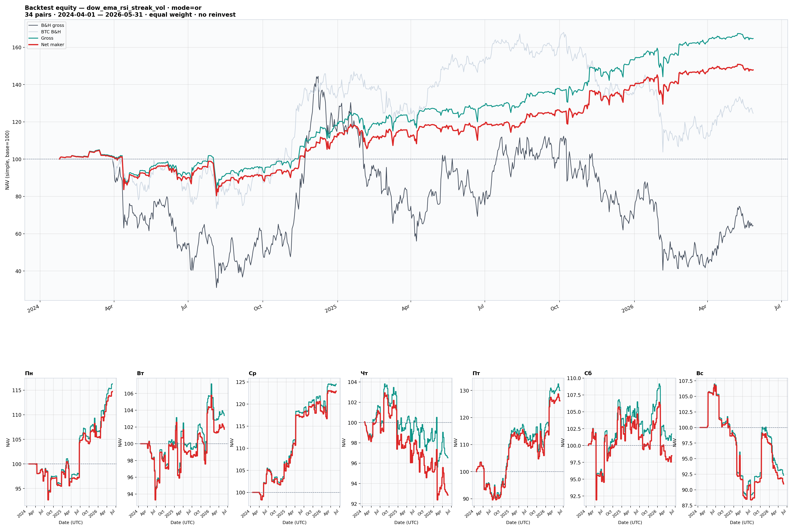
**Рис. С21. Equity curve — combined algo `or` `dow_ema_rsi_streak_vol`**.

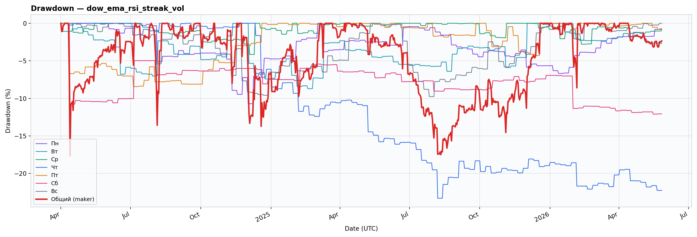
**Рис. С22. Drawdown — combined ML `dow_ema_rsi_streak_vol`**.

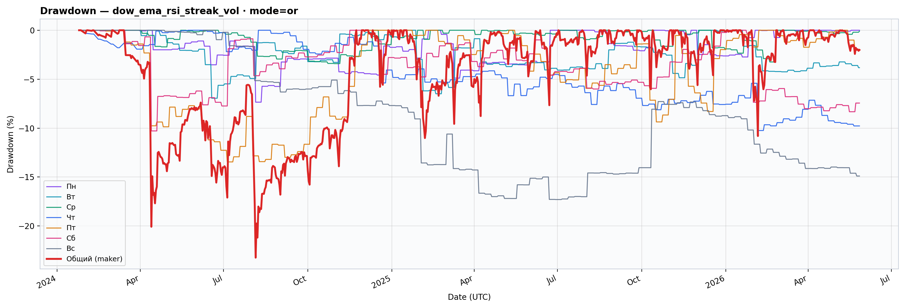
**Рис. С23. Drawdown — combined algo `or` `dow_ema_rsi_streak_vol`**.

### Выводы

**По моделям.** Цепочка `day_of_week_ml` → `ema_spreads_ml` → `rsi_spreads_ml` → `price_sequences_ml` → `dow_ema_sp` → `dow_ema_rsi_sp` → `dow_ema_rsi_streak` → `dow_ema_rsi_streak_vol`: weekday + EMA поднимают ROC AUC до **0.546–0.547** (`dow_ema_sp` / `dow_ema_rsi_sp`). `streak_pair_norm` отдельно слабее на test (0.509), в combined даёт ROC AUC **0.540**, но сильно смещает `pred↑` (**68.8%**). Добавление `vol_log_rel_pair` в полный стек снижает ROC AUC до **0.533** (уровень `day_of_week_ml`), signal acc **0.527**; калибровка чуть лучше (ECE **0.024**).

**По бэктесту `dow_ema_sp` (net maker).** Combined ML на 49 парах: **+93.9%** (CAGR +36.0%, IR 0.73). Algo `or` (47 пар, предыдущий прогон) — умереннее по доходности, но меньший хвостовой риск (worst day −11.4% vs −18.5%).

**По бэктесту `dow_ema_rsi_sp` (net maker).** Combined ML — лидер (**+125.4%**, CAGR +45.8%, IR 0.84), worst day −19.6% (2025-10-10). Algo `or` — +60.8% при меньшем worst day (−9.9%). Algo `and` — низкая exposure, MaxDD −13.6%, PF 1.24, но слабая доходность (+14.8%).

**По бэктесту `price_sequences_ml` (net maker).** Умеренная альфа (+11.7%, IR 0.31) при низкой MaxDD (−13.9%) и exposure 55% (бэктест на 44 парах, без переобучения). ML фактически торгует только long.

**По бэктесту `dow_ema_rsi_streak` (net maker).** Combined ML на 49 парах — **+62.2%** (IR 0.41), но глубокая просадка (MaxDD −35.0%, worst day −20.7%). Algo `and` — консервативный бенчмарк (+9.4%, MaxDD −8.7%). Добавление streak **не улучшает** результат относительно `dow_ema_rsi_sp`.

**По бэктесту `dow_ema_rsi_streak_vol` (net maker).** Combined ML на 49 парах — **+29.7%** (IR 0.38), MaxDD −39.2%, worst day −14.6% (2025-10-10). Algo `or` (34 пары, optimistic) — **+47.9%** (Sharpe 0.80, IR 0.67) при меньшем хвостовом риске (worst day −9.9%). Полный ML-стек с volume **слабее** `dow_ema_rsi_sp` и `dow_ema_rsi_streak` по доходности; rule-based `or` на этом val-окне выигрывает у ML.

**Практический итог.** Для paper/live: (1) **combined ML `dow_ema_rsi_sp`** — лидер по доходности на полном пуле 49 пар; (2) **`dow_ema_sp`** — чуть ниже по доходности, но стабильнее по классификатору; (3) **`dow_ema_rsi_streak`** — промежуточный combined; (4) **`dow_ema_rsi_streak_vol`** — полный стек, но ML-бэктест уступает algo `or` и более ранним combined; (5) **`price_sequences_ml`** — слабый standalone; (6) algo `or` / `and` — rule-based бенчмарки (train-отбор пар); (7) все combined-стратегии требуют учёта хвостовых дней (2025-10-10).

| Артефакт | Путь |
| -------- | ---- |
| ML metrics `dow_ema_sp` | [direction_dow_ema_…_train_test.json](research_outputs/combined/dow_ema_sp/ml/metrics/direction_dow_ema_49pairs_20220101_20260531_train_test.json) |
| Бэктест ML `dow_ema_sp` | [dow_ema_sp_backtest_ml_49pairs_….log](research_outputs/combined/dow_ema_sp/backtest/ml/dow_ema_sp_backtest_ml_49pairs_20240401_20260531.log) |
| Бэктест algo or `dow_ema_sp` | [dow_ema_sp_backtest_or_47pairs_….log](research_outputs/combined/dow_ema_sp/backtest/algo/dow_ema_sp_backtest_or_47pairs_20240401_20260531.log) |
| ML metrics `dow_ema_rsi_sp` | [direction_dow_ema_rsi_…_train_test.json](research_outputs/combined/dow_ema_rsi_sp/ml/metrics/direction_dow_ema_rsi_49pairs_20220101_20260531_train_test.json) |
| Бэктест ML `dow_ema_rsi_sp` | [dow_ema_rsi_sp_backtest_ml_49pairs_….log](research_outputs/combined/dow_ema_rsi_sp/backtest/ml/dow_ema_rsi_sp_backtest_ml_49pairs_20240401_20260531.log) |
| Бэктест algo or `dow_ema_rsi_sp` | [dow_ema_rsi_sp_backtest_or_48pairs_….log](research_outputs/combined/dow_ema_rsi_sp/backtest/algo/dow_ema_rsi_sp_backtest_or_48pairs_20240401_20260531.log) |
| Бэктест algo and `dow_ema_rsi_sp` | [dow_ema_rsi_sp_backtest_and_48pairs_….log](research_outputs/combined/dow_ema_rsi_sp/backtest/algo/dow_ema_rsi_sp_backtest_and_48pairs_20240401_20260531.log) |
| ML metrics `price_sequences_ml` | [direction_streak_…_train_test.json](research_outputs/price_sequences/ml/metrics/direction_streak_49pairs_20220101_20260531_train_test.json) |
| Бэктест ML `price_sequences_ml` | [price_sequences_ml_backtest_ml_44pairs_….log](research_outputs/price_sequences/backtest/price_sequences_ml_backtest_ml_44pairs_20240401_20260531.log) |
| ML metrics `dow_ema_rsi_streak` | [direction_dow_ema_rsi_streak_…_train_test.json](research_outputs/combined/dow_ema_rsi_streak/ml/metrics/direction_dow_ema_rsi_streak_49pairs_20220101_20260531_train_test.json) |
| Бэктест ML `dow_ema_rsi_streak` | [dow_ema_rsi_streak_backtest_ml_49pairs_….log](research_outputs/combined/dow_ema_rsi_streak/backtest/ml/dow_ema_rsi_streak_backtest_ml_49pairs_20240401_20260531.log) |
| Бэктест algo and `dow_ema_rsi_streak` | [dow_ema_rsi_streak_backtest_and_34pairs_….log](research_outputs/combined/dow_ema_rsi_streak/backtest/algo/dow_ema_rsi_streak_backtest_and_34pairs_20240401_20260531.log) |
| ML metrics `dow_ema_rsi_streak_vol` | [direction_dow_ema_rsi_streak_vol_…_train_test.json](research_outputs/combined/dow_ema_rsi_streak_vol/ml/metrics/direction_dow_ema_rsi_streak_vol_49pairs_20220101_20260531_train_test.json) |
| Бэктест ML `dow_ema_rsi_streak_vol` | [dow_ema_rsi_streak_vol_backtest_ml_49pairs_….log](research_outputs/combined/dow_ema_rsi_streak_vol/backtest/ml/dow_ema_rsi_streak_vol_backtest_ml_49pairs_20240401_20260531.log) |
| Бэктест algo or `dow_ema_rsi_streak_vol` | [dow_ema_rsi_streak_vol_backtest_or_34pairs_….log](research_outputs/combined/dow_ema_rsi_streak_vol/backtest/algo/dow_ema_rsi_streak_vol_backtest_or_34pairs_20240401_20260531.log) |
