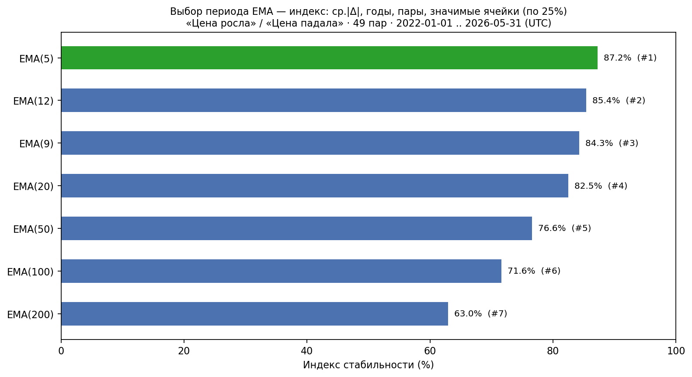
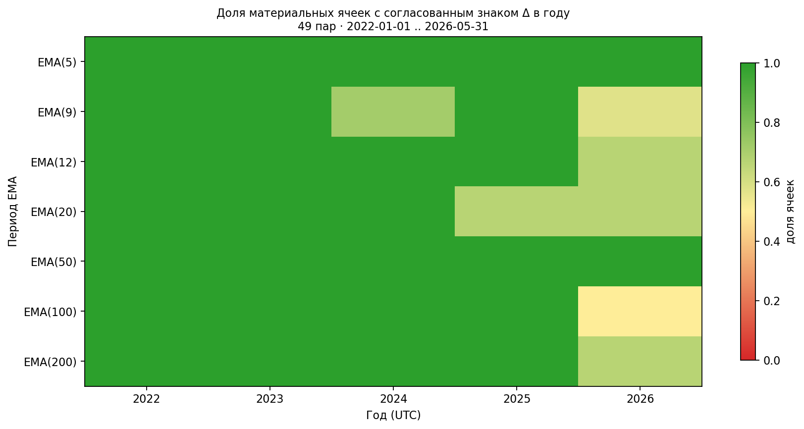
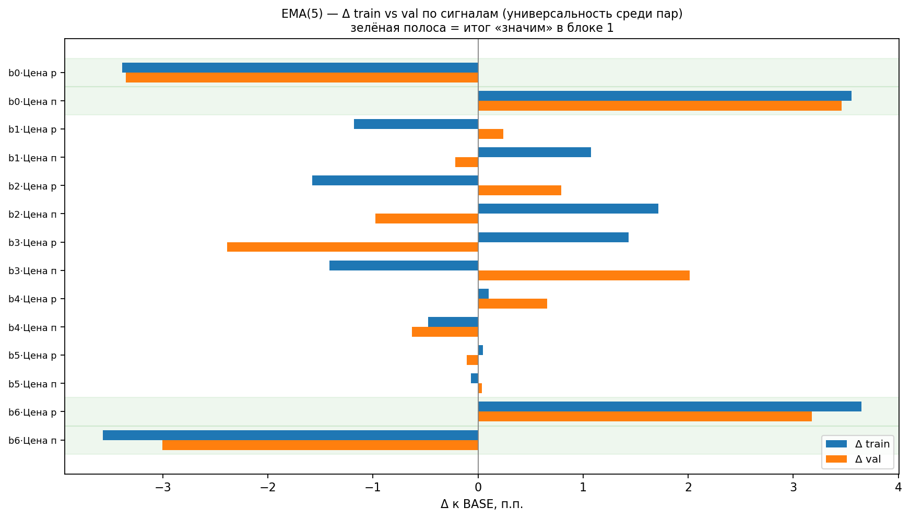
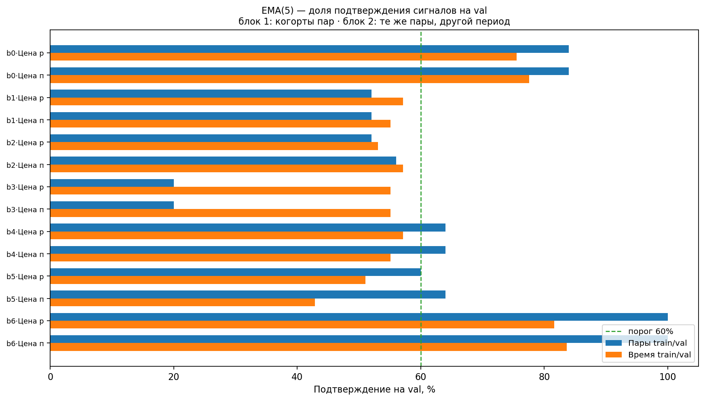

# Анализ и выявление воспроизводимых аномалий на криптовалютном рынке

## Цель проекта

Сформировать набор воспроизводимых аномалий с подтверждённой статистической значимостью на независимых активах (cross‑asset) и непересекающихся временных окнах (out‑of‑time), пригодных для построения торговой стратегии.

## Описание проекта

Проект представляет собой анализ и выявление аномалий и закономерностей на криптовалютном рынке. В фокусе исследования — поиск повторяющихся паттернов, которые могут служить основой для торговой стратегии. После каждого исследования проводится бектест для подтверждения значимости выявленных закономерностей при торговле.

## Методология

Пул исследования — 49 пар из локального архива Bybit: все пары, у которых первая 1m-свеча ≤ 2023-01-01 (UTC). Это не динамический top-49 по обороту: критерий — достаточная история + ликвидность на момент включения в датасет.

Паттерн считается подтверждённым, если одновременно выполняются два условия:

### 1. Универсальность среди пар (cross‑asset)

Эффект подтверждается на независимой когорте пар (обычно ≥ 60% активов сохраняют направление эффекта).

- **Train**: 24 пары, период 2022-01-01 – 2026-05-31 (ранние данные)
- **Val**: 25 пар, период 2023-01-01 – 2026-05-31 (более новые пары, не пересекаются с train)

### 2. Устойчивость во времени (out‑of‑time)

Эффект сохраняется во втором, непересекающемся временном окне (обычно ≥ 60% активов или единиц наблюдения сохраняют направление)

- **Train**: 49 пар, период 2022-01-01 – 2024-04-01
- **Val**: 49 пар, период 2024-04-01 – 2026-05-31  
  (одни и те же пары, два непересекающихся временных окна)

## Исследования

### Исследование 1. Эффект дня недели

**Метрика эффекта** — средняя **intraday-доходность open→close (UTC)** по всем календарным дням выбранного дня недели, **pooled** по парам с равным весом:

`(close − open) / open × 100%`

Отрицательное значение — в среднем день закрывается ниже open (удобно для short); положительное — выше open (long).

**Критерии подтверждения:**

- **Cross‑asset (проверка 1):** p-value < 0.0071 (Bonferroni) на train + ≥60% val-пар с тем же знаком, что pooled train
- **Out‑of‑time (проверка 2):** ≥60% пар сохраняют знак среднего open→close во втором периоде

---

#### Проверка 1. Универсальность среди пар (cross‑asset)

24 train-пары (ранние активы) / 25 val-пар (новые активы), период 2022–2026

| День | Train, % | Val, % | Δ     | p-value (train) | Val-пар с тем же знаком | Статус       |
| ---- | -------- | ------ | ----- | --------------- | ----------------------- | ------------ |
| Пн   | -0.02    | +0.09  | +0.11 | 0.7201          | 12/25 (48%)             | ❌ не значим |
| Вт   | -0.12    | -0.15  | -0.03 | 0.0026          | 19/25 (76%)             | ✅ значим    |
| Ср   | +0.24    | +0.30  | +0.06 | 0.0003          | 23/25 (92%)             | ✅ значим    |
| Чт   | -0.34    | -0.47  | -0.13 | <0.0001         | 22/25 (88%)             | ✅ значим    |
| Пт   | +0.27    | +0.53  | +0.26 | 0.0001          | 23/25 (92%)             | ✅ значим    |
| Сб   | +0.23    | +0.32  | +0.10 | 0.0001          | 23/25 (92%)             | ✅ значим    |
| Вс   | -0.20    | -0.18  | +0.02 | <0.0001         | 21/25 (84%)             | ✅ значим    |


_Рис. 1a. Накопленная open→close доходность по дням недели: train (24 пары) и val (25 пар), один период 2022–2026. Отдельная линия на каждый weekday._

---

#### Проверка 2. Устойчивость во времени (out‑of‑time)

49 пар, train: 2022-01-01 – 2024-04-01, val: 2024-04-01 – 2026-05-31

| День | Train, % | Val, % | Δ     | p-value (train) | Пар с тем же знаком | Статус       |
| ---- | -------- | ------ | ----- | --------------- | ------------------- | ------------ |
| Пн   | -0.03    | +0.08  | +0.11 | 0.9085          | 29/49 (59%)         | ❌ не значим |
| Вт   | +0.03    | -0.27  | -0.30 | 0.5649          | 24/49 (49%)         | ❌ не значим |
| Ср   | +0.10    | +0.41  | +0.32 | 0.0348          | 28/49 (57%)         | ❌ не значим |
| Чт   | -0.19    | -0.58  | -0.39 | 0.0001          | 36/49 (73%)         | ✅ значим    |
| Пт   | +0.51    | +0.29  | -0.22 | <0.0001         | 39/49 (80%)         | ✅ значим    |
| Сб   | +0.20    | +0.33  | +0.13 | 0.0022          | 34/49 (69%)         | ✅ значим    |
| Вс   | +0.24    | -0.55  | -0.79 | 0.0001          | 15/49 (31%)         | ❌ не значим |


_Рис. 1b. Накопленная open→close доходность: train-период (2022-01-01 – 2024-04-01) и val-период (2024-04-01 – 2026-05-31), 49 пар. Отдельная линия на каждый weekday._

---

#### Итоговая сводка (49 пар, 2022–2026)

| День | Средняя, % | Медиана, % | σ, % | Доля роста | Статус       |
| ---- | ---------- | ---------- | ---- | ---------- | ------------ |
| Пн   | +0.03      | +0.07      | 5.32 | 50.7%      | ❌ не значим |
| Вт   | -0.13      | -0.13      | 4.70 | 51.5%      | ❌ не значим |
| Ср   | +0.27      | -0.05      | 5.35 | 49.3%      | ❌ не значим |
| Чт   | -0.40      | -0.48      | 4.79 | 55.8%      | ✅ значим    |
| Пт   | +0.39      | +0.37      | 5.52 | 54.8%      | ✅ значим    |
| Сб   | +0.27      | +0.10      | 4.50 | 51.7%      | ✅ значим    |
| Вс   | -0.19      | -0.36      | 4.62 | 55.0%      | ❌ не значим |

_Статус «значим» — одновременно прошли cross‑asset и out‑of‑time._


_Рис. 1с. Накопленная open→close доходность: весь период (2022-01-01 – 2026-05-31), все 49 пар. Дни недели со статусом - ✅ значим_

---

### Ключевые выводы

По протоколу исследования подтверждены **три дня недели**:

| День   | Направление | Cross‑asset    | Out‑of‑time    | Смысл для стратегии                                 |
| ------ | ----------- | -------------- | -------------- | --------------------------------------------------- |
| **Чт** | минус       | 22/25 (88%) ✅ | 36/49 (73%) ✅ | Систематическое падение open→close → short          |
| **Пт** | плюс        | 23/25 (92%) ✅ | 39/49 (80%) ✅ | Положительный эффект, стабилен во времени → long    |
| **Сб** | плюс        | 23/25 (92%) ✅ | 34/49 (69%) ✅ | Аналогично пятнице, наименьшая волатильность → long |

**Отсеяны:** Вт, Ср, Вс (прошли cross‑asset, но не прошли out‑of‑time); Пн (не прошёл ни один фильтр).

**Итог:** торгово релевантный календарный паттерн — **short в четверг, long в пятницу и субботу** (open→close, gross).

---

#### Дополнительные материалы

| Материал                                                                                                                           | Описание                                                                                                             |
| ---------------------------------------------------------------------------------------------------------------------------------- | -------------------------------------------------------------------------------------------------------------------- |
| [weekday_summary.log](research_outputs/day_of_week/statistics/weekday_summary.log)                                                 | Сводные таблицы проверок 1–2 и итоговая (блоки «Универсальность среди пар», «Устойчивость во времени», «Полный пул») |
| [24 train-пары](research_outputs/day_of_week/statistics/weekday_statistics_24pairs_20220101_20260531_train.log)                    | Проверка 1 — детальная статистика train-когорты                                                                      |
| [25 val-пар](research_outputs/day_of_week/statistics/weekday_statistics_25pairs_20220101_20260531_val.log)                         | Проверка 1 — детальная статистика val-когорты                                                                        |
| [train 2022–2024-04](research_outputs/day_of_week/statistics/weekday_statistics_49pairs_20220101_20240401.log)                     | Проверка 2 — детальная статистика train-периода                                                                      |
| [val 2024-04–2026](research_outputs/day_of_week/statistics/weekday_statistics_49pairs_20240401_20260531.log)                       | Проверка 2 — детальная статистика val-периода                                                                        |
| [детальная статистика 49 пар, 2022–2026](research_outputs/day_of_week/statistics/weekday_statistics_49pairs_20220101_20260531.log) | Итоговая сводка — сила close, High/Low, повторяемость по годам и парам                                               |

#### Воспроизведение отчётов

Из каталога `crypto_research` (нужны `*_klines_1m.jsonl` в `load_data_from_bybit/data` или `CRYPTO_DATA_DIR`):

```bash
cd crypto_research

python3 report_generator.py day_of_week --summary # Сводные таблицы проверок 1–2 и итоговая (weekday_summary.log)

python3 report_generator.py day_of_week --train --from-date 2022-01-01 --to-date 2026-05-31 # Проверка 1 — детальные таблицы по когортам
python3 report_generator.py day_of_week --val   --from-date 2022-01-01 --to-date 2026-05-31

python3 report_generator.py day_of_week --from-date 2022-01-01 --to-date 2024-04-01 --max-pair-start 2023-01-01 # Проверка 2 — детальные таблицы по периодам (49 пар)
python3 report_generator.py day_of_week --from-date 2024-04-01 --to-date 2026-05-31 --max-pair-start 2023-01-01

python3 report_generator.py day_of_week --from-date 2022-01-01 --to-date 2026-05-31 --max-pair-start 2023-01-01 # Итоговая сводка — полный период, 49 пар (+ NAV-график)
```

Отчёты пишутся в `research_outputs/day_of_week/statistics/`; графики — в `…/plots/`.

### Историческое тестирование стратегии day_of_week (out-of-sample)

**Out-of-sample период** совпадает с val-окном исследования (устойчивость во времени): **2024-04-01 — 2026-05-31 (UTC)**.  
Сигналы сформированы на train (2022-01-01 — 2024-04-01) и не пересматривались.

#### Правила стратегии

| День (UTC)           | Позиция | Доходность позиции           |
| -------------------- | ------- | ---------------------------- |
| **Четверг**          | short   | (open − close) / open × 100% |
| **Пятница, суббота** | long    | (close − open) / open × 100% |
| Пн–Ср, Вс            | flat    | 0%                           |

- Равный вес активных пар в каждый торговый день, **без реинвестирования**, NAV=100
- **Exposure:** 42.9% (339 торговых дней из 791)
- **Комиссии** (Bybit USDT Perpetual, non-VIP): taker 0.200% round-trip, maker 0.072% round-trip
- **Бенчмарки:** равновесный B&H 49 пар (gross) и BTC B&H (gross)

#### Сценарии тестирования

| Сценарий           | Описание                                                                                               |
| ------------------ | ------------------------------------------------------------------------------------------------------ |
| **Консервативный** | Все 49 пар на каждый торговый день                                                                     |
| **Оптимистичный**  | Отбор пар по train-периоду: знак эффекта подтверждён в ≥⅔ лет (Чт: 33 пары, Пт: 31, Сб: 23, union: 40) |

#### Сводная таблица полученных метрик (val, 2024-04-01 — 2026-05-31)

| Метрика                       | Консервативный (49 пар, taker) | Консервативный (49 пар, maker) | Оптимистичный (отбор, taker) | Оптимистичный (отбор, maker) | B&H 49 пар (gross) | BTC B&H (gross)  |
| ----------------------------- | ------------------------------ | ------------------------------ | ---------------------------- | ---------------------------- | ------------------ | ---------------- |
| Total Return                  | +68.6%                         | +112.0%                        | +91.2%                       | **+134.6%**                  | −31.4%             | +28.3%           |
| CAGR (compounded)             | +27.3%                         | +41.5%                         | +34.9%                       | **+48.3%**                   | −16.0%             | +12.3%           |
| Sharpe (0% rf)                | 0.67                           | 1.09                           | 0.86                         | **1.27**                     | −0.20              | 0.28             |
| Sharpe / √exposure            | 1.02                           | 1.66                           | 1.32                         | **1.94**                     | −0.20              | 0.28             |
| Max Drawdown                  | −37.7%                         | −32.7%                         | −35.0%                       | **−30.0%**                   | −70.3%             | −37.4%           |
| Recovery from max DD          | 140 дн.                        | 33 дн.                         | 140 дн.                      | **27 дн.**                   | не восстановился   | не восстановился |
| Longest underwater            | 365 дн.                        | **307 дн.**                    | 358 дн.                      | **307 дн.**                  | 539 дн.            | 233 дн.          |
| % time in drawdown            | 92.3%                          | 88.2%                          | 90.9%                        | **86.1%**                    | 98.1%              | 94.3%            |
| Calmar                        | 0.84                           | 1.58                           | 1.20                         | **2.07**                     | −0.21              | 0.35             |
| Profit Factor                 | 1.16                           | 1.28                           | 1.22                         | **1.33**                     | 0.97               | 1.04             |
| Win Rate (trades)             | 55.5%                          | **58.4%**                      | 55.5%                        | 56.9%                        | 50.9%              | 50.2%            |
| Median trade return           | +0.398%                        | +0.526%                        | +0.449%                      | **+0.577%**                  | +0.078%            | +0.007%          |
| Information Ratio (vs B&H 49) | 0.60 (taker)                   | 0.87 (maker)                   | 0.73 (taker)                 | **0.99 (maker)**             | —                  | —                |
| Worst day (net)               | −22.5% (2025-10-10, Пт)        | **−22.3% (2025-10-10, Пт)**    | −23.5% (2025-10-10, Пт)      | −23.4% (2025-10-10, Пт)      | −22.3%             | −14.0%           |


**Рис. 2. Консервативный сценарий** — 49 пар, val (2024-04-01 — 2026-05-31). Красная линия — net maker, синяя — net taker; серые — B&H 49 и BTC.


**Рис. 3. Оптимистичный сценарий** — 40 пар (train-отбор), val. Красная — net maker, синяя — net taker;; нижний ряд — вклад по дням (Чт / Пт / Сб).

#### Выводы по сводной таблице

**Все активные стратегии превосходят бенчмарки.**

- Например, CAGR у худшей активной стратегии (консервативный taker: +27.3%) более чем на 43 п.п. выше, чем у B&H 49 пар (−16.0%), и на 15 п.п. выше, чем у BTC B&H (+12.3%).
- Максимальная просадка B&H 49 пар (−70.3%) более чем вдвое глубже, чем у любой активной стратегии (глубина от −30% до −37.7%).

**Maker-версии заметно эффективнее taker.**

- У консервативного и оптимистичного maker Total Return выше на 43.4 п.п. (как раз комиссия), а CAGR — на 14.2 п.п. и 13.4 п.п., чем у taker версии.
- Восстановление после максимума у maker-стратегий в 4–5 раз быстрее (33 и 27 дней против 140 дней у taker-аналогов). Но по графику видно, что эта огромная разница не полная заслуга maker стратегий, пик в начале августа 2024г у taker варианта не достиг предыдущего максимума на доли п.п., а далее у обоих стратегий был продолжительный underwater до ~ноября 2024 г., который и добавил к полному восстановлению ≈80% времени.
  О скорости восстановления в данном случае лучше говорит longest underwater 307 vs 358 дн. на ~15% выше чем у taker, а не 4–5×.

**Оптимистичный maker — абсолютный лидер.**

- У него наивысшая доходность (CAGR +48.3%) и наименьшая просадка (−30.0%) среди всех активных стратегий.
- Calmar (CAGR / Max DD) у оптимистичного maker (2.07) более чем вдвое выше, чем у консервативного taker (0.84).
- Sharpe (1.27) и Sharpe/√exposure (1.94) — максимальные, что означает лучшую доходность на единицу риска.

**Бенчмарки слабы не только по доходности, но и по качеству.**

- B&H 49 пар не восстановился после просадки (в отличие от всех активных стратегий) и проводит в просадке 98% времени против 86–92% у активных.
- BTC B&H показывает положительную, но низкую доходность (CAGR +12.3%) с просадкой −37.4% — хуже, чем у любого maker, и сопоставимо с taker, но без быстрого восстановления.

**Итог:** переход от taker к maker даёт прибавку к CAGR ~13–14 п.п. и ускоряет восстановление. Переход от консервативного к оптимистичному отбору добавляет ещё ~7 п.п. к CAGR при снижении просадки на ~3 п.п. Обе активные maker-стратегии превосходят бенчмарки с большим запасом по всем основным метрикам доходности и риска (CAGR, Max DD, Sharpe, IR).

#### Вклад по дням недели (оптимистичный, net maker)

| День           | Total Ret | Avg trade | Sharpe | MaxDD  | Skewness (net maker) |
| -------------- | --------- | --------- | ------ | ------ | -------------------- |
| **Чт** (short) | +60.6%    | +0.536%   | 2.68   | −16.5% | −0.09                |
| **Пт** (long)  | +33.7%    | +0.298%   | 1.24   | −29.1% | **−1.11**            |
| **Сб** (long)  | +40.4%    | +0.357%   | 2.12   | −15.0% | −0.02                |


**Рис. 4. Drawdown — оптимистичный сценарий** — общий (жирная красная, net maker) и вклад по дням (Чт / Пт / Сб).


**Рис. 5. Корреляция дневных доходностей — оптимистичный сценарий**

- **Четверг и суббота** — основные источники доходности (наибольший Total Ret и Sharpe).
- **Пятница** — слабое звено: низкий Sharpe, глубокая просадка, отрицательная асимметрия (редкие крупные убытки). Худший день портфеля (−23.4%, 2025-10-10) пришёлся на пятницу.
- **Корреляция Пт ↔ Сб** — **+0.41** (умеренная, частичная диверсификация).

#### Распределение доходностей (оптимистичный maker)

| Показатель       | Значение |
| ---------------- | -------- |
| Skewness         | −0.64    |
| Kurtosis         | 5.20     |
| 1% VaR (дневной) | −11.2%   |
| 1% CVaR          | −15.4%   |
| 5% VaR           | −5.6%    |
| 5% CVaR          | −9.1%    |


**Рис. 6. Распределение дневных доходностей — оптимистичный сценарий**

Отрицательная асимметрия и «толстые хвосты» подтверждают риск редких, но крупных потерь; это согласуется с экстремальным днём −23.4% (Пт, 2025-10-10).

#### Ограничения и риски

- Результаты out-of-sample по времени, но **не гарантируют** сохранение эффекта в будущем.
- **Пятница** — наименее устойчивый день (Sharpe 1.24, MaxDD −29.1%, skew −1.11);
- **Комиссии** существенны: taker-исполнение съедает ~68 п.п. от gross до net.
- **Capacity / проскальзывание:** не моделируются (предполагается идеальное maker-исполнение).
- Отрицательная асимметрия и CVaR 1% = −15.4% указывают на хвостовые риски.

#### Итоги

На val-периоде **2024-04-01 — 2026-05-31** intraday-стратегия «short четверг, long пятница и суббота» показывает **положительную альфа** относительно равновесного B&H 49 пар (gross) (IR maker **0.87–0.99**) и **превосходит BTC** по CAGR в обоих торговых сценариях. Наиболее сильные исторические метрики — **оптимистичный сценарий с maker-комиссиями** (CAGR +48.3%, Sharpe 1.27, MaxDD −30.0%).

#### Итоговый вывод

Статистически подтверждённый паттерн «**short в четверг, long в пятницу и субботу**» показывает устойчивую альфу на out-of-sample периоде 2024–2026. Оптимальная реализация — **отбор пар по train + maker-исполнение** — даёт CAGR +48.3%, Sharpe 1.27, MaxDD −30.0%, Information Ratio 0.99 против равновесного B&H.

Основной риск — концентрация убытков в пятницу (skew −1.11, худший день −23.4%). Для практического применения требуется дополнительная фильтрация сигналов или комбинирование с другими паттернами для сглаживания просадок.

---

#### Дополнительные материалы

| Материал                                                                                                                             | Описание                                                   |
| ------------------------------------------------------------------------------------------------------------------------------------ | ---------------------------------------------------------- |
| [консервативный бэктест](research_outputs/day_of_week/backtest/day_of_week_backtest_49pairs_20240401_20260531.log)                   | Полный отчёт, консервативный сценарий (49 пар)             |
| [оптимистичный бэктест](research_outputs/day_of_week/backtest/day_of_week_backtest_optimistic_thu33_pt31_sb23_20240401_20260531.log) | Полный отчёт, оптимистичный сценарий (отбор по train)      |
| [отбор пар по train](research_outputs/day_of_week/statistics/weekday_statistics_49pairs_20220101_20240401.log)                       | Критерии отбора и списки пар (секция «Отбор пар по train») |

#### Воспроизведение бэктестов

Из каталога `crypto_research`:

```bash
cd crypto_research
python3 backtester.py day_of_week --scenario conservative   # консервативный
python3 backtester.py day_of_week --scenario optimistic     # оптимистичный
```

Отчёты пишутся в `research_outputs/day_of_week/backtest/`; графики — в `…/backtest/plots/`.

### Исследование 2. Расстояние между ценой и EMA

Исследование в **два этапа** (критерии не смешивать):

1. **Этап 0 — выбор периода EMA** (`ema_period_screen`): на полной выборке 49 пар (2022–2026) сравниваем кандидатов **5, 9, 12, 20, 50, 100, 200** по **силе и воспроизводимости** условного эффекта. Здесь **не** проверяем p-value и train/val — только отбор периода с наиболее устойчивым сигналом.
2. **Этапы 1–3 — паттерн** (`ema_spreads` с **фиксированным** EMA): значимость на train, универсальность среди пар, устойчивость во времени (см. критерии в начале README).

#### Этап 0: методология выбора периода EMA

**Цель:** Выяснить какой период EMA даёт наиболее сильную и воспроизводимую связь «вчерашнее отклонение цены от EMA → сегодняшний intraday return»?

**Условие (вчера):** `dev = (close − EMA) / EMA × 100%` на дневном close UTC. Бакеты **b0–b6** — диапазоны dev по порогам **своей пары** (в % индивидуально):

| Бакет  | Условие           |
| ------ | ----------------- | --- | ------ |
| **b0** | dev > t2⁺         |
| **b1** | t1⁺ < dev ≤ t2⁺   |
| **b2** | near < dev ≤ t1⁺  |
| **b3** |                   | dev | ≤ near |
| **b4** | t2⁻ ≤ dev < −near |
| **b5** | t1⁻ ≤ dev < t2⁻   |
| **b6** | dev < t1⁻         |

_t1⁺/t2⁺ — ⅓ и ⅔ квантили среди dev>0; t1⁻/t2⁻ — ⅓ и ⅔ среди dev<0 (t1⁻ ≤ t2⁻); near = max(Q10(dev), 0.05%). Пороги пересчитываются по истории пары без look-ahead._

**Метрика эффекта для скрининга:** Δ к BASE в колонках **«Цена росла»** и **«Цена падала»** (п.п.) — насколько доля дней с ростом/падением open→close в бакете отличается от безусловного BASE. Те же определения, что в блоке Δ отчёта `ema_spreads`.

**Значимая ячейка** — пара (бакет × колонка), где |Δ| ≥ **1.5 п.п.** на полном периоде 2022–2026. Это отдельный условный сигнал: «в этом положении относительно EMA систематически смещена вероятность роста/падения на следующий день».

**Repeatability** (как в `ema_spreads`):

- **Годы X/Y** — в скольких календарных годах знак годового Δ совпал с полным периодом (порог: ≥40 дн. BASE и ≥15 дн. в бакете за год).
- **Пары N/M** — в скольких парах знак эффекта на уровне пары совпал с pooled-знаком.

**Сводные метрики периода** (среднее по всем значимым ячейкам этого EMA):

| Метрика     | Смысл                                    |
| ----------- | ---------------------------------------- | ---- | ----------------------------------------- |
| \*\*ср.     | Δ                                        | \*\* | средняя сила эффекта среди значимых ячеек |
| **Ср.годы** | средняя доля согласия по годам (X/Y → %) |
| **Ср.пары** | средняя доля согласия по парам (N/M → %) |
| **Знач.**   | число значимых ячеек (охват сигналов)    |

**Индекс стабильности** — равный вес **25%** на каждую компоненту:

1. ср.|Δ| (нормировка к максимуму среди кандидатов),
2. ср.годы %,
3. ср.пары %,
4. число значимых ячеек (нормировка к максимуму).

Период с **максимальным индексом** берётся для этапов 1–3. Этап 0 **не** заменяет проверки значимости — он лишь фиксирует горизонт EMA до train/val.

#### Этап 0: результаты скрининга (49 пар, 2022-01-01 – 2026-05-31)

| #   | EMA   | ср.     | Δ        | , п.п.  | Ср.годы | Ср.пары  | Знач. | Индекс % |
| --- | ----- | ------- | -------- | ------- | ------- | -------- | ----- | -------- |
| 1   | **5** | **3.4** | **100%** | **92%** | 4       | **87.2** |
| 2   | 12    | 2.7     | 93%      | 83%     | 6       | 85.4     |
| 3   | 9     | 2.5     | 86%      | 78%     | 7       | 84.3     |
| 4   | 20    | 2.7     | 87%      | 78%     | 6       | 82.5     |
| 5   | 50    | 2.1     | 100%     | 74%     | 5       | 76.6     |
| 6   | 100   | 2.0     | 90%      | 80%     | 4       | 71.6     |
| 7   | 200   | 1.7     | 93%      | 66%     | 3       | 63.0     |

_Порог значимости: |Δ| ≥ 1.5 п.п. Колонки скрининга: «Цена росла» / «Цена падала». Индекс = 25%·норм(ср.Δ) + 25%·ср.годы + 25%·ср.пары + 25%·норм(Знач.)._

**Источник:** [ema*period_screen_49pairs*…20260531.log](research_outputs/ema/ema_spreads/statistics/ema_period_screen_49pairs_ema5_9_12_20_50_100_200_20220101_20260531.log) · [график индекса](research_outputs/ema/ema_spreads/statistics/plots/ema_period_screen_stability_index_49pairs_ema5_9_12_20_50_100_200_20220101_20260531.png) · [heatmap по годам](research_outputs/ema/ema_spreads/statistics/plots/ema_period_screen_yearly_agreement_49pairs_ema5_9_12_20_50_100_200_20220101_20260531.png)





#### Обоснование выбора EMA(5) для этапов 1–3

Для дальнейших исследований (`ema_spreads`, train/val, бэктест) зафиксирован период **EMA(5)**.

1. **Лидер по индексу (87.2%)** — единственный кандидат с одновременно максимальной силой эффекта и лучшей кросс-парной согласованностью среди топ-группы.
2. **Наибольшая ср.|Δ| = 3.4 п.п.** — в ~1.3 раза сильнее EMA(9) и EMA(12); условный сдвиг вероятности «цена росла/падала» на следующий день выраженнее.
3. **Ср.годы 100%, ср.пары 92%** — все 4 значимые ячейки согласованы по знаку во всех 5 календарных годах; 92% пар подтверждают направление эффекта (лучший показатель в таблице).
4. **Чистая структура сигнала** — все 4 значимые ячейки только в **b0** (dev > t2⁺) и **b6** (dev < t1⁻): эффект на верхней/нижней трети отклонений, без b2–b5.
5. **Компромисс** — у EMA(5) только **4** значимые ячейки (меньше охват, чем у EMA(9)/12). Это осознанный выбор: предпочитаем **меньше, но сильнее и стабильнее** сигналов на экстремумах, чем больше слабых ячеек у средних периодов.

**Ограничение этапа 0:** скрининг на полном 2022–2026 не является out-of-sample проверкой. Выбор EMA(5) подлежит подтверждению на этапах 1–3 (train/val, p-value, ≥60% пар/лет).

#### Этапы 1–3: метрика эффекта (`ema_spreads`)

**Метрика эффекта** — условная связь **вчерашнего отклонения close от EMA(5)** с **сегодняшним** intraday return open→close (UTC), **pooled** по парам с равным весом (без look-ahead: EMA и пороги бакетов — только по истории пары до текущего дня).

**Условие (вчера):** бакеты **b0–b6** (таблица диапазонов dev в разделе этапа 0).

**Исход (сегодня):** в проверках 1–3 анализируются колонки **«Цена росла»** и **«Цена падала»** — доля дней, когда close > open / close < open. **Δ** — отклонение этой доли от безусловного BASE (п.п.). Полный отчёт `ema_spreads` дополнительно содержит 10 колонок силы close и intraday High/Low.

### Проверка 1: универсальность среди пар (24 train / 25 val, 2022–2026)

| Сигнал (бакет × колонка)           | Δ train, п.п. | Δ val, п.п.          | Δ (val−train) | p-value (train) | Подтверждение на val | Статус    |
| ---------------------------------- | ------------- | -------------------- | ------------- | --------------- | -------------------- | --------- | ------------- | --------- |
| b0 dev > t2⁺ × Цена росла          | −3.39         | −3.35                | +0.03         | <0.0001         | 21/25 (84%) ✅       | значим    |
| b0 dev > t2⁺ × Цена падала         | +3.55         | +3.46                | −0.09         | <0.0001         | 21/25 (84%) ✅       | значим    |
| b1 t1⁺ < dev ≤ t2⁺ × Цена росла    | −1.18         | +0.24                | +1.42         | 0.0963          | 13/25 (52%) ❌       | не значим |
| b1 t1⁺ < dev ≤ t2⁺ × Цена падала   | +1.07         | −0.22                | −1.29         | 0.1269          | 13/25 (52%) ❌       | не значим |
| b2 near < dev ≤ t1⁺ × Цена росла   | −1.58         | +0.79                | +2.37         | 0.0105          | 13/25 (52%) ❌       | не значим |
| b2 near < dev ≤ t1⁺ × Цена падала  | +1.72         | −0.98                | −2.69         | 0.0062          | 14/25 (56%) ❌       | не значим |
| b3                                 | dev           | ≤ near × Цена росла  | +1.43         | −2.39           | −3.82                | 0.0763    | 5/25 (20%) ❌ | не значим |
| b3                                 | dev           | ≤ near × Цена падала | −1.41         | +2.01           | +3.43                | 0.0721    | 5/25 (20%) ❌ | не значим |
| b4 t2⁻ ≤ dev < −near × Цена росла  | +0.10         | +0.66                | +0.56         | 0.7196          | 16/25 (64%) ✅       | не значим |
| b4 t2⁻ ≤ dev < −near × Цена падала | −0.47         | −0.63                | −0.15         | 0.3991          | 16/25 (64%) ✅       | не значим |
| b5 t1⁻ ≤ dev < t2⁻ × Цена росла    | +0.05         | −0.11                | −0.16         | 0.7700          | 15/25 (60%) ✅       | не значим |
| b5 t1⁻ ≤ dev < t2⁻ × Цена падала   | −0.07         | +0.04                | +0.10         | 0.7557          | 16/25 (64%) ✅       | не значим |
| b6 dev < t1⁻ × Цена росла          | +3.65         | +3.18                | −0.47         | <0.0001         | 25/25 (100%) ✅      | значим    |
| b6 dev < t1⁻ × Цена падала         | −3.57         | −3.01                | +0.56         | <0.0001         | 25/25 (100%) ✅      | значим    |

_Train и val — непересекающиеся когорты пар на одном календарном периоде (2022–2026). Материальность на train: |Δ| ≥ 1.5 п.п. Статус «значим» при p < 0.0036 (Bonferroni, 14 ячеек) на train и ≥ 60% val-пар с тем же знаком Δ, что pooled train._

**Источники:** [ema_summary_ema5.log](research_outputs/ema/ema_spreads/statistics/ema_summary_ema5.log) (блок «Универсальность среди пар»)

### Проверка 2: устойчивость во времени (49 пар)

| Сигнал (бакет × колонка)           | Δ train, п.п. | Δ val, п.п.          | Δ (val−train) | p-value (train) | Подтверждение на val | Статус    |
| ---------------------------------- | ------------- | -------------------- | ------------- | --------------- | -------------------- | --------- | -------------- | --------- |
| b0 dev > t2⁺ × Цена росла          | −4.70         | −2.48                | +2.22         | <0.0001         | 37/49 (76%) ✅       | значим    |
| b0 dev > t2⁺ × Цена падала         | +5.02         | +2.47                | −2.55         | <0.0001         | 38/49 (78%) ✅       | значим    |
| b1 t1⁺ < dev ≤ t2⁺ × Цена росла    | −1.39         | +0.32                | +1.71         | 0.0862          | 28/49 (57%) ❌       | не значим |
| b1 t1⁺ < dev ≤ t2⁺ × Цена падала   | +1.40         | −0.42                | −1.83         | 0.0687          | 27/49 (55%) ❌       | не значим |
| b2 near < dev ≤ t1⁺ × Цена росла   | −0.14         | −0.59                | −0.45         | 0.8989          | 26/49 (53%) ❌       | не значим |
| b2 near < dev ≤ t1⁺ × Цена падала  | +0.13         | +0.58                | +0.45         | 0.9315          | 28/49 (57%) ❌       | не значим |
| b3                                 | dev           | ≤ near × Цена росла  | −2.09         | +0.83           | +2.92                | 0.0059    | 27/49 (55%) ❌ | не значим |
| b3                                 | dev           | ≤ near × Цена падала | +1.95         | −0.84           | −2.79                | 0.0056    | 27/49 (55%) ❌ | не значим |
| b4 t2⁻ ≤ dev < −near × Цена росла  | +1.27         | −0.93                | −2.21         | 0.1376          | 28/49 (57%) ❌       | не значим |
| b4 t2⁻ ≤ dev < −near × Цена падала | −1.67         | +1.04                | +2.72         | 0.0890          | 27/49 (55%) ❌       | не значим |
| b5 t1⁻ ≤ dev < t2⁻ × Цена росла    | +1.60         | −1.06                | −2.66         | 0.0193          | 25/49 (51%) ❌       | не значим |
| b5 t1⁻ ≤ dev < t2⁻ × Цена падала   | −1.89         | +1.06                | +2.95         | 0.0035          | 21/49 (43%) ❌       | не значим |
| b6 dev < t1⁻ × Цена росла          | +4.40         | +3.10                | −1.30         | <0.0001         | 40/49 (82%) ✅       | значим    |
| b6 dev < t1⁻ × Цена падала         | −4.21         | −3.09                | +1.13         | <0.0001         | 41/49 (84%) ✅       | значим    |

_Train: 2022-01-01 – 2024-04-01, val: 2024-04-01 – 2026-05-31 — одни и те же 49 пар. Подтверждение: ≥ 60% пар сохраняют знак Δ во втором периоде._

**Источники:** [ema_summary_ema5.log](research_outputs/ema/ema_spreads/statistics/ema_summary_ema5.log) (блок «Устойчивость во времени»)

### Итоговая сводка (49 пар, 2022–2026)



_Рис. EMA-1. Отклонение доли «Цена росла» / «Цена падала» от BASE на train и val (п.п.). Зелёная заливка — итоговый статус «значим»._

| Сигнал (бакет × колонка)           | Δ, п.п. | Годы (X/Y)           | Пары (N/M) | n бакета | Статус (после двух проверок) |
| ---------------------------------- | ------- | -------------------- | ---------- | -------- | ---------------------------- | ----- | --------- |
| b0 dev > t2⁺ × Цена росла          | −3.37   | 5/5                  | 42/49      | 13 176   | **значим**                   |
| b0 dev > t2⁺ × Цена падала         | +3.51   | 5/5                  | 42/49      | 13 176   | **значим**                   |
| b1 t1⁺ < dev ≤ t2⁺ × Цена росла    | −0.53   | 3/5                  | 29/49      | 9 633    | не значим                    |
| b1 t1⁺ < dev ≤ t2⁺ × Цена падала   | +0.48   | 3/5                  | 27/49      | 9 633    | не значим                    |
| b2 near < dev ≤ t1⁺ × Цена росла   | −0.46   | 3/5                  | 30/49      | 6 624    | не значим                    |
| b2 near < dev ≤ t1⁺ × Цена падала  | +0.45   | 3/5                  | 30/49      | 6 624    | не значим                    |
| b3                                 | dev     | ≤ near × Цена росла  | −0.31      | 3/5      | 30/49                        | 6 391 | не значим |
| b3                                 | dev     | ≤ near × Цена падала | +0.15      | 3/5      | 30/49                        | 6 391 | не значим |
| b4 t2⁻ ≤ dev < −near × Цена росла  | +0.35   | 2/5                  | 27/49      | 8 251    | не значим                    |
| b4 t2⁻ ≤ dev < −near × Цена падала | −0.54   | 3/5                  | 29/49      | 8 251    | не значим                    |
| b5 t1⁻ ≤ dev < t2⁻ × Цена росла    | −0.02   | 1/5                  | 18/49      | 11 565   | не значим                    |
| b5 t1⁻ ≤ dev < t2⁻ × Цена падала   | −0.02   | 1/5                  | 17/49      | 11 565   | не значим                    |
| b6 dev < t1⁻ × Цена росла          | +3.43   | 5/5                  | 48/49      | 15 116   | **значим**                   |
| b6 dev < t1⁻ × Цена падала         | −3.31   | 5/5                  | 48/49      | 15 116   | **значим**                   |

_Сводка за полный период 2022–2026: pooled Δ к BASE; «Годы» и «Пары» — repeatability знака Δ (порог 40/15 дн. в году); n бакета — pooled число дней-наблюдений по всем парам. Статус «значим» — пересечение проверок 1 и 2._

**Источники:** [ema_summary_ema5.log](research_outputs/ema/ema_spreads/statistics/ema_summary_ema5.log) (блок «Полный пул») · [детальная статистика EMA(5), 49 пар, 2022–2026](research_outputs/ema/ema_spreads/statistics/ema_spreads_49pairs_ema5_20220101_20260531.log) (все 12 колонок, High/Low, repeatability)

### Ключевые выводы

По протоколу исследования (|Δ| ≥ 1.5 п.п. на train; p < 0.0036 Bonferroni; **cross-asset** — ≥ 60% val-пар; **out-of-time** — ≥ 60% пар из пула 49) подтверждены **четыре условных сигнала EMA(5)** — зеркальная пара в экстремальных бакетах **b0** и **b6**:

| Бакет  | Колонка     | Δ, п.п. | Подтверждение cross-asset (25 val-пар) | Подтверждение out-of-time (49 пар) | Смысл для стратегии                                                               |
| ------ | ----------- | ------- | -------------------------------------- | ---------------------------------- | --------------------------------------------------------------------------------- |
| **b0** | Цена росла  | −3.4    | 21/25 (84%) ✅                         | 37/49 (76%) ✅                     | После сильного вчерашнего роста относительно EMA — реже рост open→close завтра.   |
| **b0** | Цена падала | +3.5    | 21/25 (84%) ✅                         | 38/49 (78%) ✅                     | …и чаще падение — mean-reversion вниз после перекупленности.                      |
| **b6** | Цена росла  | +3.4    | 25/25 (100%) ✅                        | 40/49 (82%) ✅                     | После сильного вчерашнего падения относительно EMA — чаще рост open→close завтра. |
| **b6** | Цена падала | −3.3    | 25/25 (100%) ✅                        | 41/49 (84%) ✅                     | …и реже падение — отскок вверх после перепроданности.                             |

**Остальные ячейки отсеяны**, т.к. не прошли **обе** проверки:

- **b2** — на train |Δ| ≥ 1.5 п.п. и p < 0.01, но **cross-asset** только 52–56% val-пар (ниже порога 60%).
- **b3** — на temporal-train значимы по p (0.0056–0.0059), но **out-of-time** 55% пар; cross-asset 20% (знак Δ на val-когорте не совпал с train).
- **b1, b4, b5** — |Δ| на train ниже порога материальности или p > 0.0036; часть прошла 60% на val по знаку, но без значимости на train.
- **b5 × Цена падала** (temporal) — p = 0.0035 на train, но только **43%** пар подтвердили знак во 2-м периоде.

**Итог:** воспроизводимый паттерн mean-reversion на **экстремумах** отклонения от EMA(5): вчерашний **b0** (dev > t2⁺) смещает завтрашний intraday к падению; вчерашний **b6** (dev < t1⁻) — к росту. Средние бакеты b1–b5 не дают устойчивого сигнала после train/val. Детальный отчёт `ema_spreads` показывает, что у b0/b6 смещение концентрируется в колонках «Цена росла» / «Цена падала»; колонки силы High/Low на полном периоде согласованы по знаку, но не проходят отдельный протокол Bonferroni по 14 ячейкам.

#### Дополнительные материалы



| Материал                                                                                                                                                             | Описание                                                     |
| -------------------------------------------------------------------------------------------------------------------------------------------------------------------- | ------------------------------------------------------------ |
| [Δ train vs val](research_outputs/ema/ema_spreads/statistics/plots/ema_summary_signal_delta_ema5.png)                                                                | Отклонения долей «Цена росла» / «Цена падала» на train и val |
| [Подтверждение на val](research_outputs/ema/ema_spreads/statistics/plots/ema_summary_confirmation_ema5.png)                                                          | Доля val-пар / пар 2-го периода с тем же знаком Δ            |
| [Индекс стабильности EMA](research_outputs/ema/ema_spreads/statistics/plots/ema_period_screen_stability_index_49pairs_ema5_9_12_20_50_100_200_20220101_20260531.png) | Этап 0 — сравнение кандидатов периода                        |
| [Heatmap по годам](research_outputs/ema/ema_spreads/statistics/plots/ema_period_screen_yearly_agreement_49pairs_ema5_9_12_20_50_100_200_20220101_20260531.png)       | Этап 0 — согласованность знака Δ по календарным годам        |

#### Воспроизведение отчётов

Из каталога `crypto_research` (нужны `*_klines_1m.jsonl` в `load_data_from_bybit/data` или `CRYPTO_DATA_DIR`):

```bash
cd crypto_research

# Этап 0: сводная таблица + графики стабильности
python3 report_generator.py ema_period_screen \
  --from-date 2022-01-01 --to-date 2026-05-31 --max-pair-start 2023-01-01

# Этапы 1–3: сводка train/val (проверки 1–2 + итог) — ema_summary_ema5.log
python3 report_generator.py ema_spreads --summary

# Этапы 1–3: детальный отчёт EMA(5) — все колонки, repeatability
python3 report_generator.py ema_spreads \
  --from-date 2022-01-01 --to-date 2026-05-31 --max-pair-start 2023-01-01 \
  --ema-periods 5
```

`--summary` для `day_of_week` и `ema_spreads` загружает klines **один раз** (49 пар, полный период) и режет срезы в памяти — ~40 с вместо ~200 с при пяти отдельных чтениях с диска.

Отчёты пишутся в `research_outputs/ema/ema_spreads/statistics/`; графики — в `…/plots/`.
